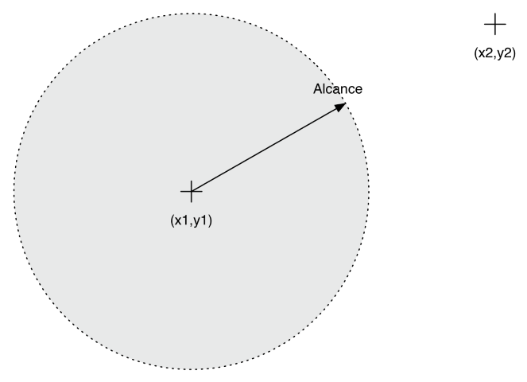

# Práctica 1: Introducción a Scheme

**Importante**: Antes de empezar esta práctica debes haber terminado
  *todos* los ejercicios del seminario de Scheme.

## Entrega de la práctica

Para entregar la práctica debes subir a Moodle el fichero
`practica01.rkt` con una cabecera inicial con tu nombre y apellidos, y
las soluciones de cada ejercicio separadas por comentarios. Cada
solución debe incluir:

- La **definición de las funciones** que resuelven el ejercicio.
- Un conjunto de **pruebas** que comprueben su funcionamiento, y el de
  funciones auxiliares que hayamos definido, utilizando el API SchemeUnit.

Por ejemplo, supongamos que el primer ejercicio de la práctica 1 sea
implementar la función `suma-cuadrados` que recibe dos números y
devuelve la suma de sus cuadrados y se proponen en el enunciado los
siguientes ejemplos:

```scheme
(suma-cuadrados 10 10) ; ⇒ 200
(suma-cuadrados -2 9) ; ⇒  85
```

La solución se debería entregar de la siguiente forma:

**`practica01.rkt`**:

```scheme
;; José Fernandez Muñoz

#lang r6rs
(import (rnrs)
        (schemeunit))

;;
;; Ejercicio 1: suma-cuadrados
;;

;; Función auxiliar cuadrado

(define (cuadrado x)
    (* x x))
    
(display "Probando 'cuadrado'\n")

(check-equal? (cuadrado 2) 4)
(check-equal? (cuadrado 10) 100)
(check-equal? (cuadrado -2) 4)

;; Función principal suma-cuadrados

(define (suma-cuadrados x y)
    (+ (* x x) (* y y)))

(display "Probando 'suma-cuadrados'\n")

(check-equal?  (suma-cuadrados 10 10)  200)
(check-equal?  (suma-cuadrados -2 9)  85)
(check-equal?  (suma-cuadrados 0.5 9)  81.25)

;;
;; Ejercicio 2:
;;

...

```

En los casos de prueba se deben incluir los ejemplos del enunciado
del ejercicio **y alguno más** que compruebe que la implementación
funciona correctamente.

## Ejercicios

### Ejercicio 1

a) Implementa la función `(binario-a-decimal b3 b2 b1 b0)` que reciba
4 bits que representan un número en binario y devuelva el número
decimal equivalente.

```scheme
(binario-a-decimal 1 1 1 1) ; ⇒ 15
(binario-a-decimal 0 1 1 0) ; ⇒ 6
(binario-a-decimal 0 0 1 0) ; ⇒ 2
```

**Nota**: recuerda que para realizar esta conversión, se utiliza la siguiente fórmula:

```
n = b3 * 2ˆ3 + b2 * 2ˆ2 + b1 * 2ˆ1 + b0 * 2ˆ0
```

Para la implementación de la expresión debes utilizar la función `expt`.


b) Implementa la función `(binario-a-hexadecimal b3 b2 b1 b0)` que
reciba 4 bits de un número representado en binario y devuelva el
carácter correspondiente a su representación en hexadecimal.

```scheme
(binario-a-hexadecimal 1 1 1 1) ; ⇒ #\F
(binario-a-hexadecimal 0 1 1 0) ; ⇒ #\6
(binario-a-hexadecimal 1 0 1 0) ; ⇒ #\A
```

**Nota**: para realizar esta conversión, como paso intermedio debes
pasar primero el número binario a su representación decimal
(utilizando la función definida en el apartado anterior) y después a
su correspondiente hexadecimal. 

Recuerda que la representación hexadecimal de los números decimales
del 0 al 9 es el carácter correspondiente a ese número, y que el
número decimal 10 se representa con el carácter A, el 11 con el B, y
así sucesivamente hasta el 15 que es el F en hexadecimal.

Para la implementación de esta función auxiliar que pasa de decimal a
hexadecimal debes usar las funciones `integer->char` y
`char->integer`. En la función `char->ingeger` los caracteres
consecutivos están asociados con números consecutivos. Por ejemplo, el
entero correspondiente al carácter `#\A` es uno menos que el
correspondiente al carácter `#\B`. Los caracteres de números y los de
letras no son consecutivos.


### Ejercicio 2

Implementa la función `(mayor-de-tres n1 n2 n3)` que reciba tres
números como argumento y devuelva el mayor de los tres, intentando que
el número de condiciones sea mínima.

No debes utilizar la función `max`. 

Implementa dos versiones de la función: 

- versión 1: usando la forma especial `if` 
- versión 2 (llámala `mayor-de-tres-v2`): definiendo una función auxiliar `(mayor x y)` que
  devuelva el mayor de dos números (deberás usar también la forma
  especial `if` para implementarla) y construyendo la función
  `mayor-de-tres-v2` como una composición de llamadas a esta función
  auxiliar.

```scheme
(mayor-de-tres 2 8 1) ;; ⇒ 8
(mayor-de-tres-v2 3 0 3) ;; ⇒ 3
```


### Ejercicio 3

Supongamos las definiciones

```scheme
(define (f x y)
    (+ (* 2 x) y))

(define (cuadrado x)
    (* x x))
```

Realiza la evaluación paso a paso de la siguiente expresión 

```scheme
(f (cuadrado (+ 2 1)) (+ 1 1))
```

mediante el **modelo de sustitución**, utilizando tanto el **orden
aplicativo** y como el **orden normal**.

Escribe la solución entre comentarios en el propio fichero `.rkt` de
la práctica.


### Ejercicio 4

Implementa la función `(tirada-ganadora t1 t2)` que reciba 2 parejas
como argumento, donde cada pareja representa una tirada con 2 dados
(contiene dos números). La función debe determinar qué tirada es la
ganadora, teniendo en cuenta que será aquella cuya suma de sus 2 dados
esté más próxima al número 7. La función devolverá 1 si `t1` es la
ganadora, 2 si `t2` es la ganadora o bien 0 si hay un empate. Este
último caso se producirá cuando la diferencia con 7 de ambas tiradas
es la misma.

```scheme
(tirada-ganadora (cons 1 3) (cons 1 6)) ; ⇒ 2
(tirada-ganadora (cons 1 5) (cons 2 2)) ; ⇒ 1
(tirada-ganadora (cons 6 2) (cons 3 3)) ; ⇒ 0
```


### Ejercicio 5

Supongamos que estamos implementando un **juego de guerra de barcos** en
el que los barcos están situados en coordenadas del plano definidas
por la posición _x_ y la posición _y_, ambos números reales (**metros**).

Cada barco puede lanzar un torpedo a otro barco con una velocidad
determinada (_v_, en **km/h**). El torpedo tiene combustible, y seguirá
moviéndose hasta que se termine. La distancia a la que eso sucede la
denominamos el **alcance** del torpedo (ver la siguiente figura):



Cuanto más alta es la velocidad del torpedo, antes termina su
combustible. En concreto, el tiempo de terminación del combustible
(_t_, en **segundos**) depende de la velocidad (en **km/h**) según la
siguiente expresión:

```
t= 50000 / v^2
```

Recuerda que conociendo la velocidad y el tiempo que está
moviéndose un objeto podemos calcular el espacio recorrido con la siguiente
expresión:

```
e = v * t
```

Esto es, multiplicando la velocidad por el tiempo resulta el espacio
en recorrido. Las **unidades de la velocidad y el tiempo deben ser
compatibles**. Esto es, si _v_ está en m/s, _t_ deberá estar en
segundos y el espacio reorrido resultará en metros.

Dadas todas estas condiciones, debes programar en Scheme la función 

```scheme
(dentro-alcance? x1 y1 x2 y2 v)
```

que tome como parámetros las coordenadas `x1`, `y1` del barco 1 que
lanza el torpedo (en **metros**), `x2`, `y2` del barco 2 al que se le
lanza (en **metros**) y `v` la velocidad del torpedo (en **km/h**).

La función debe comprobar si el barco 2 está dentro del alcance del
torpedo, tal y como lo hemos definido previamente y devolver el 
booleano correspondiente.

Debes modularizar la implementación, **creando las funciones auxiliares**
que necesites para que el código sea legible y auto-documentado (los
nombres de las funciones y los parámetros deben ser lo más
descriptivos posibles).

Ejemplos:

```
(dentro-alcance? 0 0 500 500 30) ; ⇒ #f
(dentro-alcance? 100 200 500 500 20) ; ⇒ #t
```

### Ejercicio 6

Define la función `tipo-triangulo` que recibe como parámetro las
coordenadas en el plano de los vértices de un triángulo representados
con parejas. La función devuelve un string con el tipo de triángulo
correspondiente: equilátero, isósceles o escaleno.

Recuerda que un triángulo equilátero es aquel cuyos tres lados tienen
la misma longitud, el isósceles el que tiene dos lados iguales y el
escaleno el que todos sus lados son diferentes.

Ejemplos:

```scheme
(tipo-triangulo (cons 1 1) (cons  1 6) (cons 6 1)) ; ⇒ "isosceles"
(tipo-triangulo (cons -2 3) (cons  2 6) (cons 5 3)) ; ⇒ "escaleno"
(tipo-triangulo (cons -3 0) (cons  3 0) (cons 0 5.1961) ;  ⇒ "equilatero"
```

**Nota**: Para comparar dos números reales debemos comprobar si la
resta entre ambos es menor que una constante `epsilon` que hemos
definido. Por ejemplo, `epsilon` puede valer 0.0001.

Puedes usar la siguiente función auxiliar:

```scheme
(define epsilon 0.0001)

(define (iguales-reales? x y)
  (< (abs (- x y)) epsilon))
```

### Ejercicio 7


Define la función `calculadora` que recibe una lista como
parámetro. La lista contiene tres elementos: el primero es un carácter
(`+`, `-`, `*` o `/`) que indica un operador y los dos siguientes
elementos corresponden a los operandos. La función realiza la
operación y devuelve el resultado.


Ejemplos:

```scheme
(calculadora (list #\+ 2 3)) ; ⇒ 5
(calculadora (list #\* 3 4)) ; ⇒ 12
(calculadora (list #\- 7 4)) ; ⇒ 3
(calculadora (list #\/ 6 3)) ; ⇒ 2
```

----

Lenguajes y Paradigmas de Programación, curso 2017-18  
© Departamento Ciencia de la Computación e Inteligencia Artificial, Universidad de Alicante  
Domingo Gallardo, Cristina Pomares, Antonio Botía, Francisco Martínez
