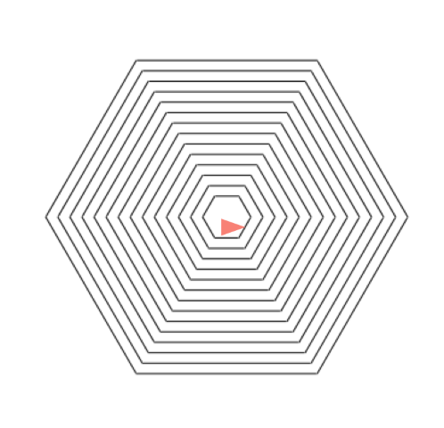
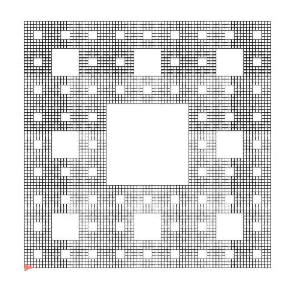

# Práctica 5: Procedimientos recursivos

## Entrega de la práctica

Para entregar la práctica debes subir a Moodle el fichero
`practica05.rkt` con una cabecera inicial con tu nombre y apellidos, y
las soluciones de cada ejercicio separadas por comentarios. Cada
solución debe incluir:

- La **definición de las funciones** que resuelven el ejercicio.
- Un conjunto de **pruebas** que comprueben su funcionamiento
  utilizando la librería `schemeunit`.

## Ejercicios


### Ejercicio 1  ###

a) Implementa **utilizando recursión por la cola** la versión iterativa de la función
`(cuadrado-lista lista)` que toma como argumento una lista de números
y devuelve una lista con sus cuadrados.

La función `cuadrado-lista` deberá llamar a la función
`cuadrado-lista-iter` que es la que implementa propiamente la versión
iterativa usando recursión por la cola.

Ejemplo:

```scheme
(cuadrado-lista '(2 3 4 5)) ; ⇒ (4 9 16 25)
```


b) Define **utilizando recursión por la cola** la función `(max-lista
lista)` que recibe una lista numérica y devuelve el máximo de sus
elementos.

Ejemplo:

```scheme
(max-lista '(2 5 9 12 5 0 4)) ; ⇒ 12
```


### Ejercicio 2 ###

Implementa **utilizando recursión por la cola** las funciones
`expande-pareja` y `expande` de la práctica 3.

```scheme
(expande-pareja (cons 'a 4)) ; ⇒ {a a a a}
(expande '((#t . 3) ("LPP" . 2) (b . 4)))
⇒ {#t #t #t "LPP" "LPP" b b b b}
```


### Ejercicio 3

Implementa **utilizando recursión por la cola** función `(aplica-funciones
lista-parejas)` que recibe una lista de parejas `{{función
. argumento} ...}` y devuelve la lista con los resultados de aplicar
cada función al argumento situado en la parte derecha de la pareja.

Ejemplo:

```scheme
(aplica-funciones (list (cons sqrt 16) (cons list 2) (cons even? 5) (cons not #f))) 
; ⇒ {4 {2} #f #t}
```

### Ejercicio 4 ###

a) Implementa utilizando recursión por la cola la función
`binario-a-decimal` que reciba una cadena con un número arbitrario de
0s y 1s y devuelva el número decimal correspondiente a ese número
binario.

Ejemplos:

```scheme
(binario-a-decimal "101") ; ⇒ 5
(binario-a-decimal "101101") ; ⇒ 45
```

Ejemplos:

b) Implementa, utilizando recursión por la cola, la función
`decimal-a-hexadecimal` que recibe un número decimal y devuelve una
lista con el número hexadecimal correspondiente en forma de cadena:

```scheme
(decimal-a-hexadecimal 200) ; ⇒ "C8"
(decimal-a-hexadecimal 999) ; ⇒ "3E7"
```

### Ejercicio 5 ###

a) Usando gráficos de tortuga, implementa la función
`(piramide-hexagonal lado decremento)` que dibuje hexágonos
concéntricos con el lado inicial `lado` y que cada vez vaya
decrementando ese valor con el `decremento`.

Por ejemplo, la llamada a `(piramide-hexagonal 150 10)` debe dibujar
la siguiente figura:

**Pista**: el desplazamiento que debe realizar la tortuga antes de
dibujar cada hexágono es de `decremento`, en la dirección del ángulo
que va al centro del hexágono.



b) Define la función `(alfombra-sierpinski tam min)` que construya la
Alfombra de Sierpinski (una variante del Triágulo de Sierpinski que
hemos visto en teoría) de lado `tam` píxeles utilizando gráficos de
tortuga. 

Por ejemplo, la llamada a `(alfombra-sierpinski 500 6)` debe dibujar la
siguiente figura:




----

Lenguajes y Paradigmas de Programación, curso 2017-18  
© Departamento Ciencia de la Computación e Inteligencia Artificial, Universidad de Alicante  
Domingo Gallardo, Cristina Pomares, Antonio Botía, Francisco Martínez
