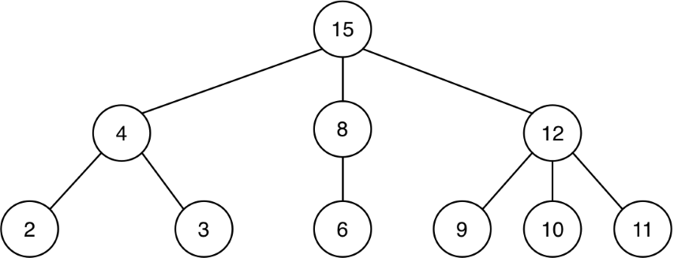
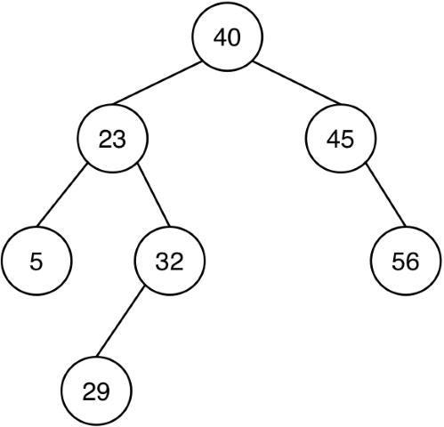
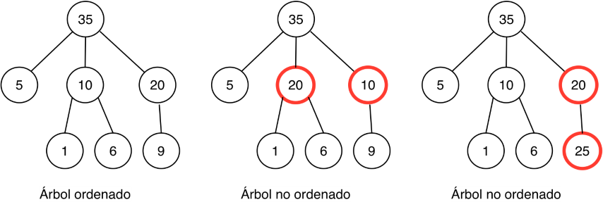
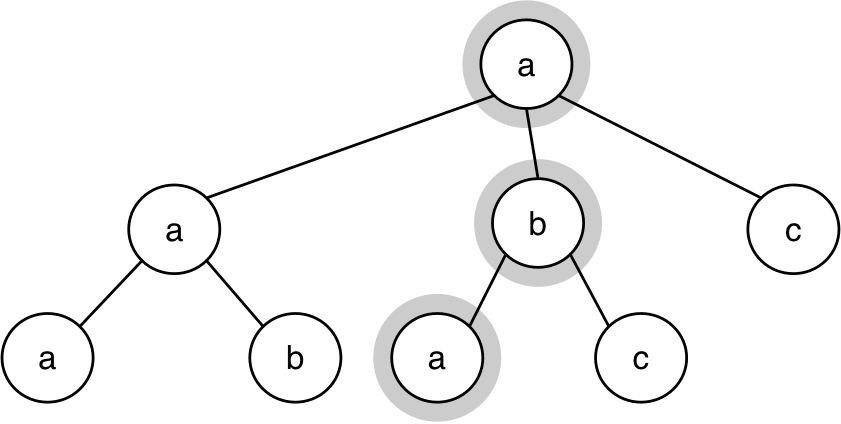
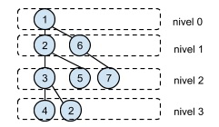
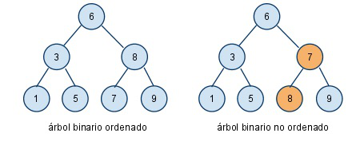

## Práctica 7: Árboles

### Entrega de la práctica

Para entregar la práctica debes subir a Moodle el fichero
`practica07.rkt` con una cabecera inicial con tu nombre y apellidos, y
las soluciones de cada ejercicio separadas por comentarios. Cada
solución debe incluir:

- La **definición de las funciones** que resuelven el ejercicio.
- Un conjunto de **pruebas** que comprueben su funcionamiento
  utilizando la librería `schemeunit`.

## Ejercicios

**Importante**: Copia al principio de la práctica las funciones de las
barreras de abstracción de árboles y árboles binarios y utiliza esas
funciones en todos los ejercicios cuando estés realizando operaciones
sobre árboles.


### Ejercicio 1 ###

a.1) Escribe la sentencia en Scheme que define el siguiente árbol
genérico y escribe **utilizando las funciones de la barrera de
abstracción de árboles** una expresión que devuelva el número 10.



```
(define arbol '(_________))
(check-equal? __________ 10)
```

a.2) Las funciones que suman los datos de un árbol utilizando
recursión mutua y que hemos visto en teoría son las siguientes:

```scheme
(define (suma-datos-arbol arbol)
    (+ (dato-arbol arbol)
       (suma-datos-bosque (hijos-arbol arbol))))

(define (suma-datos-bosque bosque)
    (if (null? bosque)
        0
        (+ (suma-datos-arbol (car bosque)) 
           (suma-datos-bosque (cdr bosque)))))
```


Si realizamos la siguiente llamada a la función `suma-datos-bosque`,
siendo `arbol` el definido en el apartado anterior:

```scheme
(suma-datos-bosque (hijos-arbol arbol))
```

1. ¿Qué devuelve la invocación a `(suma-datos-arbol (car bosque))` que
  se realiza dentro de la función?
2. ¿Qué devuelve la primera llamada recursiva a `suma-datos-bosque`?

Escribe la contestación a estas preguntas como comentarios en el
fichero de la práctica.

a.3) La función de orden superior que hemos visto en teoría y que
realiza también la suma de los datos de un árbol es:

```scheme
(define (suma-datos-arbol-fos arbol)
   (fold-right + (dato-arbol arbol) 
       (map suma-datos-arbol-fos (hijos-arbol arbol))))
```	

Si realizamos la siguiente llamada a la función, siendo `arbol` el
definido en el apartado anterior:

```scheme
(suma-datos-arbol-fos arbol)
```

1. ¿Qué devuelve la invocación a `map` dentro de la función?
2. ¿Qué invocaciones se realizan a la función `+` durante la ejecución
   de `fold-right` sobre la lista devuelta por la invocación a `map`?
   Enuméralas en orden, indicando sus parámetros y el valor devuelto
   en cada una de ellas.


b.1) Escribe la sentencia en Scheme que define el siguiente árbol
binario y escribe **utilizando las funciones de la barrera de
abstracción de árboles binarios** una expresión que devuelva el número 29.



```
(define arbolb '(_________))
(check-equal? __________ 29)
```


### Ejercicio 2 ###

Implementa dos versiones de la función `(to-string-arbol arbol)` que
recibe un árbol de símbolos y devuelve la cadena resultante de
concatenar todos los símbolos en recorrido preorden. Debes implementar
una versión con recursión mutua y otra (llamada `to-string-arbol-fos`)
con una única función en la que se use funciones de orden superior.

Ejemplo:

```scheme
(define arbol2 '(a (b (c (d)) (e)) (f)))
(to-string-arbol arbol2) ⇒ "abcdef"
```


### Ejercicio 3 ###

Decimos que un árbol está ordenado cuando cumple las siguientes
propiedades:

- La raíz es mayor que las raíces de sus hijos.
- Las raíces de sus hijos están en orden creciente.
- Todos los hijos son árboles que están ordenados.

Por ejemplo, en la siguiente figura, el primer árbol está ordenado. El
segundo árbol no lo está, porque las raíces de sus hijos no están en
orden creciente. Y el tercer árbol no lo está porque hay una raíz de
un hijo (el único) es mayor que la propia raíz. 



Implementa la función `(ordenado-arbol? arbol)` que compruebe si un
árbol cumple las condiciones anteriores. Puedes usar FOS, recursión
mutua y/o funciones auxiliares.

Ejemplos:

```scheme
(ordenado-arbol? '(10 (5) (7))) ⇒ #t
(ordenado-arbol? '(50 (10 (4) (6) (8)) (25 (15)))) ⇒ #t
(ordenado-arbol? '(10 (8) (7))) ⇒ #f
(ordenado-arbol? '(6 (5) (7))) ⇒ #f
(ordenado-arbol? '(50 (10 (4) (6) (11)) (25) (15))) ⇒ #f
```

### Ejercicio 4 ###

a) Implementa la función `(veces a b arbol)` que busca en el árbol arbol
los valores a y b y devuelve una pareja con el número de veces que
aparece a y el número de veces que aparece b. Debe recorrerse el árbol
una única vez. Los valores a y b siempre serán distintos. Puedes usar
recursión o funciones de orden superior.


```scheme
(define arbol '(1 (1 (1)) (2 (3) (2)) (1 (2) (3))))
(veces 1 2 arbol) => {4 . 3}
(veces 4 3 arbol) => {0 . 2}
(veces 4 5 arbol) => {0 . 0}
```


b) Define la función `(es-camino? lista arbol)` que debe comprobar si
la secuencia de elementos de la lista se corresponde con un camino
del árbol que empieza en la raíz y que termina exactamente en una
hoja. Suponemos que `lista` contiene al menos un elemento

Por ejemplo, la lista ```'(a b a)``` sí que es camino en el siguiente árbol,
pero la lista ```'(a b)``` no.



Ejemplos: suponiendo que `arbol` es el árbol definido por la figura
anterior:


```scheme
(es-camino? '(a b a) arbol) ⇒ #t
(es-camino? '(a b) arbol) ⇒ #f
(es-camino? '(a b a b) arbol) ⇒ #f
```


c) Escribe la función `(nodos-nivel nivel arbol)` que reciba un nivel
y un árbol genérico y devuelva una lista con todos los nodos que se
encuentran en ese nivel.



Ejemplos, suponiendo que `arbol` es el árbol definido por la figura anterior:

```scheme
(nodos-nivel 0 arbol) ⇒ '(1)
(nodos-nivel 1 arbol) ⇒ '(2 6)
(nodos-nivel 2 arbol) ⇒ '(3 5 7)
(nodos-nivel 3 arbol) ⇒ '(4 2)
```

### Ejercicio 5 ###


a) Define la función `(pertenece? dato arbolb)` que recibe un dato y
un árbol binario ordenado y que busque **eficientemente** el dato (realizando
el menor recorrido posible) en el árbol binario ordenado.

```scheme
(define arbolb '(40 (18 (3 () ())
                        (23 ()
                            (29 () ())))
                    (52 (47 () ())
                        ())))
(pertenece? 29 arbolb) ⇒ #t
(pertenece? 42 arbolb) ⇒ #f
```

b) Un árbol binario está ordenado cuando todos sus hijos de la rama
izquierda son menores que el dato de la raíz y los de la rama derecha
son mayores y, a su vez, los árboles binarios de las ramas izquierda y
derecha también están ordenados. 

Escribe el procedimiento `(ordenado-arbolb? arbolb)` que reciba un
árbol binario como argumento y devuelva verdadero si está ordenado y
falso si no lo está.

**Pista**: Implementa como funciones auxiliares las funciones
`(menor-arbolb arbolb)` y `(mayor-arbolb arbolb)` que devuelvan el
menor y mayor número respectivamente de un árbol binario.




c) Dado un árbol binario y un camino definido como una lista de símbolos:
`'(< > = > > =)` en el que:

- `<`: indica que nos vamos por la rama izquierda
- `>`: indica que nos vamos por la rama derecha
- `=`: indica que nos quedamos con el dato de ese nodo.

Implementa la función `(camino-b-tree b-tree camino)` que devuelva una
lista con los datos recogidos por el camino.


```scheme
(camino-b-tree b-tree '(= < < = > =)) ⇒ '(9 3 4)
(camino-b-tree b-tree '(> = < < =)) ⇒ '(15 10)
```

----

Lenguajes y Paradigmas de Programación, curso 2017-18  
© Departamento Ciencia de la Computación e Inteligencia Artificial, Universidad de Alicante  
Domingo Gallardo, Cristina Pomares, Antonio Botía, Francisco Martínez
