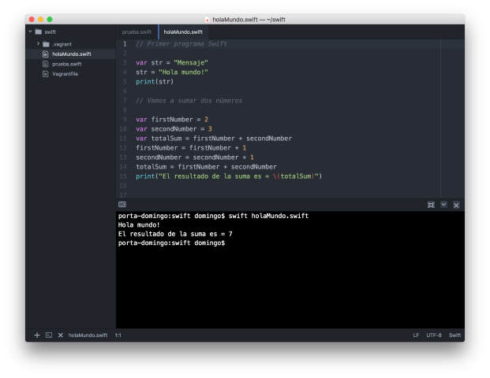

# Seminario 2: Seminario de Swift

Lenguajes y Paradigmas de Programación, curso 2017-18  
Departamento Ciencia de la Computación e Inteligencia Artificial, Universidad de Alicante  

## Contenidos

- [1. El lenguaje de programación Swift](#1)
- [2. Ejecución de programas Swift](#2)
    - [2.1. Ejecución en una máquina Docker](#2-1)
    - [2.2. Instalación en MacOs](#2-2)
    - [2.3. Instalación en Linux Ubuntu](#2-3)
    - [2.5. Editor de código Atom](#2-5)
- [3. Un tour de Swift](#3)

## <a name="0"></a> Bibliografía y referencias

- Documentación sobre Swift
    - [The Swift Programming Language (html)](https://developer.apple.com/library/prerelease/content/documentation/Swift/Conceptual/Swift_Programming_Language/index.html)
    - [Recursos Swift en Apple](https://developer.apple.com/swift/resources/)
    - [swift.org](https://swift.org)
- Swift Open Source
    - [Repositorio `swift` en GitHub](https://github.com/apple/swift): repositorio principal de Swift, que contiene el código fuente del compilador Swift, la biblioteca estándar y SourceKit.
    - [Repositorio `swift-evolution` en GitHub](https://github.com/apple/swift-evolution): documentos relacionados con la evolución continua de Swift, incluyendo objetivos de las próximas versiones y propuestas de cambios y extensiones de Swift.

## <a name="1"></a> 1. El lenguaje de programación Swift

[Swift](https://en.wikipedia.org/wiki/Swift_(programming_language)) es
un lenguaje de programación compilado, de propósito general y
multi-paradigma desarrollado por Apple. Swift se presentó en la
Conferencia de Desarrolladores de Apple (WWDC) de 2014. Durante el año
2014 se desarrolló la versión 1.2 y en la WWDC 2015 se presentó Swift
2, una actualización importante del lenguaje. Inicialmente fue un
lenguaje propietario, pero el 3 de diciembre de 2015 se hizo _open
source_ bajo la licencia Apache 2.0, para las plataformas Apple y
Linux. Los cambios en el lenguaje son propuestos y discutidos por la
comunidad en un proceso denominado [Swift
evolution](https://github.com/apple/swift-evolution). En la actualidad
se ha estabilizado la versión 4 del lenguaje y se está desarrollando
la versión 5 que se presentará a finales de 2018.
 
La siguiente descripción se ha extraído del repositorio GitHub de
Swift:

> Swift es un lenguaje de programación de sistemas de alta
> eficiencia. Tiene una sintaxis limpia y moderna, ofrece acceso
> transparente a código y librerías existentes en C y Objective-C, y
> es seguro en el uso de memoria (*memory safe*).

> Aunque está inspirado en Objective-C y en muchos otros lenguajes,
> Swift no es en si mismo un lenguaje derivado de C. Como lenguaje
> completo e independiente, Swift proporciona características
> fundamentales como control de flujo, estructuras de datos y
> funciones, junto con construcciones de alto nivel como objetos,
> protocolos, clausuras y genéricos. Swift se apoya en módulos,
> eliminando la necesidad de cabeceras y la duplicación de código que
> éstas inducen.


## <a name="2"></a> 2. Ejecución de programas Swift

Es posible descargar el compilador de Swift en los sistemas operativos
Mac (utilizando el entorno de desarrollo Xcode) o Linux.

Para la asignatura recomendamos utilizar una máquina Docker basada en
la distribución Linux. La utilización de la máquina Docker hace
posible su utilización en Windows y Mac sin instalar Xcode y permite
un entorno unificado en el que hacer las prácticas.

A continuación explicamos las distintas formas de ejecutar programas
Swift.

### <a name="2-1"></a> 2.1. Ejecución en una máquina Docker

[Docker](https://docs.docker.com) es una tecnología que ha tenido una gran expansión en los
últimos años. Permite construir máquinas virtuales ligeras que
utilizan el mismo sistema operativo de la máquina host. Estas máquinas
virtuales se denominan contenedores y, al compartir el propio sistema
operativo en el que se están ejecutando, su gestión (construcción,
arranque, parada, etc.) es muchísimo más rápida que las máquinas
virtuales tradicionales.

Docker se controla desde línea de comando, desde la aplicación
Terminal de Mac o el PowerShell de Windows. Existen comandos docker
para descargar imágenes, lanzar y parar contenedores, montar
directorios de la máquina host en contenedores, etc. Nosotros sólo
utilizaremos el comando `docker run` para lanzar un contenedor, pero
te recomendamos que investigues y pruebes más comandos y que conozcas
mejor esta interesante tecnología. Puedes empezar por la guía [Get
started with Docker](https://docs.docker.com/get-started/).

Usaremos la [imagen Docker
swift:4.0.3](https://hub.docker.com/_/swift/), que contiene el
comando `swift` necesario para compilar y ejecutar aplicaciones Swift.

#### Instalación de Docker ####

Debes instalar la versión de Docker CE (_Community Edition_)
correspondiente a tu sistema operativo. Descárgalo [desde esta
página](https://www.docker.com/community-edition) y sigue las
instrucciones correspondientes a tu sistema operativo.

#### Instalación y ejecución de la imagen Swift ####

Una vez instalado Docker, abre un terminal y lanza el siguiente
comando:

```text
$ docker pull swift:4.0.3
```

El comando descarga la imagen `swift:4.0.3` a nuestro ordenador. Una
vez descargada lanzamos el contenedor con el siguiente comando:

```text
$ docker run --privileged -it --rm -v "${PWD}:/home" swift:4.0.3 /bin/bash
```

El contenedor arranca en muy pocos segundos y aparece su prompt,
indicando que ya estás dentro de él y puedes ejecutar cualquier
comando linux:

```text
root@97265a262a58:/# ls
bin  boot  dev	etc  home  lib	lib64  media  mnt  opt	proc  root  run  sbin  srv  sys  tmp  usr  var
root@97265a262a58:/# 
```

Lanzamos el intérprete de Swift con el comando `swift`:
    
```text
root@97265a262a58:/# swift
Welcome to Swift version 4.0.3 (swift-4.0.3-RELEASE). Type :help for assistance.
1> "hola".uppercased()
$R0: String = "HOLA"
2>
```

Una vez hayamos terminado de trabajar podemos salir del intérprete
de Swift y del contenedor de la siguiente forma:

```text
3> :quit
root@97265a262a58:/# exit
```


#### Directorio compartido entre el ordenador _host_ y el contenedor ####


El argumento `-v "${PWD}:/home"` del comando `docker run` hace que el
contenedor monte el directorio actual en su directorio `/home`. De
esta forma podemos editar los programas Swift en el ordenador
anfitrión y ejecutarlos desde línea de comando en el contenedor.

Recomendamos utilizar un editor de textos orientado a la programación
para editar los programas Swift en el ordenador anfitrión. Más
adelante hablaremos de los editores Atom y Visual Studio Code, pero
cualquier otro editor orientado a programación te puede valer
(Sublime, Xcode en el Mac, etc.)

Vamos a probar a usar el directorio compartido:

1. Nos movemos en el ordenador anfitrión a un directorio en el que
   trabajaremos con los programas en Swift:
   
```test
~ $ cd swift
~/swift $ 
```

2. Creamos en el directorio actual un programa llamado
   `holaMundo.swift`.

**Fichero `holaMundo.swift`**:

```swift
// Primer programa Swift

var str = "Mensaje"
str = "Hola mundo!"
print(str)

// Vamos a sumar dos números

var firstNumber = 2
var secondNumber = 3
var totalSum = firstNumber + secondNumber
firstNumber = firstNumber + 1
secondNumber = secondNumber + 1
totalSum = firstNumber + secondNumber
print("El resultado de la suma es = \(totalSum)")
```

3. Arrancamos el contenedor swift:

```text
$ docker run --privileged -it --rm -v "${PWD}:/home" swift:4.0.3 /bin/bash
```

4. Compilamos y ejecutamos el programa desde el contenedor, cambiando
   al directorio `/home` (el directorio compartido) y ejecutando el
   comando swift:

```text
root@3131534ce480:/# cd /home
root@3131534ce480:~# swift holaMundo.swift 
Hola mundo!
El resultado de la suma es = 7
```

5. Prueba a cambiar cualquier cosa en el programa desde el editor en
   el ordenador anfitrión y a volver a ejecutar el programa desde el
   contenedor. Verás que el directorio está realmente compartido
   y que el programa se ejecuta con las modificaciones que has
   introducido.

6. Cuando termines de trabajar con el contenedor Docker recuerda salir
   de él. El argumento `--rm` del comando `docker run` hace que el
   contenedor se elimine al terminar su ejecución.
   
```text
root@3131534ce480:~# exit
exit
~/swift $ 
```


### <a name="2-2"></a> 2.2. Instalación en MacOS

Para instalar la última versión de Swift en MacOs debes instalar
Xcode. Una vez instalado puedes ejecutar Swift desde el terminal.


### <a name="2-3"></a> 2.3. Instalación en Linux Ubuntu

Existe una distribución oficial de Swift para Ubuntu de 64 bits
(distribuciones 14.04, 16.04 y 16.10).

Puedes encontrar la información completa en la
[web oficial de Apple](https://swift.org/download/).

Brevemente, los pasos son los siguientes:

```
$ sudo apt-get install clang libicu-dev
// Descargar la versión y plataforma deseada (fichero swift-<VERSION>-<PLATFORM>.tar.gz)
$ tar xzf swift-<VERSION>-<PLATFORM>.tar.gz
// Esto crea el directorio usr/ en la localización del archivo
// Actualizar el PATH o mover usr/bin/swift al directorio /usr/bin
```

### <a name="2-5"></a> 2.5. Editor de código

Para editar código Swift puedes usar cualquier editor orientado a
programación. Aconsejamos [Atom](https://atom.io) o [Visual Studio
Code](https://code.visualstudio.com). Ambos son multi-plataforma.

#### Atom ####

Atom es un editor modular en el que se pueden instalar múltiples
extensiones desarrolladas por terceros. Para programar con swift es
conveniente instalar los siguientes paquetes (en **Preferencias >
Settings > Install Packages**):

- `language-swift`: proporciona coloreado de sintaxis de
  Swift
- `platformio-ide-terminal`: proporciona la posibilidad de abrir un
  terminal en la parte inferior de la ventana.



Puedes consultar los conceptos básicos de Atom y el manual completo en [este enlace](http://flight-manual.atom.io/getting-started/sections/atom-basics/).

#### Visual Studio Code ####

Es recomendable instalar la extensión `Swift Language` que realiza un
coloreado de sintaxis de Swift.

Para trabajar de forma más cómoda podemos abrir el terminal integrado
**Ver > Terminal integrado** y lanzar el contenedor de Swift en ese
terminal.


Puedes consultar los conceptos básicos de Visual Studio Code y el
manual completo en [este enlace](https://code.visualstudio.com/docs).

## <a name="3"></a> 3. Un tour de Swift

Aquí empieza el seminario de Swift. El texto que hay a continuación es
una traducción del documento de Apple
*[A Swift Tour](https://developer.apple.com/library/prerelease/content/documentation/Swift/Conceptual/Swift_Programming_Language/GuidedTour.html#//apple_ref/doc/uid/TP40014097-CH2-ID1)*
en el que se presenta una introducción rápida a los conceptos
fundamentales del lenguaje. En los temas siguientes de la asignatura
(Tema 5 - Programación Funcional con Swift y Tema 6 - Programación
Orientada a Objetos con Swift) profundizaremos en aspectos como
funciones, genéricos, clases o protocolos.

Te recomendamos que crees un fichero llamado `seminario.swift` y que
vayas copiando y probando en él todos los ejemplos que aparecen a
continuación. 

La tradición sugiere que el primer programa en un nuevo lenguaje
debería imprimir las palabras "Hello, world!" en la pantalla. En
Swift, esto puede hacerse con una única línea:

```swift
print("Hello, world!")
```

Si has escrito código en C o en Objective-C, esta sintaxis te parecerá
familiar. En Swift, esta línea de código es un programa completo. No
necesitas importar una biblioteca separada para funcionaliades como
entrada/salida o manejo de cadenas. El código escrito en el ámbito
global se usa como el punto de entrada del programa, por lo que no
necesitas una función `main()`. Tampoco tienes que escribir puntos y
comas al final de cada sentencia.

Este tour te da información suficiente para empezar a escribir código
in Swift enseñándote cómo conseguir una variedad de tareas de
programación. No te preocupes si no entiendes algo, todo lo que se
introduce en este tour se explica en detalle en el
[resto del libro](https://developer.apple.com/library/ios/documentation/Swift/Conceptual/Swift_Programming_Language/TheBasics.html#//apple_ref/doc/uid/TP40014097-CH5-ID309).

#### Valores simples

Usa `let` para crear una constante y `var` para crear una variable. No
es necesario que se conozca en tiempo de compilación el valor de una
constante, pero debes asignarle un valor exactamente una vez. Esto
significa que puedes usar constantes para nombrar un valor que
determinas una vez pero que usas en muchos lugares.

```swift
var miVariable = 42
miVariable = 50
let miConstante = 42
```

Una constante o variable debe tener el mismo tipo que el valor que
quieres asignarle. Sin embargo, no siempre tienes que escribir el tipo
explícitamente. Cuando se proporciona un valor al crear una constante
o una variable el compilador infiere su tipo. En el ejemplo anterior,
el compilador infiere que `myVariable` es un entero porque su valor
inicial es un entero.

Si el valor inicial no proporciona información suficiente (o si no hay
valor inicial), especifica el tipo escribiéndolo después de la
variable, separándolo por dos puntos.

```swift
let implicitoInteger = 70
let implicitoDouble = 70.0
let explicitoDouble: Double = 70
```

> EXPERIMENTO  
> Crea una constante con el tipo explícito de `Float` y un valor de 4.

Los valores nunca se convierten implícitamente a otro tipo. Si
necesitas convertir un valor a un tipo diferente, construye
explícitamente una instancia del tipo deseado.

```swift
let etiqueta = "El ancho es "
let ancho = 94
let anchoEtiqueta = etiqueta + String(ancho)
```

> EXPERIMENTO  
> Intenta eliminar la conversión a `String` en la última línea. ¿Qué error obtienes?

Hay una forma aún más sencilla de incluir valores en cadenas: escribe
el valor entre paréntesis, y escribe una barra invertida (`\`) antes
de los paréntesis. Por ejemplo:

```swift
let manzanas = 3
let naranjas = 5
let resumenManzanas = "Tengo \(manzanas) manzanas."
let resumenFrutas = "Tengo \(manzanas + naranjas) frutas."
```

> EXPERIMENTO  
> Usa `\()` para incluir un cálculo en punto flotante en una cadena y
> para incluir el nombre de alguien en un saludo.

Crea arrays y diccionarios utilizando corchetes (`[]`), y accede a sus
elementos escribiendo el índice o la clave en los corchetes. Se
permite una coma después del último elemento.

```swift
var listaCompra = ["huevos", "agua", "tomates", "pan"]
listaCompra[1] = "botella de agua"

var trabajos = [
    "Malcolm": "Capitán",
    "Kaylee": "Mecánico",
]
trabajos["Jayne"] = "Relaciones públicas"
```

Para crear un array o diccionario vacío, usa la sintaxis de inicialización.

```swift
let arrayVacio = [String]()
let diccionarioVacio = [String: Float]()
```

Si el tipo de información puede ser inferido, puedes escribir un array
vacío como `[]` y un diccionario vacío como `[:]`; por ejemplo, cuando
estableces un nuevo valor para una variable o pasas un argumento a una
función.

```swift
listaCompra = []
trabajos = [:]
```

#### Tuplas

Una tupla agrupa varios valores en un único valor compuesto.

```swift
let http404Error = (404, "Not Found")
```

El tipo de la tupla es `(Int, String)`.

Para obtener los valores de la tupla podemos _descomponerla_. Si
queremos ignorar una parte podemos utilizar un subrrayado (`_`).

```swift
let (statusCode, statusMensaje) = http404Error
let (soloStatusCode, _) = http404Error
```

También podemos acceder por posición:

```swift
print("El código de estado es \(http404Error.0)")
```

#### Control de flujo

Usa `if` y `switch` para hacer condicionales y usa `for-in`, `for`,
`while` y `repeat-while` para hacer bucles. Los paréntesis alrededor
de las condiciones o de la variable del bucle son opcionales. Se
requieren llaves alrededor del cuerpo.

```swift
let puntuacionesIndividuales = [75, 43, 103, 87, 12]
var puntuacionEquipo = 0
for puntuacion in puntuacionesIndividuales {
    if puntuacion > 50 {
        puntuacionEquipo += 3
    } else {
        puntuacionEquipo += 1
    }
}
print(puntuacionEquipo)
```

En una sentencia `if`, el condicional debe ser una expresión booleana;
esto significa que código como `if score { ... }` es un error, no una
comparación implícita con cero.

Puedes usar `if` y `let` juntos para trabajar con valores que pueden
faltar. Estos valores se representan como opcionales. Un valor
opcional o bien contiene un valor o contiene `nil` para indicar que el
valor falta. Escribe una interrogación (`?`) después del tipo de un
valor para marcar el valor como opcional.

```swift
var cadenaOpcional: String? = "Hola"
print(cadenaOpcional == nil)

var nombreOpcional: String? = "John Appleseed"
var saludo = "Hola!"
if let nombre = nombreOpcional {
    saludo = "Hola, \(nombre)"
}
```

> EXPERIMENTO  
> Cambia `nombreOpcional` a `nil`. ¿Qué saludo obtienes? Añade una
> cláusula `else` que establezca un saludo diferente si
> `nombreOpcional` es `nil`.

Si el valor opcional es `nil`, el condicional es `false` y el código
en las llaves se salta. En otro caso, el valor opcional se desenvuelve
y se asigna a la constante después del `let`, lo que hace que el valor
desenvuelto esté disponible dentro del bloque de código.

Otra forma de manejar valores opcionales es proporcionar un valor por
defecto usando el operador `??`. Si falta el valor valor opcional, se
usa el valor por defecto en su lugar.

```swift
let nombrePila: String? = nil
let nombreCompleto: String = "John Appleseed"
let saludoInformal = "¿Qué tal, \(nombrePila ?? nombreCompleto)?"
```

Las sentencias `switch` permiten cualquier tipo de datos y una amplia
variedad de operaciones de comparación; no están limitados a enteros y
pruebas de igualdad.

```swift
let verdura = "pimiento rojo"
switch verdura {
    case "zanahoria":
        print("Buena para la vista.")
    case "lechuga", "tomates":
        print("Podrías hacer una buena ensalada.")
    default:
        print("Siempre puedes hacer una buena sopa.")
}
```

> EXPERIMENTO  
> Intenta eliminar el caso por defecto. ¿Qué error obtienes?

Después de ejecutar el código dentro del caso que se empareja, el
programa sale de la sentencia `switch`. La ejecución no continua con
el siguiente caso, por lo que no hay necesidad de romper el `switch`
al final del código de cada caso.

Usa `for-in` para iterar sobre elementos en un diccionario
proporcionando una pareja de nombres para usar en cada pareja
clave-valor. Los diccionarios son colecciones desordenadas, por lo que
sus claves y valores se iteran en un orden arbitrario.

```swift
let numerosInteresantes = [
    "Primos": [2, 3, 5, 7, 11, 13],
    "Fibonacci": [1, 1, 2, 3, 5, 8],
    "Cuadrados": [1, 4, 9, 16, 25],
]
var mayor = 0
for (clase, numeros) in numerosInteresantes {
    for numero in numeros {
        if numero > mayor {
            mayor = numero
        }
    }
}
print(mayor)
```

> EXPERIMENTO  
> Añade otra variable para seguir qué clase de número es el mayor.

Usa `while` para repetir un bloque de código hasta que una condición
cambie. La condición de un bucle puede estar también al final,
asegurando que el bucle se ejecuta al menos una vez.

```swift
var n = 2
while n < 100 {
    n *= 2
}
print(n)
 
var m = 2
repeat {
    m *=  2
} while m < 100
print(m)
```

Puedes definir un índice en un bucle usando `..<` para construir un
rango de índices.

```swift
var total = 0
for i in 0..<4 {
    total += i
}
print(total)
```

Usa `..<` para construir un rango que omita su valor superior, y usa
`...` para construir un rango que incluya ambos valores.


#### Funciones y clausuras

Usa `func` para declarar una función. Usa `->` para separar los
nombres de los parámetros y sus tipos del tipo devuelto de la
función.

```swift
func saluda(nombre: String, dia: String) -> String {
    return "Hola \(nombre), hoy es \(dia)."
}
saluda(nombre: "Bob", dia: "Martes")
```

> EXPERIMENTO  
> Elimina el parámetro día. Añade un parámetro para incluir la comida
> de hoy en el saludo.

Por defecto, las funciones usan los nombres de los parámetros como
etiquetas de los argumentos. Es posible definir una etiqueta
escribiéndola antes del nombre del parámetro, o no usar etiqueta
escribiendo `_`:

```swift
func saluda(_ nombre: String, el dia: String) -> String {
    return "Hola \(nombre), hoy es \(dia)."
}
saluda("Bob", el: "Martes")
```

Las funciones pueden devolver cualquier tipo de dato, como tuplas.

```swift
func calculaEstadisticas(puntuaciones: [Int]) -> 
                        (min: Int, max: Int, sum: Int) {
    var min = puntuaciones[0]
    var max = puntuaciones[0]
    var sum = 0
    
    for puntuacion in puntuaciones {
        if puntuacion > max {
            max = puntuacion
        } else if puntuacion < min {
            min = puntuacion
        }
        sum += puntuacion
    }
    
    return (min, max, sum)
}
let estadisticas = calculaEstadisticas(puntuaciones: [5, 3, 100, 3, 9])
print(estadisticas.sum)
print(estadisticas.2)
```

Las funciones también pueden tener un número variable de argumentos,
agrupándose todos ellos en un array.

```swift
func suma(numeros: Int...) -> Int {
    var suma = 0
    for numeros in numeros {
        suma += numeros
    }
    return suma
}
print(suma())
print(suma(numeros: 42, 597, 12))
```

> EXPERIMENTO  
> Escribe una función que calcule la media de sus argumentos.

Las funciones pueden anidarse. Las funciones pueden acceder variables
declaradas en la función exterior. Puedes usar funciones anidadas para
organizar el código en una función que es larga o complicada.

```swift
func devuelveQuince() -> Int {
    var y = 10
    func suma() {
        y += 5
    }
    suma()
    return y
}
print(devuelveQuince())
```

Las funciones son un tipo de primera clase. Esto significa que una
función puede devolver otra función como resultado.

```swift
func construyeIncrementador() -> ((Int) -> Int) {
    func sumaUno(numero: Int) -> Int {
        return 1 + numero
    }
    return sumaUno
}
var incrementa = construyeIncrementador()
print(incrementa(7))
```

Podemos modificar el ejemplo `devuelveQuince` para que se devuelva una
versión modificada de la función `suma`. Llamamos a la función
`devuelveSuma`.

```swift
func devuelveSuma() -> (() -> Int) {
    var y = 10
    func suma() -> Int {
        y += 5
        return y
    }
    return suma
}

let f = devuelveSuma()
print(f())
print(f())
```

Una función puede tomar otra función como uno de sus argumentos.

```swift
func cumpleCondicion(lista: [Int], condicion: (Int) -> Bool) -> Bool {
    for item in lista {
        if condicion(item) {
            return true
        }
    }
    return false
}
func menorQueDiez(numero: Int) -> Bool {
    return numero < 10
}
var numeros = [20, 19, 7, 12]
print(cumpleCondicion(lista: numeros, condicion: menorQueDiez))
```

Las funciones son en la realidad un caso especial de clausuras:
bloques de código que pueden ser llamados después.  El código en la
clausura tiene acceso a cosas como variables y funciones que estaban
disponibles en el ámbito (*scope*) en el que se creó la clausura,
incluso si la clausura está en un ámbito distinto cuando se
ejecuta; ya viste un ejemplo de esto con las funciones
anidadas. Puedes escribir una clausura rodeando el código con llaves
(`{}`). Usa `in` para separar los argumentos del cuerpo.

```swift
numeros.map({
    (numero: Int) -> Int in
    let resultado = 3 * numero
    return resultado
})
```

> EXPERIMENTO  
> Reescribe la clausura para que devuelva cero para todos los números
> impares.

Tienes bastantes opciones para escribir clausuras de forma más
concisa. Cuando ya se conoce el tipo de una clausura puedes omitir el
tipo de sus parámetros, el tipo devuelto o ambos. Las clausuras
escritas en una línea devuelven implícitamente el valor de su única
sentencia.

```swift
let numerosMapeados = numeros.map({ numero in 3 * numero })
print(numerosMapeados)
```

Puedes referirte a los parámetros por número en lugar de por nombre;
este enfoque es especialmente útil en clausuras muy cortas. Una
clausura pasada como último argumento puede aparecer inmediatamente
después de los paréntesis. Cuando una clausura es el único argumento
de una función, puedes omitir los paréntesis por completo.

```swift
let numerosOrdenados = numeros.sorted { $0 > $1 }
print(numerosOrdenados)
```

#### Objetos y clases 

Usa `class` seguido por el nombre de la clase para crear una
clase. Una declaración de una propiedad en una clase se escribe de la
misma forma que la declaración de una constante o una variable,
excepto que está en el contexto de una clase. De la misma forma, las
declaraciones de los métodos se escriben de la misma forma que las
funciones.

```swift
class Figura {
    var numeroDeLados = 0
    func descripcionSencilla() -> String {
        return "Una figura con \(numeroDeLados) lados."
    }
}
```

> EXPERIMENTO  
> Añade una propiedad constante con `let`, y añade otro método que
> tome un argumento.

Crea una instancia de una clase poniendo paréntesis después del nombre
de la clase. Usa la sintaxis de punto para acceder a las propiedades y
los métodos de la instancia.

```swift
var figura = Figura()
figura.numeroDeLados = 7
var descripcionFigura = figura.descripcionSencilla()
```

A esta versión de la clase `Figura` le falta algo importante: un
inicializador para preparar la clase cuando se crea una instancia. Usa
`init` para crear uno.

```swift
class FiguraConNombre {
    var numeroDeLados: Int = 0
    var nombre: String
    
    init(nombre: String) {
        self.nombre = nombre
    }
    
    func descripcionSencilla() -> String {
        return "Una figura con \(numeroDeLados) lados."
    }
}
```

Fíjate en cómo se utiliza `self` para distinguir la propiedad `nombre`
del argumento `nombre` al inicializador. Los argumentos al
inicializador se pasan como una llamada a una función cuando creas una
instancia de la clase. Cada propiedad necesita un valor asignado; ya
sea en su declaración (como `numeroDeLados`) o en el inicializador
(como `nombre`).

Usa `deinit` para crear un *desinicializador* si necesitas realizar
alguna limpieza antes de que el objeto sea eliminado.

Las subclases incluyen el nombre de su subclase después del nombre de
la clase, separado por una coma. No hay ningún requisito de que las
clases deban ser subclases de alguna clase raíz, por lo que puedes
omitir una superclase si así lo necesitas.

Los métodos en una subclase que sobreescriben la implementación de la
superclase se marcan con `override`; la sobreescritura de un método
por accidente, sin `override`, se detecta por el compilador como un
error. El compilador también detecta métodos con `override` que
realmente no sobreescriben ningún método de la superclase.

```swift
class Cuadrado: FiguraConNombre {
    var longitudLado: Double
    
    init(longitudLado: Double, nombre: String) {
        self.longitudLado = longitudLado
        super.init(nombre: nombre)
        numeroDeLados = 4
    }
    
    func area() ->  Double {
        return longitudLado * longitudLado
    }
    
    override func descripcionSencilla() -> String {
        return "Un cuadrado con lados de longitud \(longitudLado)."
    }
}
let test = Cuadrado(longitudLado: 5.2, nombre: "Mi cuadrado de prueba")
print(test.area())
print(test.descripcionSencilla())
```

> EXPERIMENTO  
> Construye otra subclase de `FiguraConNombre` llamada `Circulo` que
> tome un radio y un nombre como argumentos de su
> inicializador. Implementa un método `area()` y
> `descripcionSencilla()` en la clase `Circulo`.

Además de propiedades simples que se almacenan, las propiedades pueden
tener un *getter* y un *setter*.

```swift
class TrianguloEquilatero: FiguraConNombre {
    var longitudLado: Double = 0.0
    
    init(longitudLado: Double, nombre: String) {
        self.longitudLado = longitudLado
        super.init(nombre: nombre)
        numeroDeLados = 3
    }
    
    var perimetro: Double {
        get {
            return 3.0 * longitudLado
        }
        set {
            longitudLado = newValue / 3.0
        }
    }
    
    override func descripcionSencilla() -> String {
        return "Un triangulo equilátero con lados de longitud \(longitudLado)."
    }
}
var triangulo = TrianguloEquilatero(longitudLado: 3.1, nombre: "un triángulo")
print(triangulo.perimetro)
triangulo.perimetro = 9.9
print(triangulo.longitudLado)
```

En el *setter* de `perimetro`, el nuevo valor tiene el nombre
implícito `newValue`. Puedes proporcionar un nombre explícito en el
paréntesis después de `set`.

Date cuenta de que el inicializador de la clase `TrianguloEquilatero`
tiene tres pasos diferentes:

1. Establecer el valor de las propiedades que declara la subclase.
2. Llamar al inicializador de la superclase.
3. Cambiar el valor de las propiedades definidas por la
   superclase. Cualquier trabajo adicional que use métodos, *getters*
   o *setters* puede hacerse también en este punto.

Si no necesitas calcular la propiedad pero necesitas proporcionar
código que se ejecuta antes y después de establecer un nuevo valor,
usa `willSet` y `didSet`. El código que proporcionas se ejecuta cada
vez que el valor cambia fuera de un inicializador. Por ejemplo, la
siguiente clase se asegura de que la longitud del lado de su triángulo
siempre es la misma que la longitud del lado de su cuadrado.

```swift
class TrianguloYCuadrado {
    var triangulo: TrianguloEquilatero {
        willSet {
            cuadrado.longitudLado = newValue.longitudLado
        }
    }
    var cuadrado: Cuadrado {
        willSet {
            triangulo.longitudLado = newValue.longitudLado
        }
    }
    init(tamaño: Double, nombre: String) {
        cuadrado = Cuadrado(longitudLado: tamaño, nombre: nombre)
        triangulo = TrianguloEquilatero(longitudLado: tamaño, nombre: nombre)
    }
}
var trianguloYCuadrado = TrianguloYCuadrado(tamaño: 10, nombre: "Otra figura de prueba")
print(trianguloYCuadrado.cuadrado.longitudLado)
print(trianguloYCuadrado.triangulo.longitudLado)
trianguloYCuadrado.cuadrado = Cuadrado(longitudLado: 50, nombre: "Cuadrado mayor")
print(trianguloYCuadrado.triangulo.longitudLado)
```

Cuando trabajamos con valores opcionales, puedes escribir `?` antes de
operaciones como métodos, propiedades y subíndices. Si el valor antes
del `?` es `nil`, todo lo que hay después se ignora y el valor de la
expresión completa es `nil`. En otro caso, el valor opcional se
desenvuelve, y todo lo que hay después del `?` se realiza sobre el
valor desenvuelto. En ambos casos, el valor de la expresión completa
es un valor opcional.

```swift
let cuadradoOpcional: Cuadrado? = Cuadrado(longitudLado: 2.5, nombre: "Cuadrado opcional")
let longitudLado = cuadradoOpcional?.longitudLado
```

#### Enumeraciones y estructuras

Usa `enum` para crear una enumeración. Como las clases y otros tipos
con nombre, las enumeraciones pueden tener métodos asociados.

```swift
enum Valor: Int {
    case uno = 1
    case dos, tres, cuatro, cinco, seis, siete, ocho, nueve, diez
    case sota, caballo, rey
    func descripcionSencilla() -> String {
        switch self {
        case .uno:
            return "as"
        case .sota:
            return "sota"
        case .caballo:
            return "caballo"
        case .rey:
            return "rey"
        default:
            return String(self.rawValue)
        }
    }
}
let carta = Valor.uno
let valorBrutoCarta = carta.rawValue
```

> EXPERIMENTO  
> Escribe una función que compare dos valores `Valor` a través de una
> comparación de sus valores brutos.

Por defecto, Swift asigna los valores brutos comenzando en cero e
incrementándolos por uno cada vez, pero puedes cambiar esta conducta
especificando explícitamente los valores. En el ejemplo anterior, a
`As` se le da un valor bruto de `1` y el resto de los valores brutos
se asignan en orden. Puedes también usar cadenas o números en punto
flotante como valores brutos de una enumeración. Utiliza la propiedad
`rawValue` para acceder al valor bruto de una enumeración.

Usa el inicializador para construir un valor de una enumeración a
través de un valor bruto. Si el valor bruto no existe, el
inicializador devolverá `nil`.

```swift
if let valorConvertido = Valor(rawValue: 3) {
    let descripcionTres = valorConvertido.descripcionSencilla()
    print(descripcionTres)
}
```

Los valores *case* de una enumeración son valores reales, no una forma
nueva de escribir sus valores brutos. De hecho, en los casos en los
que no hay un valor bruto que tenga sentido, no tienes que
proporcionar uno.

```swift
enum Palo {
    case oros, bastos, copas, espadas
    func descripcionSencilla() -> String {
        switch self {
        case .oros:
            return "oros"
        case .bastos:
            return "bastos"
        case .copas:
            return "copas"
        case .espadas:
            return "espadas"
        }
    }
}
let copas = Palo.copas
let descripcionCopas = copas.descripcionSencilla()
```

> EXPERIMENTO  
> Añade un método `color()` a `Palo` que devuelva "agresivo" para
> *bastos* y *espadas* y devuelva "reflexivo" para *oros* y *copas*.

Date cuenta de las dos formas en las que nos referimos al caso `copas`
de la enumeración anterior: cuando se asigna un valor a la constante
`copas`, nos referimos al caso de la enumeración `Palo.copas` usando
su nombre completo porque la constante no tiene un tipo explícito
especificado. Dentro del `switch`, nos referimos al caso de la
enumeración con la forma abreviada `.copas` porque ya se sabe que el
valor de `self` es un `Palo`. Puedes usar la forma abreviada en
cualquier momento en que el tipo del valor ya se conozca.

Una instancia de un caso de enumeración puede tener valores asociados
con la instancia. Instancias del mismo caso de enumeración pueden
tener asociados valores diferentes. Proporcionas los valores asociados
cuando creas la instancia. Los valores asociados y los valores brutos
son distintos: el valor bruto de un caso de enumeración es el mismo
para todas las instancias, mientras que proporcionas el valor asociado
cuando defines la enumeración.

Por ejemplo, considera el caso de realizar una petición a un servidor
de la hora de salir el sol y de la hora de ponerse el sol. El servidor
responde con la información o responde con alguna información de
error.

```swift
enum RespuestaServidor {
    case resultado(String, String)
    case error(String)
}
 
let exito = RespuestaServidor.resultado("6:00 am", "8:09 pm")
let fallo = RespuestaServidor.error("Sin queso.")
 
switch exito {
    case let .resultado(salidaSol, puestaSol):
        print("La salida del sol es a las \(salidaSol) y la puesta es a \(puestaSol).")
    case let .error(error):
        print("Fallo...  \(error)")
}
```

> EXPERIMENTO  
> Añade un tercer caso al `ServerResponse` y al switch.

Date cuenta de cómo la hora de salir el sol y de ponerse el sol se
extraen del `ServerResponse` como parte del emparejamiento entre el
valor y los casos switch.


Usa `struct` para crear una estructura. Las estructuras comparten
muchas características de las clases, incluyendo métodos e
inicializadores. Una de las diferencias más importantes entre
estructuras y clases es que las estructuras siempre se copian cuando
las pasas en tu código, mientras que las clases se pasan por
referencia.

```swift
struct Carta {
    var valor: Valor
    var palo: Palo
    func descripcionSencilla() -> String {
        return "El \(valor.descripcionSencilla()) de \(palo.descripcionSencilla())"
    }
}
let tresDeEspadas = Carta(valor: .tres, palo: .espadas)
let descripcionTresDeEspadas = tresDeEspadas.descripcionSencilla()
```

> EXPERIMENTO  
> Añade un método a `Carta` que cree un mazo completo de cartas, con
> una carta de cada combinación de valor y palo.


#### Protocolos y extensiones

Usa `protocol` para declarar un protocolo.

```swift
protocol ProtocoloEjemplo {
    var descripcionSencilla: String { get }
    mutating func ajustar()
}
```

Clases, enumeraciones y estructuras pueden todas adoptar protocolos.

```swift
class ClaseSencilla: ProtocoloEjemplo {
    var descripcionSencilla: String = "Una clase muy simple."
    var otraPropiedad: Int = 69105
    func ajustar() {
        descripcionSencilla += "  Ahora 100% ajustada."
    }
}
var a = ClaseSencilla()
a.ajustar()
let descripcionA = a.descripcionSencilla
 
struct EstructuraSencilla: ProtocoloEjemplo {
    var descripcionSencilla: String = "Una estructura sencilla"
    mutating func ajustar() {
        descripcionSencilla += " (ajustada)"
    }
}
var b = EstructuraSencilla()
b.ajustar()
let descripcionB = b.descripcionSencilla
```

> EXPERIMENTO  
> Escribe una enumeración que cumpla el protocolo.

Date cuenta del uso de la palabra clave `mutating` en la declaración
de `SimpleStructure` para marcar el método que modifica la
estructura. La declaración de `SimpleClass` no necesita que se marquen
como mutadores ninguno de sus métodos porque los métodos en una clase
siempre pueden modificar la clase.

Usa `extension` para añadir funcionalidad a un tipo existente, como
métodos nuevos y propiedades calculadas. Puedes utilizar una extensión
para añadir un cumplimiento de un protocolo a un tipo que se declara
en otro lugar, o incluso a un tipo que hayas importado de una
biblioteca o un *framework*.

```swift
extension Int: ProtocoloEjemplo {
    var descripcionSencilla: String {
        return "El número \(self)"
    }
    mutating func ajustar() {
        self += 42
    }
}
print(7.descripcionSencilla)
```

Otro ejemplo usando una función:

```swift
extension Int { 
    func repetir(task: () -> ()) { 
        for _ in 0...self { 
            task() 
        } 
    } 
} 

10.repetir {print("Hola")}
```


> EXPERIMENTO  
> Escribe una extensión para el tipo `Double` que añada una propiedad
> `absoluteValue`.

Puedes usar un nombre de un protocolo de la misma forma que cualquier
otro tipo con nombre; por ejemplo, para crear una colección de objetos
que tienen tipos diferentes pero que cumplen un único
protocolo. Cuando trabajas con valores cuyo tipo es un tipo de
protocolo, no están disponibles los métodos fuera del protocolo.

```swift
let valorProtocolo: ProtocoloEjemplo = a
print(valorProtocolo.descripcionSencilla)
// print(valorProtocolo.otraPropiedad)  // Descomentar para comprobar el error
```

Incluso aunque la variable `valorProtocolo` tenga un tipo en tiempo de
ejecución de `ClaseSencilla`, el compilador lo trata como uno del tipo
`ProtocoloEjemplo`. De esta forma no es posible acceder
accidentalmente a métodos o propiedades que implemente la clase de
forma adicional al cumplimiento del protocolo.

#### Genéricos 

Escribe un nombre dentro de paréntesis angulares para construir una
función o un tipo genérico.

```swift
func itemRepetido<Item>(_ item: Item, numeroDeVeces: Int) -> [Item] {
    var resultado = [Item]()
    for _ in 0..<numeroDeVeces {
        resultado.append(item)
    }
    return resultado
}
print(itemRepetido("knock", numeroDeVeces:4))
```

Puedes hacer formas genéricas de funciones y métodos, así como de
clases, enumeraciones y estructuras.

```swift
// Reimplementamos el tipo Optional de la biblioteca estándar de Swift
enum ValorOpcional<Envuelto> {
    case ninguno
    case alguno(Envuelto)
}
var posibleInteger: ValorOpcional<Int> = .ninguno
posibleInteger = .alguno(100)
```

Es posible usar `where` justo antes del cuerpo para especificar una
lista de requisitos. Por ejemplo, para requerir el tipo que debe
implementar un protocolo, para requerir que dos tipos sean los mismos
o para requerir que una clase tenga una superclase determinada.


```swift

func elementosComunes<T: Sequence, U: Sequence>(_ izq: T, _ der: U) -> Bool
    where T.Iterator.Element: Equatable, T.Iterator.Element == U.Iterator.Element {
        for izqItem in izq {
            for derItem in der {
                if izqItem == derItem {
                    return true
                }
            }
        }
        return false
}

print(elementosComunes([1, 2, 3], [3]))
```

Si se escribe `<T: Equatable>` es equivalente a escribir `<T> ... where T: Equatable`.
