# Tema 1: Historia y conceptos de los lenguajes de programación

## Contenidos 

- [1. Historia de los lenguajes de programación](#1)
    - [1.1. De las máquinas de calcular a los computadores programables](#1-1)
    - [1.2. Los primeros lenguajes de programación](#1-2)
    - [1.3 El nacimiento de los computadores comerciales](#1-3)
    - [1.4. Los primeros lenguajes de alto nivel](#1-4)
    - [1.5. La explosión de los lenguajes de programación](#1-5)
    - [1.6. Lenguajes de programación en la actualidad](#1-6)
- [2. Elementos de los lenguajes de programación](#2)
    - [2.1. Definición de la Encyclopedia of Computer Science](#2-1)
    - [2.2. Definición de Abelson y Sussman](#2-2)
    - [2.3. Características de un LP](#2-3)
    - [2.4. Elementos de un LP](#2-4)
    - [2.5. Sintaxis y semántica](#2-5)
    - [2.6. Los lenguajes son para las personas](#2-6)
    - [2.7. Importancia del aprendizaje de técnicas de LPs](#2-7)
- [3. Abstracción](#3)
    - [3.1. Modelar como una actividad fundamental](#3-1)
    - [3.2. Abstracciones computacionales](#3-2)
    - [3.3. Construcción de abstracciones](#3-3)
    - [3.4. Distintos aspectos de los lenguajes de programación](#3-4)
- [4. Paradigmas de programación](#4)
    - [4.1. ¿Qué es un paradigma de programación?](#4-1)
    - [4.2. Paradigmas más importantes](#4-2)
    - [4.3. Paradigma funcional](#4-3)
    - [4.4. Paradigma lógico](#4-4)
    - [4.5. Paradigma imperativo](#4-5)
    - [4.6. Paradigma orientado a objetos](#4-6)
- [5. Compiladores e intérpretes](#5)
    - [5.1. Compilación](#5-1)
    - [5.2. Interpretación](#5-2)
    - [5.3. Enfoques mixtos](#5-3)

## <a name="1"/> 1. Historia de los lenguajes de programación

### <a name="1-1"/> 1.1. De las máquinas de calcular a los computadores programables ###

<table>
  <tr>
     <td>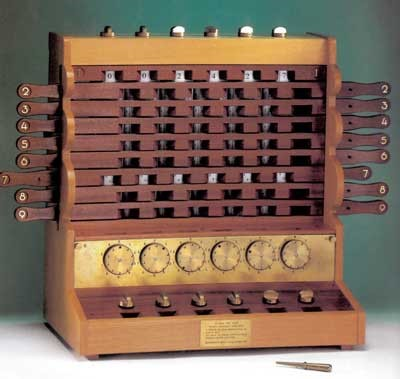</td>
     <td>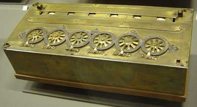 
         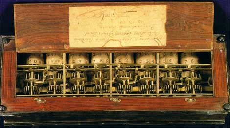</td>
  </tr>
  <tr>
     <td align="center">Máquina de Schickard (1623)</td>
     <td align="center">Calculadora de Pascal (1650)</td>
  </tr>
</table>

Desde las [primeras calculadoras
mecánicas](https://github.com/domingogallardo/historia-computadores#1)
diseñadas en el siglo XVII hasta los años 40 del siglo pasado se han
inventado multitud de máquinas y computadores mecánicos, analógicos o
electrónicos que han intentado acelerar y mejorar la precisión de los
cálculos.

Todas estas máquinas fueron más o menos sofisticadas y más o menos
configurables, pero ninguna llegó a tener la capacidad fundamental de
un computador: ser un dispositivo de propósito general capaz de
cambiar de comportamiento mediante un programa insertado en su memoria
(con la excepción del famoso Motor analítico de Charles Babbage, que
nunca llegó a construirse).

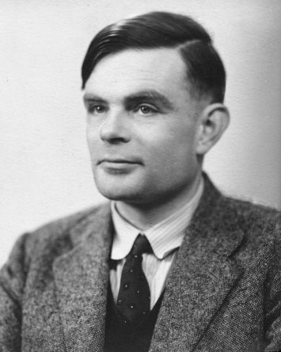

En 1936 el matemático inglés [Alan
Turing](https://en.wikipedia.org/wiki/Alan_Turing) formalizó la idea
de computador, utilizando un modelo muy sencillo de procesamiento: una
máquina abstracta con un scanner que lee y escribe 0s y 1s de una
cinta infinita (memoria) y se mueve y los escribe en función de una
tabla definida en la máquina (programa). Con esta máquina abstracta
([Máquina de Turing](https://en.wikipedia.org/wiki/Turing_machine))
Turing explora la idea de lo computable y lo no computable. ¿Existen
problemas no computables para los que no es posible inventar un
algoritmo que los resuelva? Turing demuestra que sí y establece con su
trabajo los límites de la computación.

En el mismo trabajo Turing define el concepto de *máquina universal*
que es capaz de leer de la cinta un programa cualquiera y simular su
comportamiento en otra parte de la cinta. Esta idea tuvo un profundo
impacto en el desarrollo de los computadores, porque mostraba que es
posible escribir programas que tomen como datos otros programas. Esto
abre la puerta a la idea de los programas almacenados en memoria (ya
que son otros datos más) y a la creación de compiladores e intérpretes.

En la [década de
1940](https://github.com/domingogallardo/historia-computadores#3) hubo
una explosión de máquinas de computación electrónicas y
electromecánicas. Fue una década prodigiosa en la que se desarrollaron
tecnologías cada vez más rápidas y resistentes, y se consiguieron
enormes avances en la velocidad y precisión de los cálculos.

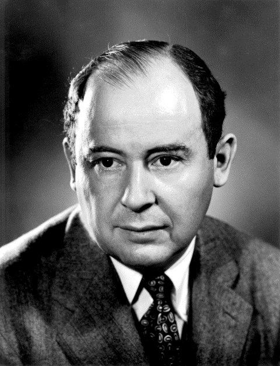

Pero no fue hasta 1945 cuando [John Von Neumann](https://en.wikipedia.org/wiki/John_von_Neumann), que trabajaba en la
construcción del [ENIAC](https://en.wikipedia.org/wiki/ENIAC), propuso su famosa arquitectura en la que por
primera vez se introducen las dos ideas claves de los computadores de
propósito general: el programa almacenado en memoria y un conjunto de
instrucciones de procesamiento que incluye el direccionamiento
indirecto.

Y en 1948, tres años después, se construyó en la universidad de
Manchester el primer computador electrónico digital de propósito
general que utilizaba esta arquitectura (llamado
[Baby](https://en.wikipedia.org/wiki/Manchester_Small-Scale_Experimental_Machine)). Fue
diseñado por Max Newmann usando la tecnología proporcionada por los
ingenieros F.C. Williams y Tom Kilburn. Williams había inventado un
dispositivo de memoria electrónico (la *válvula de Williams*) capaz de
sustituir las lentas líneas de retardo de mercurio utilizadas hasta
ese momento.

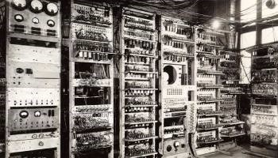

La máquina de Manchester fue el primer computador con un conjunto de
instrucciones completo, capaz de realizar saltos, condicionales y
direccionamiento indirecto. La primera ejecución de un programa fue el
21 de junio de 1948. En esa fecha Alan Turing se incorporó a la
universidad de Manchester, como director del Laboratorio de
Computación. Tres años después, con un diseño ampliado en el que
también influyó Turing, una versión mucho mayor de la máquina se
convirtió en el primer computador disponible comercialmente, el
Ferranti Mark I. El primero se instaló en la universidad de Manchester
en febrero de 1951, un mes antes que el UNIVAC I fuera entregado al
Departamento de Censo de los EEUU. Se vendieron otras 10 máquinas a
Gran Bretaña, Canadá, Holanda e Italia.

El primer programa complejo de Inteligencia Artificial, un jugador de
damas escrito por Christopher Strachey, se ejecutó en el verano de
1952 en el Ferranti Mark I en el Laboratorio de Computación de
Manchester. Strachey escribió el programa animado por Turing y usando
el manual de programación del Ferranti que Turing acababa de
escribir. Turing participó también en el desarrollo de otros programas
de IA, como un jugador de ajedrez basado en heurísticas.

### <a name="1-2"/> 1.2. Los primeros lenguajes de programación

Los primeros computadores electrónicos se programan directamente
usando el conjunto de instrucciones del procesador, en código máquina,
código hexadecimal

El primer lenguaje de un nivel algo más elevado que el código máquina
es el ensamblador. Programas que empiezan a ayudar a los
programadores: ensambladores. Hay una relación casi directa entre la
notación en ensamblador y el código hexadecimal que produce el
ensamblador.

A finales de la década de los 40 se empiezan a intentar resolver con
los primeros computadores los primeros problemas matemáticos distintos
de operaciones numéricas: codificación y descodificación, problemas
combinatorios como el coloreado del mapa o problemas de ordenación.

Uno de los primeros algoritmos de von Neumann realiza una ordenación
de un conjunto de números. Von Neumann lo describe en una carta
fechada en 1945. Utiliza el conjunto de instrucciones del EDSAC cuando
todavía no se había construido. El programa fue estudiado por Donald
Knuth en el artículo *Von Neumann's first Computer Program*, en donde
documenta que había un bug en las primeras instrucciones. Es el primer
bug escrito del que se tiene historia. Si Von Neumann hubiera podido
ejecutar el programa en el EDSAC se hubiera dado cuenta del error y
hubiera sido la primera depuración de un programa.

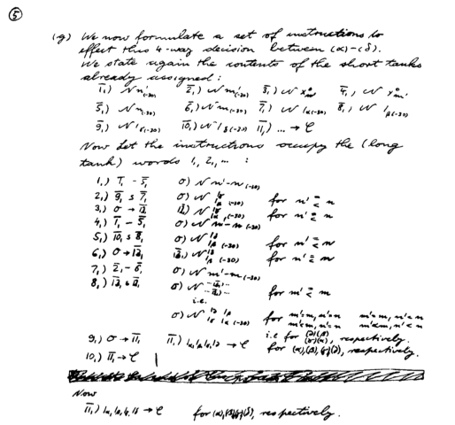

*Primer programa de Von Neumann*

(Donald Knuth, "Von Neumann's first Computer Program", Journal of the
ACM Computing Surveys (CSUR) Surveys, Volume 2 Issue 4, Dec. 1970,
Pages 247-260)

### <a name="1-6"/> 1.6 El nacimiento de los computadores comerciales

El [UNIVAC](http://en.wikipedia.org/wiki/UNIVAC_I) fue el primer
computador comercial (1951). Con este computadora aparece por primera
vez la figura del programador: manuales, cursos de formación, ofertas
de empleo, etc.

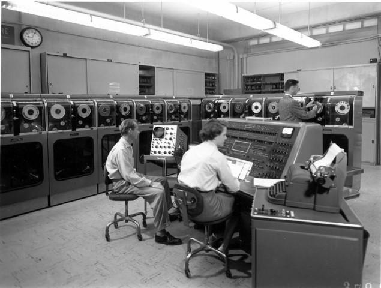

*UNIVAC*

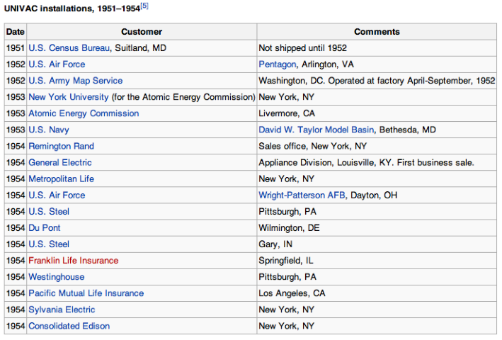

*Instalaciones comerciales del UNIVAC*

#### Manual de programación del UNIVAC (1959)

Los computadores son lentos y muy complicados de instalar y mantener.

Son más importantes las horas de funcionamiento del computador que las
horas de trabajo del programador.

La complejidad de las tareas a programar es pequeña y es suficiente
con los programas en ensamblador.

El
[manual de 1959 de programación del UNIVAC](http://www.bitsavers.org/pdf/univac/univac1/UNIVAC1_Programming_1959.pdf)
es una referencia histórica de gran interés de la que hemos extraído
las siguientes imágenes:

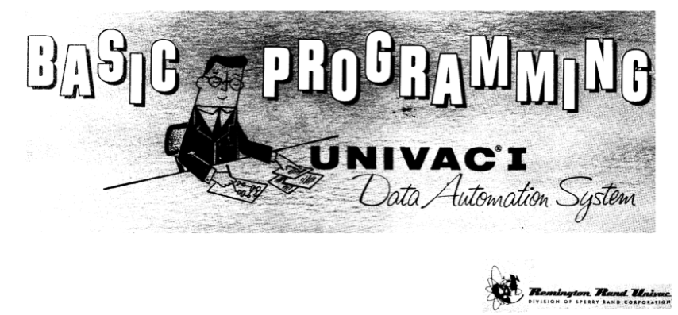

*Manual del UNIVAC*

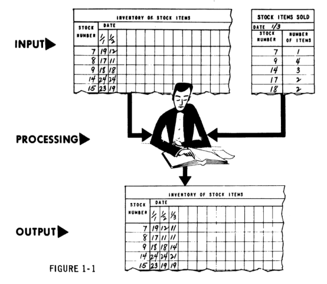
*Programación del UNIVAC*

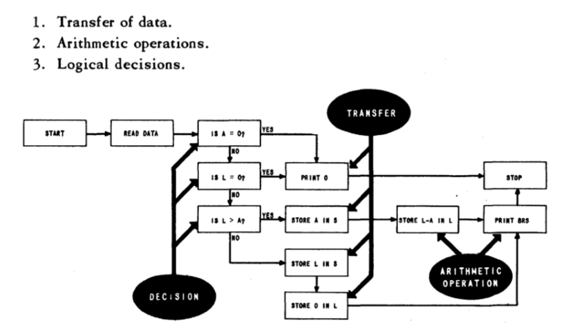
*Algoritmo UNIVAC*

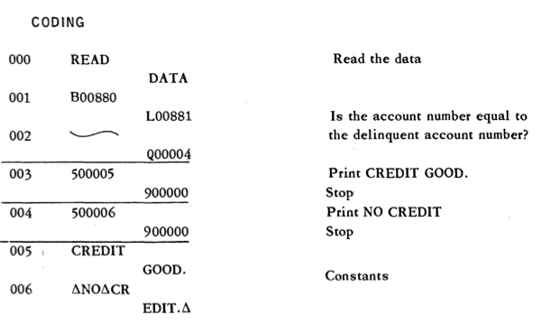
*Codigo UNIVAC*

Se realizan los primeros anuncios y reportajes de televisión sobre
computadores ([YouTube](https://www.youtube.com/watch?v=Pd63MHGQygQ))

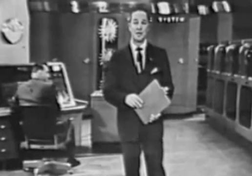

*Anuncio UNIVAC*

#### IBM 704

El [IBM 704](http://en.wikipedia.org/wiki/IBM_704) fue el otro gran
ordenador comercial de la década de los 50.

Tuvo una difusión mucho mayor que el UNIVAC: centros gubernamentales,
universidades.

Los primeros lenguajes de programación de alto nivel se desarrollan
para este computador.

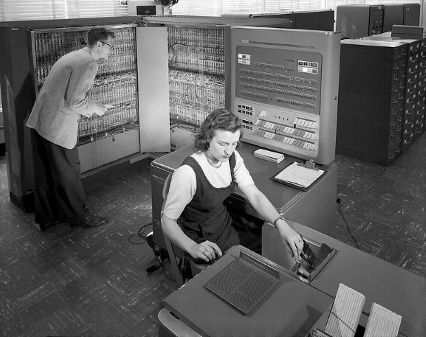

*Foto IBM 704*

#### Programando los primeros computadores

> The UNIVAC I was an interesting machine to program, with its mercury
> delay line storage and its short mean time to failure. Programs were
> entered into the computer by typing them onto steel magnetic tape, a
> major innovation at that time.

> Working with the IBM 704 at NYU was an entirely different experience
> from the UNIVAC I. It was built for executing scientific
> applications, and had as its major innovation a magnetic core
> memory, replacing the Williams tube memory of the IBM 701 and the
> primary memory drum of the IBM 650. It also had a floating point
> arithmetic unit and index registers to form effective addresses,
> both of which were significant advances at that time. The machine
> had the equivalent of 128 KB primary memory, 32 KB of secondary drum
> memory and magnetic tapes that held 5 MB of data. It operated at
> 0.04 MIPS, and cost $3 million dollars in 1957, the equivalent of
> perhaps $20 million today.

> George Sadowsky,
> [My Second Computer was a UNIVAC I](http://www.georgesadowsky.com/papers/Univac-I.pdf)

### <a name="1-7"/> 1.7. Los primeros lenguajes de alto nivel

Los primeros lenguajes de alto nivel se desarrollaron a finales de la
década de los 50:

- FORTRAN en 1956
- Lisp en 1958

Ambos lenguajes planteaban dos enfoques muy distintos desde el
principio:

* FORTRAN
	* Primer lenguaje comercial, equipo de IBM dirigido por John
      W. Backus
	* Lenguaje imperativo: estado, estructuras de control, contador de
      programa, celdas de memoria
	* Lenguaje compilado
* Lisp
	* Lenguaje diseñado en un departamento de investigación, un equipo
      del MIT dirigido por John McCarthy
	* Lenguaje funcional: funciones, recursión, listas, símbolos
	* Lenguaje interpretado

#### FORTRAN

Desarrollado por IBM para programar el IBM 704. Algunos datos:

- Su nombre proviene de *FORmula TRANslating system*.
- El primer manual de FORTRAN se imprime en octubre de 1956 para el IBM 704.
- El primer compilador se comercializa en abril de 1956.

Cita de John Backus ([Wikipedia sobre FORTRAN](http://en.wikipedia.org/wiki/Fortran)):

> Much of my work has come from being lazy. I didn't like writing
> programs, and so, when I was working on the IBM 701, writing
> programs for computing missile trajectories, I started work on a
> programming system to make it easier to write programs.

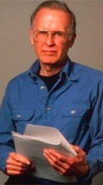

*John Backus*

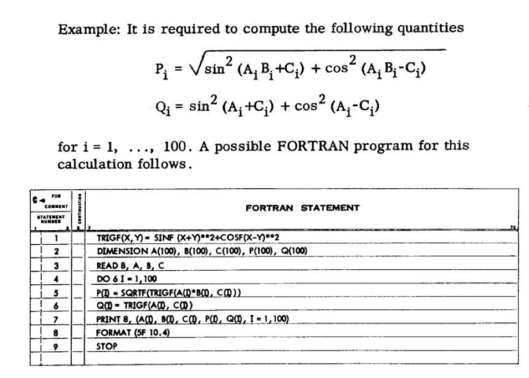

*Ejemplo FORTRAN*

Tomado del
[manual de FORTRAN del IBM 704](http://archive.computerhistory.org/resources/text/Fortran/102665486.05.01.acc.pdf)

#### Lisp

El otro lenguaje de alto nivel desarrollado en esa época es el
Lisp. Desarrollado a finales de los 50 en el MIT por John McCarthy.

Aunque históricamente el nombre del lenguaje se solía escribir con
letras mayúsculas (LISP), posteriormente se ha popularizado el uso de
la mayúscula sólo para la primera letra (Lisp). Esta forma es más fiel
al origen del nombre del lenguaje. *Lisp* no es un acrónimo, sino la
contracción de la expresión *List Processing*. El procesamiento de
listas es una de las características principales del Lisp.

McCarthy explica en un artículo de 1979 la historia inicial del Lisp:

> [...] My desire for an algebraic list processing language for
> artificial intelligence work on the IBM 704 computer arose in the
> summer of 1956 during the Dartmouth Summer Research Project on
> Artificial Intelligence which was the first organized study of
> AI. [...]

> [...] There were two motivations for developing a language for the
> IBM 704. First, IBM was generously establishing a New England
> Computation Center at M.I.T. which Dartmouth would use. Second, IBM
> was undertaking to develop a program for proving theorems in plane
> geometry (based on an idea of Marvin Minsky's), and I was to serve
> as a consultant to that project. At the time, IBM looked like a good
> bet to pursue artificial intelligence research vigorously, and
> further projects were expected. It was not then clear whether IBM's
> FORTRAN project would lead to a language within which list
> processing could conveniently be carried out or whether a new
> language would be required.[...]

> [...] I invented conditional expressions in connection with a set of
> chess legal move routines I wrote in FORTRAN for the IBM 704 at
> M.I.T. during 1957-58. This program did not use list processing. The
> IF statement provided in FORTRAN 1 and FORTRAN 2 was very awkward to
> use, and it was natural to invent a function XIF(M,N1,N2) whose
> value was N1 or N2 according to whether the expression M was zero or
> not. The function shortened many programs and made them easier to
> understand, but it had to be used sparingly, because all three
> arguments had to be evaluated before XIF was entered, since XIF was
> called as an ordinary FORTRAN function though written in machine
> language. This led to the invention of the true conditional
> expression which evaluates only one of N1 and N2 according to
> whether M is true or false and to a desire for a programming
> language that would allow its use.[...]

> John McCarthy, [History of LISP]

[History of LISP]: http://www-formal.stanford.edu/jmc/history/lisp/lisp.html

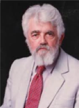

*John McCarthy*

Uno de los primeros manuales de Lisp publicados es el
[manual de LISP](http://bitsavers.org/pdf/mit/rle_lisp/LISP_I_Programmers_Manual_Mar60.pdf)
de 1960 para el IBM 704 escrito por Phyllis A. Fox. del grupo de
investigación del MIT dirigido por McCarthy.

Un ejemplo de código Lisp:

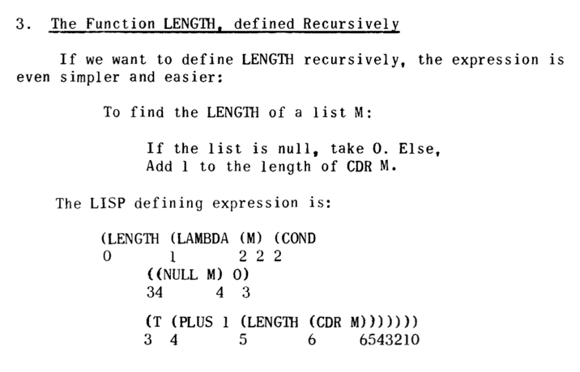

*Ejemplo LISP*

Tomado de
"[The Programming Language LISP](http://www.softwarepreservation.org/projects/LISP/lisp15_family#Berkeley_and_Bobrow_)",
MIT Press, 1964

### <a name="1-8"/> 1.8. La explosión de los lenguajes de programación

Desde 1954 hasta la actualidad se han documentado más de 2.500
(consultar en [The Language List]).  Entre 1952 y 1972 alrededor de
200 lenguajes. Una decena fueron realmente siginificativos y tuvieron
influencia en el desarrollo de lenguajes posteriores.

[The Language List]: http://people.ku.edu/~nkinners/LangList/Extras/langlist.htm

#### Genealogía de los lenguajes de programación

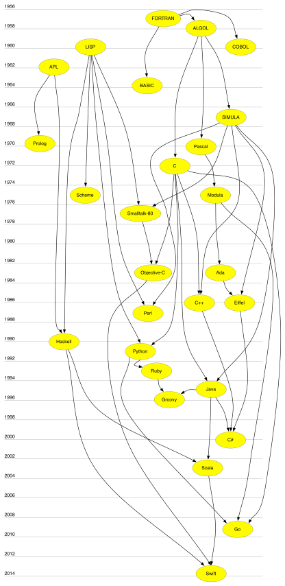

*Genealogía de los LP*

Algunas notas sobre la genealogía:

* APL es un lenguaje algebraico declarativo de especificación de
  funciones y circuitos lógicos. Su carácter declarativo ha tenido
  influencia en lenguajes como Prolog o Haskell.

* Lisp no sólo es un lenguaje funcional, sino que también es el primer
  lenguaje interpretado, con muchas características de tiempo de
  ejecución y poco chequeo estático. En esos aspectos ha influido en
  lenguajes dinámicos no funcionales como Python o
  Smalltalk. Lenguajes como Smalltalk o Objective-C también heredan de
  Lisp algunas características funcionales como la posibilidad de usar
  un bloque de código como un objeto primitivo que se crea en tiempo
  de ejecución y que se puede asignar o pasar como parámetro. Es lo
  que se denomina *clausura* en el paradigma de programación
  funcional.

* SIMULA es el primer lenguaje que define conceptos como clase u
  objeto. Es el origen de la programación orientada a objetos estática
  y fuertemente tipeada. Lenguajes como C++, Eiffel, o Java toman esta
  idea. Frente a esta tendencia se encuentra otra visión de la
  programación orientada a objetos de lenguajes como Smalltalk u
  Objective-C en la que se enfatiza más aspectos dinámicos como el
  paso de mensajes o la modificación de clases en tiempo de ejecución.

#### Algunos lenguajes importantes y su fecha de creación

| 1950-1960  | 1970  | 1980 | 1990 | 2000 |
| :--------- | :---: | :---: | :---: | ---: |
| 1957 FORTRAN | 1970 Pascal     | 1980 Smalltalk-80   |  1990 Haskell   | 2000 C#  |  
| 1958 ALGOL |  1972 Prolog  | 1983 Objective-C   | 1991 Python   | 2003 Scala  |  
| 1960 Lisp | 1972 C | 1983 Ada   |  1993 Ruby  | 2003 Groovy  |  
| 1960 COBOL | 1975 Scheme | 1986 C++  | 1995 Java  | 2009 Go  |  
| 1962 APL |  1975 Modula   | 1986 Eiffel   |   |  2014 Swift |  
| 1964 BASIC |      | 1987 Perl   |    |   |  
| 1967 SIMULA |      |    |    |   |  

#### Aspectos que provocan la evolución de los LP

¿Por qué hay tanta variedad en los lenguajes de programación? Hay
muchos aspectos que fomentan esta variedad y que provocan la necesidad
de nuevos lenguajes:

* Nuevos recursos y tipos de ordenadores
* Nuevas aplicaciones y necesidades de los usuarios
* Nuevos métodos de programación
* Descubrimientos en estudios teóricos
* Necesidad de estandarización

La siguiente tabla (extraída del libro *Programming Languages. Design
and Implementation*, de Terrence W. Pratt y Marvin V. Zelkowitz)
muestra una pequeña lista de los lenguajes y las influencias que
fueron importante a finales del siglo 20.

*Evolución de los lenguajes*

#### Los creadores de los LPs

Si comprobamos la historia de los lenguajes de programación, podemos
clasificar a sus creadores en tres grandes categorías:

* Investigadores trabajando en empresas
([Backus](http://en.wikipedia.org/wiki/John_Backus), IBM-FORTRAN,
[Gosling](http://en.wikipedia.org/wiki/James_Gosling), Sun-Java)
* Investigadores en universidades y departamentos de Informática
  ([McCarthy](http://en.wikipedia.org/wiki/John_McCarthy_(computer_scientist)),
  MIT-Lisp, [Wirth](http://en.wikipedia.org/wiki/Niklaus_Wirth),
  ETH-Pascal, [Odersky](http://en.wikipedia.org/wiki/Martin_Odersky),
  EHT-Scala)
* Desarrolladores open source que distribuyen su trabajo a la
  comunidad ([Wall](http://en.wikipedia.org/wiki/Larry_Wall), Perl,
  [Matsumoto](http://en.wikipedia.org/wiki/Yukihiro_Matsumoto), Ruby)

### <a name="1-9"/> 1.9. Lenguajes de programación en la actualidad

El índice
[TIOBE](http://www.tiobe.com/index.php/content/paperinfo/tpci/index.html)
es un indicador de la popularidad de los lenguajes de programación. El
índice se actualiza una vez al mes. Las puntaciones se basan en
estadísticas no reveladas que incluyen el número de ingenieros en todo
el mundo, cursos y aplicaciones desarrolladas. También se utilizan
resultados obtenidos en los motores de búsqueda más usados.

El índice TIOBE no trata de medir el número de líneas escritas en los
lenguajes de programación sino su *popularidad* e *importancia* en la
comunidad.

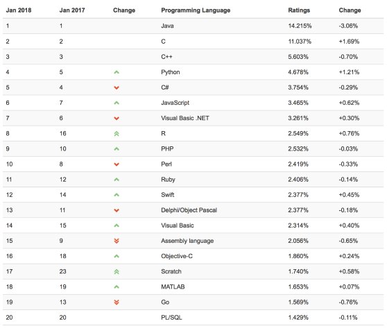

*Lista TIOBE*

También es muy interesante comprobar la evolución de los 10 lenguajes
más populares en los últimos 10 años.

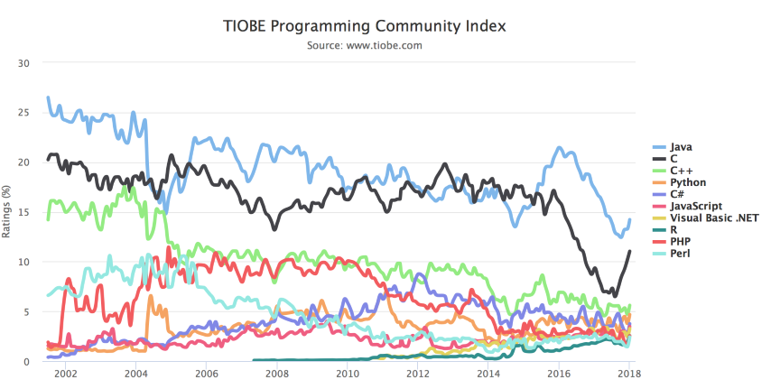

*Evolución TIOBE*

#### La evolución no se detiene

Es interesante comprobar que cada vez es más fácil desarrollar nuevos
lenguajes de programación. Las técnicas y herramientas de
procesamiento de lenguajes se han popularizado cada vez más y son
accesibles a mayor número de personas. Los lenguajes ya no sólo se
crean en departamentos con un gran número de investigadores, sino
también en comunidades open source formadas por voluntarios
interesados y motivados

Ejemplos de nuevos lenguajes y sus creadores:

**Ruby**

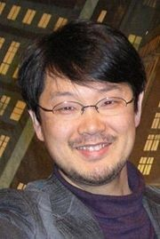

*Yukihiro Matsumoto*

* [Ruby](http://www.ruby-lang.org/)
  ([Wikipedia](https://en.wikipedia.org/wiki/Ruby_(programming_language))),
  un lenguaje de programación ideado en 1993 por el desarrollador
  japonés Yukihiro Matsumoto
* Lenguaje multi-paradigma interpretado y muy expresivo que
  actualmente se utiliza tanto para desarrollar aplicaciones web como
  videojuegos.
* Proyecto vivo, cada año aparecen nuevas versiones

**Scala**

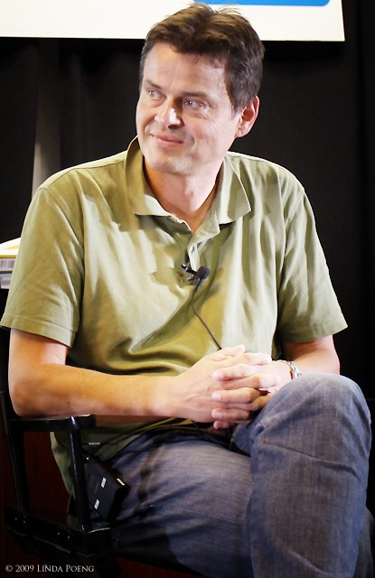

*Martin Odersky*

* [Scala](http://www.scala-lang.org/)
  ([Wikipedia](https://en.wikipedia.org/wiki/Scala_(programming_language))),
  diseñado en 2003 por el profesor alemán Martin Odersky
* Respuesta a los problemas de los lenguajes tradicionales imperativos
  para manejar la concurrencia
* Está implementado sobre Java y corre en la Máquina Virtual Java

**Go**

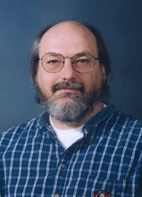

*Ken Thompson*

* [Go](http://golang.org/)
  ([Wikipedia](https://en.wikipedia.org/wiki/Go_(programming_language))),
  el nuevo lenguaje de programación de Google lanzado en 2009
* Desarrollado, entre otros, por Ken Thompson, uno de los padres del
  UNIX
* Una mezcla de C y Python que intenta conseguir un lenguaje de
programación de sistemas muy eficiente, expresivo y también
multiparadigma.

**Swift**

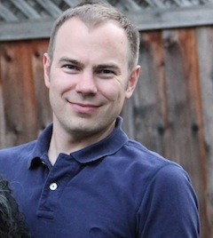

*Chris Lattner*

* [Swift](https://developer.apple.com/swift/)
  ([Wikipedia](https://en.wikipedia.org/wiki/Swift_(programming_language))),
  el nuevo lenguaje de programación de Apple lanzado en 2014
* [Proyecto _open source_](https://swift.org) en el que se puede
  observar su
  [evolución y _roadmap_ futuro](https://github.com/apple/swift-evolution)
* Desarrollado, entre otros, por
  [Chris Lattner](http://www.nondot.org/sabre/), autor del sistema
  _LLVM Compiler Infrastructure_, conjunto de compilador, depurador,
  optimizador, etc. de código C, C++ y Objective-C.
* Lenguaje moderno, multiparadigma (programación orientada a objetos y
  funcional) fuertemente tipeado y compilado.

## <a name="2"/> 2. Elementos de los lenguajes de programación

### <a name="2-1"/> 2.1. Definición de la Encyclopedia of Computer Science

A programming language is a set of characters, rules for combining
them, and rules specifying their effects when executed by a computer,
which have the following four characteristics:

1. It requires no knowledge of machine code on the part of the user
2. It has machine independence
3. Is translated into machine language
4. Employs a notation that is closer to that of the specific problem
      being solved than is machine code

### <a name="2-2"/> 2.2. Definición de Abelson y Sussman

> We are about to study the idea of a **computational
> process**. Computational processes are abstract beings that inhabit
> computers. As they evolve, processes manipulate other abstract
> things called **data**. The evolution of a process is directed by a
> pattern of rules called a program. […] The programs we use to
> conjure processes are like a sorcerer's spells. They are carefully
> composed from symbolic expressions in arcane and esoteric
> programming languages that prescribe the tasks we want our processes
> to perform.

Y otra idea fundamental

> A powerful programming language is more than just a means for
> instructing a computer to perform tasks. The language also serves as
> a framework within which we organize our ideas about
> processes. Thus, when we describe a language, we should pay
> particular attention to the means that the language provides for
> combining simple ideas to form more complex ideas.

### <a name="2-3"/> 2.3. Características de un LP

1. Define un proceso que se ejecuta en un computador
2. Es de alto nivel, cercano a los problemas que se quieren resolver
   (abstracción)
3. Permite construir nuevas abstracciones que se adapten al dominio
   que se programa

###  <a name="2-4"/> 2.4. Elementos de un LP

Para Abelson y Sussman, todos los lenguajes de progamación permiten
combinar ideas simples en ideas más complejas mediante los siguientes
tres mecanismos

* **Expresiones primitivas** que representan las entidades más simples
  del lenguaje
* **Mecanismos de combinación** con los que se construyen elementos
  compuestos a partir de elementos más simples
* **Mecanismos de abstracción** con los que dar nombre a los elementos
  compuestos y manipularlos como unidades

### <a name="2-5"/> 2.5. Sintaxis y semántica

*Sintaxis*: un conjunto de reglas que definen qué expresiones de texto
 son correctas. Por ejemplo, en C todas las sentencias deben terminar
 en ';'

Los lenguajes de programación se ejecutan en un computador y tienen
una determinada semántica que define cuál será el resultado de la
ejecución de un programa.

### <a name="2-6"/> 2.6. Los lenguajes son para las personas

Los lenguajes de programación deben ser precisos, deben poder
traducirse sin ambigüedad en lenguaje máquina para que sean ejecutados
por computadores. Pero deben ser utilizados (leídos, comentados,
probados, etc.) por personas.

La programación es una actividad colaborativa y debe basarse en la
comunicación.

### <a name="2-7"/> 2.7. Importancia del aprendizaje de técnicas de LPs

Es importante conocer cómo funciona "por dentro" un lenguaje de
programación y sus características comparadas.

* Mejora el uso del lenguaje de programación
* Incrementa el vocabulario de los elementos de programación
* Permite una mejor elección del lenguaje de programación
* Mejora la habilidad para desarrollar programas efectivos y eficientes
* Facilita el aprendizaje de un nuevo lenguaje de programación
* Facilita el diseño de nuevos lenguajes de programación

## <a name="3"/> 3. Abstracción

Una misión fundamental de los lenguajes de programación es
proporcionar herramientas que sirvan para construir estas
abstracciones. Cuando definimos una abstracción le damos un **nombre**
a una entidad del lenguaje (una variable, una función, una clase,
etc.).

Escoger un buen nombre para los elementos que vamos construyendo en
nuestro programas es fundamental para conseguir un código legible y
reutilizable.

### <a name="3-1"/> 3.1. Modelar como una actividad fundamental

* Para escribir un programa que preste unos servicios es fundamental
  modelar el dominio sobre el que va a trabajar
* Es necesario definir distintas abstracciones (tanto APIs, como
  datos) que nos permitan tratar sus elementos y comunicarnos
  correctamente con los usuarios que van a utilizar el programa.
* Las abstracciones que vamos construyendo van apoyándose unas en
  otras y permiten hacer compresible y comunicable un problema
  complejo
* Ejemplo: el modelado del funcionamiento de una biblioteca contiene
  abstracciones como "libros", "préstamo", "reserva", o "libros
  disponibles" que representan conceptos del dominio que deben ser
  implementados en nuestra solución

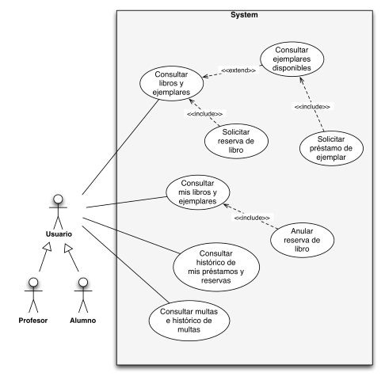

*Casos de uso biblioteca*

### <a name="3-2"/> 3.2. Abstracciones computacionales

Existen abstracciones propias de la informática (*computer science*),
que se utilizan en múltiples dominios. Por ejemplo, abstracciones de
datos como:

* Listas
* Árboles
* Grafos
* Tablas hash

También existen abstracciones que nos permiten tratar con dispositivos
y ordenadores externos:

* Fichero
* Raster gráfico
* Protocolo TCP/IP

### <a name="3-3"/> 3.3. Construcción de abstracciones

Uno de los trabajos principales de un informático es la construcción
de abstracciones que permitan ahorrar tiempo y esfuerzo a la hora de
tratar con la complejidad del mundo real.

Cita de Joel Spolsky en su blog
[Joel on Software](http://www.joelonsoftware.com/articles/LeakyAbstractions.html)

> TCP is what computer scientists like to call an abstraction: a
> simplification of something much more complicated that is going on
> under the covers. As it turns out, a lot of computer programming
> consists of building abstractions. What is a string library? It's a
> way to pretend that computers can manipulate strings just as easily
> as they can manipulate numbers. What is a file system? It's a way to
> pretend that a hard drive isn't really a bunch of spinning magnetic
> platters that can store bits at certain locations, but rather a
> hierarchical system of folders-within-folders containing individual
> files that in turn consist of one or more strings of bytes.

### <a name="3-4"/> 3.4. Distintos aspectos de los lenguajes de programación

La programación es una disciplina compleja, que tiene que tener en
cuenta múltiples aspectos de los lenguajes de programación y las API:

1. Programas como procesos *runtime* que se ejecutan en un
   computador. Tenemos que entender qué pasa cuando se crea un objeto,
   cuánto tiempo permanece en memoria, cuál es el ámbito de una
   variable, etc.

    Herramientas: depuradores, analizadores de rendimiento.

2. Programas como declaraciones estáticas. Hay que considerar un
   programa desde el punto de vista de una declaración de nuevos
   tipos, nuevos métodos, tipos genéricos, herencia entre clases, etc.

    Herramientas: entornos de programación con autocompletado de
    código, detección de errores sintácticos.

3. Programas como comunicación y actividad social. Tenemos que tener
   en cuenta que un programa va a ser usado por otras personas, leído,
   extendido, mantenido, modificado. Los programas siempre se van a
   modificar.

    Herramientas: sistemas de control de versiones (Git, Mercurial,
    Github, Bitbucket), de gestión incidencias (Jira) , tests que
    evitan errores de regresión, ...

## <a name="4"/> 4. Paradigmas de programación

### <a name="4-1"/> 4.1. ¿Qué es un paradigma de programación?

Un paradigma define un conjunto de características, patrones y estilos
de programación basados en alguna idea fundamental. Por ejemplo el
paradigma funcional se basa en la idea que una computación se puede
especificar como un conjunto de funciones que transforman valores de
entrada en valores de salida.

Es conveniente ver un paradigma como un estilo de programación que
puede usarse en distintos lenguajes de programación y expresarse con
distintas sintaxis. Por ejemplo, se puede escribir código que use
programación lógica en Prolog (sería lo más natural), pero también en
Java, usando algún API específica.

Normalmente todos los lenguajes tienen características de más de un
paradigma. Por motivos prácticos los lenguajes más populares no se
limitan de forma estricta o pura a un único paradigma de programación.

Por ejemplo, el Prolog es un lenguaje en su mayor parte lógico y
declarativo, pero tiene operadores imperativos como el *corte*. A
pesar de ello, es normal adscribir un lenguaje al paradigma en el que
es más sencillo o natural escribir código usando sus construcciones.

Existen lenguajes que refuerzan y promueven la expresión de código en
más de un paradigma de programación. Y lo hacen no por necesidad o
accidente, sino con el intento explícito de fusionar más de un
paradigma en una forma única de programar. Estos lenguajes se
denominan lenguajes *multi-paradigma*.

Por ejemplo, Scala es lenguaje multi-paradigma en el que Martin
Odersky, su creador, mezcla características de programación orientada
a objetos con programación funcional.

Prolog o Lisp, aunque tienen características no lógicas o no
funcionales, no pueden ser considerados multi-paradigma porque no
fueron creados con la idea de integrar paradigmas variados en una
forma coherente de expresión.

### <a name="4-2"/> 4.2. Paradigmas más importantes

* Paradigma funcional
* Paradigma lógico
* Paradigma imperativo o procedural
* Paradigma orientado a objetos

### <a name="4-3"/> 4.3. Paradigma funcional

Resumen de las características principales:

* La computación se realiza mediante la evaluación de expresiones
* Definición de funciones
* Funciones como datos primitivos
* Valores sin efectos laterales, no existen referencias a celdas de
  memoria en las que se guarda un estado modificable
* Programación declarativa (en la programación funcional *pura*)

Lenguajes: Lisp, Scheme, Haskell, Scala, Clojure.

Ejemplo de código (Lisp):

	(define (factorial x)
	   (if (= x 0)
	      1
	      (* x (factorial (- x 1)))))

	(factorial 8)
	40320
	(factorial 30)
	265252859812191058636308480000000

### <a name="4-4"/> 4.4. Paradigma lógico

Características:

* Definición de reglas
* Unificación como elemento de computación
* Programación declarativa

Lenguajes: Prolog, Mercury, Oz.

Ejemplo de código (Prolog):

	padrede('juan', 'maria'). % juan es padre de maria
	padrede('pablo', 'juan'). % pablo es padre de juan
	padrede('pablo', 'marcela').
	padrede('carlos', 'debora').

	hijode(A,B) :- padrede(B,A).
	abuelode(A,B) :-  padrede(A,C), padrede(C,B).
	hermanode(A,B) :- padrede(C,A) , padrede(C,B), A \== B.        

	familiarde(A,B) :- padrede(A,B).
	familiarde(A,B) :- hijode(A,B).
	familiarde(A,B) :- hermanode(A,B).

	?- hermanode('juan', 'marcela').
	yes
	?- hermanode('carlos', 'juan').
	no
	?- abuelode('pablo', 'maria').
	yes
	?- abuelode('maria', 'pablo').
	no

### <a name="4-5"/> 4.5. Paradigma imperativo

Los lenguajes de programación que cumplen el paradigma imperativo se
caracterizan por tener un estado implícito que es modificado mediante
instrucciones o comandos del lenguaje. Como resultado, estos lenguajes
tienen una noción de secuenciación de los comandos para permitir un
control preciso y determinista del estado.

Características:

* Definición de procedimientos
* Definición de tipos de datos
* Chequeo de tipos en tiempo de compilación
* Cambio de estado de variables
* Pasos de ejecución de un proceso

Ejemplo (Pascal):

	type
	   tDimension = 1..100;
	   eMatriz(f,c: tDimension) = array [1..f,1..c] of real;

	   tRango = record
	      f,c: tDimension value 1;
	   end;

	   tpMatriz = ^eMatriz;

	procedure EscribirMatriz(var m: tpMatriz);
	var filas,col : integer;
	begin
	   for filas := 1 to m^.f do begin
	      for col := 1 to m^.c do
	         write(m^[filas,col]:7:2);
	      writeln(resultado);
	      writeln(resultado)
	     end;    
	end;

### <a name="4-6"/> 4.6. Paradigma orientado a objetos

Características:

* Definición de clases y herencia
* Objetos como abstracción de datos y procedimientos
* Polimorfismo y chequeo de tipos en tiempo de ejecución

Ejemplo (Java):

	public class Bicicleta {
	    public int marcha;
	    public int velocidad;

	    public Bicicleta(int velocidadInicial, int marchaInicial) {
	        marcha = marchaInicial;
	        velocidad = velocidadInicial;
	    }

	    public void setMarcha(int nuevoValor) {
	        marcha = nuevoValor;
	    }

	    public void frenar(int decremento) {
	        velocidad -= decremento;
	    }

	    public void acelerar(int incremento) {
	        velocidad += incremento;
	    }
	}

	public class MountainBike extends Bicicleta {
	    public int alturaSillin;

	    public MountainBike(int alturaInicial,
	                        int velocidadInicial,
	                        int marchaInicial) {
	        super(velocidadInicial, marchaInicial);
	        alturaSillin = alturaInicial;
	    }   

	    public void setAltura(int nuevoValor) {
	        alturaSillin = nuevoValor;
	    }   
	}

	public class Excursion {
        public static void main(String[] args) {
           MountainBike miBicicleta = new MoutainBike(10,10,3);
           miBicicleta.acelerar(10);
           miBicicleta.setMarcha(4);
           miBicicleta.frenar(10);
        }
	}

## <a name="5"/> 5. Compiladores e intérpretes

En el nivel de abstracción más bajo, la ejecución de un programa en un
computador consiste en la ejecución de un conjunto de instrucciones
del código máquina del procesador. Por ejemplo, la siguiente figura
muestra un ejemplo de un programa en ensamblador para un antiguo
procesador (el Z80, procesador de 8 bits del mítico
[ZX Spectrum](http://es.wikipedia.org/wiki/Sinclair_ZX_Spectrum), uno
de los primeros ordenadores personales en Europa):

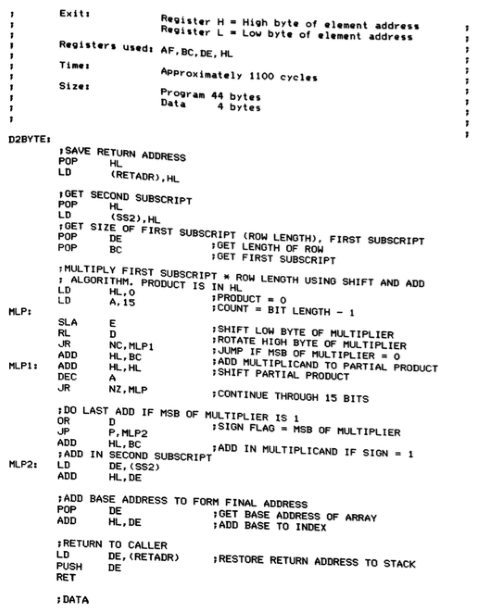

*Ensamblador Z80*

Dependiendo del tipo de lenguaje de programación en el que esté
escrito este programa, el código máquina que se estará ejecutando
será:

* el resultado de la compilación del programa original (en el caso de
  un lenguaje compilado)
* el código de un programa (intérprete) que realiza la interpretación
  del programa original (en el caso de un lenguaje interpretado)

### <a name="5-1"/> 5.1. Compilación

La siguiente figura (tomada, como las demás de este apartado del
*Programming Language Pragmatics*) muestra el proceso de generación y
ejecución de un programa compilado.

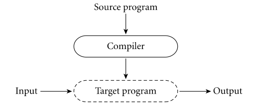

*Compilación*

El proceso de compilación de un programa consiste en la traducción del
código fuente original en el lenguaje de alto nivel al código máquina
específico del procesador en el que va a ejecutarse el programa. El
código máquina resultante sólo corre en el procesador para el que se
ha generado. Por ejemplo, un programa C compilado para un procesador
Intel no puede ejecutarse en un procesador ARM, como los
[Ax de Apple](http://en.wikipedia.org/wiki/Apple_system_on_a_chip).

- Ejemplos: C, C++
- Diferentes momentos en la vida de un programa: tiempo de compilación
  y tiempo de ejecución
- Mayor eficiencia

### <a name="5-2"/> 5.2. Interpretación

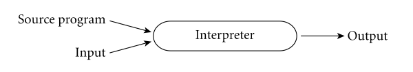

*Interpretación*

- Ejemplos: BASIC, Lisp, Scheme, Python, Ruby
- No hay diferencia entre el tiempo de compilación y el tiempo de ejecución
- Mayor flexibilidad: el código se puede construir y ejecutar "on the
  fly" (funciones lambda o clousures)

Los lenguajes interpretados suelen proporcionar un *shell* o
intérprete. Se trata de un entorno interactivo en el que podemos
definir y evaluar expresiones. Este entorno se denomina en los
círculos de programación funcional un *REPL* (*Read*, *Eval*, *Print*,
*Loop*) y ya se utilizó en los primeros años de implementación del
Lisp. El uso del *REPL* promueve una programación interactiva en la
que continuamente evaluamos y comprobamos el código que desarrollamos.

### <a name="5-3"/> 5.3. Enfoques mixtos

Existen también enfoques mixtos, como el usado por el lenguaje de
programación Java, en el que se realizan ambos procesos.

En una primera fase el compilador de Java (`javac`) realiza una
traducción del código fuente original a un _código intermedio_ binario
independiente del procesado, denominado _bytecode_. Este código
binario es multiplataforma.

El código intermedio es interpretado después por un el intérprete
(`java`) que ya sí que es dependiente de la plataforma. En la figura
el intérprete se denomina _Virtual machine_ (no confundir con el
concepto de _máquina virtual_ que permite emular un sistema operativo,
por ejemplo VirtualBox).

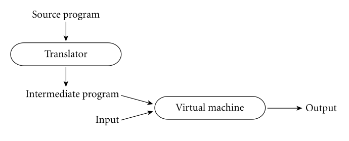

*Enfoque mixto (Java)*

- Ejemplos: Java, Scala

## 6. Bibliografía

* Introducción capítulo 1 SICP, *Building Abstractions with
  Procedures*
* Capítulo 1.2 PLP, *The Programming Language Spectrum*
* Capítulo 1.3 PLP, *Why Study Programming Languages*
* Capítulo 1.4 PLP, *Compilation and Interpretation*
* Raul Rojas, "Konrad Zuse's legacy the architecture of the Z1 and
  Z3", IEEE Annals of the History of Computing, Vol. 19, No. 2, 1997
* Charles Petzold, "Code", Microsoft Press, 2000 (Capítulo 18: "From
  Abaci to Chips")
* Jack Copeland, "The Modern History of Computing", The Stanford
  Encyclopedia of Philosophy (Fall 2008 Edition), URL =
  <http://plato.stanford.edu/archives/fall2008/entries/computing-history/>
* Georgi Dalakov, "History of Computers", URL =
  <http://history-computer.com>

----

Lenguajes y Paradigmas de Programación, curso 2017-18  
© Departamento Ciencia de la Computación e Inteligencia Artificial, Universidad de Alicante  
Domingo Gallardo, Cristina Pomares, Antonio Botía, Francisco Martínez
