# Tema 2: Programación funcional 

## Contenidos

- [1. El paradigma de Programación Funcional](#1)
    - [1.1 Pasado y presente del paradigma funcional](#1-1)
    - [1.2. Programación declarativa vs. imperativa](#1-2)
	- [1.3. Evaluación de expresiones](#1-3)
	- [1.4. Modelo de computación de sustitución](#1-4)
- [2. Scheme como lenguaje de programación funcional](#2)
	- [2.1. Funciones y formas especiales](#2-1)
	- [2.2. Formas especiales en Scheme: `define`, `if`, `cond`](#2-2)
	- [2.3. Forma especial `quote` y símbolos](#2-3)
	- [2.4. Listas](#2-4)
    - [2.5. Recursión](#2-5)
    - [2.6. Recursión y listas](#2-6)
- [3. Tipos de datos compuestos en Scheme](#3)
	- [3.1. El tipo de dato pareja](#3-1)
	- [3.2. Las parejas son objetos de primera clase](#3-2)
	- [3.3.  Diagramas *caja-y-puntero*](#3-3)
- [4. Listas en Scheme](#4)
    - [4.1. Implementación de listas en Scheme](#4-1)
    - [4.2. Listas con elementos compuestos](#4-2)
    - [4.3. Funciones recursivas sobre listas](#4-3)
    - [4.4. Funciones con número variable de argumentos](#4-4)
- [5. Funciones como tipos de datos de primera clase](#5)
    - [5.1. Forma especial `lambda`](#5-1)
    - [5.2. Funciones como argumentos de otras funciones](#5-2)
    - [5.3. Funciones que devuelven otras funciones](#5-3)
    - [5.4. Funciones en estructuras de datos](#5-4)
    - [5.5. Funciones de orden superior](#5-5)

## Bibliografía - SICP

En este tema explicamos conceptos de los siguientes capítulos del
libro *Structure and Intepretation of Computer Programs*:

- [1.1.1 - Expressions](https://mitpress.mit.edu/sicp/full-text/book/book-Z-H-10.html#%_sec_1.1.1)
- [1.1.2 - Naming and environment](https://mitpress.mit.edu/sicp/full-text/book/book-Z-H-10.html#%_sec_1.1.2)
- [1.1.3 - Evaluating combinations](https://mitpress.mit.edu/sicp/full-text/book/book-Z-H-10.html#%_sec_1.1.3)
- [1.1.4 - Compound procedures](https://mitpress.mit.edu/sicp/full-text/book/book-Z-H-10.html#%_sec_1.1.4)
- [1.1.5 - The Substitution Model for Procedure Application](https://mitpress.mit.edu/sicp/full-text/book/book-Z-H-10.html#%_sec_1.1.5)
- [1.1.6 - Conditional Expressions and Predicates](https://mitpress.mit.edu/sicp/full-text/book/book-Z-H-10.html#%_sec_1.1.6)
- [1.3 - Formulating Abstractions with Higher-Order Procedures](https://mitpress.mit.edu/sicp/full-text/book/book-Z-H-12.html#%_sec_1.3)
- [2.2 - Hierarchical Data and the Closure Property](https://mitpress.mit.edu/sicp/full-text/book/book-Z-H-15.html#%_sec_2.2) (Introducción de la sección)
- [2.2.1 - Representing Sequences](https://mitpress.mit.edu/sicp/full-text/book/book-Z-H-15.html#%_sec_2.2.1)
- [2.3.1 - Quotation](https://mitpress.mit.edu/sicp/full-text/book/book-Z-H-16.html#%_sec_2.3.1)

## <a name="1"></a> 1. El paradigma de Programación Funcional

### <a name="1-1"></a> 1.1. Pasado y presente del paradigma funcional


#### 1.1.1 Definición y características

En una definición muy breve y concisa la programación funcional define
un **programa** como:

> Un conjunto de funciones matemáticas que convierten
> unas entradas en unas salidas, sin ningún estado interno y ningún
> efecto lateral.

Hablaremos más adelante de la no existencia de estado interno
(variables en las que se guardan y se modifican valores) y de la ausencia
de efectos laterales. Avancemos que estas son también características
de la **programación declarativa**. En este sentido, la programación
funcional es un tipo concreto de programación declarativa.

Las características principales del paradigma funcional son:

- Definiciones de funciones matemáticas puras, sin estado interno ni
  efectos laterales
- Valores inmutables
- Uso profuso de la recursión en la definición de las funciones
- Uso de listas como estructuras de datos fundamentales
- Funciones como tipos de datos primitivos: expresiones lambda y
  funciones de orden superior

Explicaremos estas propiedades a continuación.

#### 1.1.1 Orígenes históricos

En los años 30, junto con la máquina de Turing, se propusieron
distintos modelos computacionales que formalizaban el concepto de
*algoritmo*. Uno de estos modelos fue el denominado
[*Cálculo lambda*](https://en.wikipedia.org/wiki/Lambda_calculus)
propuesto por Alonzo Church en los años 30 y basado en la evaluación
de expresiones matemáticas. En este formalismo se expresan los
algoritmos mediante funciones matemáticas en las que puede ser usada
la recursión. Una función matemática recibe parámetros de entrada y
devuelve un valor. La evaluación de la función se realiza evaluando
sus expresiones matemáticas mediante la sustitución de los parámetros
formales por los valores reales que se utilizan en la invocación.

Turing demostró que este modelo matemático era equivalente al su
máquina, demostrando que es posible construir una maquina equivalente
a cualquier función lambda existente, una máquina que devuelva
exactamente los mismos resultados que la función lambda. El hecho de
que ambos modelos computacionales sean equivalentes significa que
cualquier cualquier algoritmo que podamos definir con una máquina de
Turing, puede ser definido también con una función del cálculo
lambda. Y viceversa: cualquier función definida con el cálculo lambda
puede ser implementada por alguna máquina de Turing.

El cálculo lambda es un formalismo matemático, basado en operaciones
abstractas. Dos décadas después, cuando los primeros computadores
electrónicos estaban empezando a utilizarse en grandes empresas y en
universidades, este formalismo dio origen a algo mucho más tangible y
práctico: un lenguaje de alto nivel, mucho más expresivo que el
ensamblador, con el que expresar operaciones y funciones **que pueden
ser definidas y evaluadas en el computador**.

#### 1.1.2 Historia y características del Lisp

* [Lisp](http://en.wikipedia.org/wiki/Lisp_(programming_language)) es
  el primer lenguaje de programación de alto nivel basado en el
  paradigma funcional.
* Creado en 1958 por John McCarthy.
* Lisp fue en su época un lenguaje revolucionario que introdujo nuevos
  conceptos de programación no existentes entonces: funciones como
  objetos primitivos, funciones de orden superior, polimorfismo,
  listas, recursión, símbolos, homogeneidad de datos y programas,
  bucle REPL (*Read-Eval-Print Loop*)
* La herencia del Lisp llega a lenguajes derivados de él (Scheme,
  Golden Common Lisp) y a nuevos lenguajes de paradigmas no
  estrictamente funcionales, como C#, Python, Ruby, Objective-C o
  Scala.

Lisp fue el primer lenguaje de programación interpretado, con muchas
características dinámicas que se ejecutan en tiempo de ejecución
(*run-time*). Entre estas características podemos destacar la gestión
de la memoria (creación y destrucción **automática** de memoria reservada
para datos), la detección de excepciones y errores en tiempo de
ejecución o la creación en tiempo de ejecución de funciones anónimas
(expresiones *lambda*). Todas estas características se ejecutan
mediante un *sistema de tiempo de ejecución* (*rutime system*)
presente en la ejecución de los programas. A partir del Lisp
muchos otros lenguajes han usado estas características de
interpretación o de sistemas de tiempo de ejecución. Por ejemplo,
lenguajes como BASIC, Python, Ruby o JavaScript son lenguajes
interpretados. Y lenguajes como Java o C# tienen una avanzada
plataforma de tiempo de ejecución con soporte para la gestión de la
memoria dinámica (*recolección de basura*,
[*garbage collection*](https://en.wikipedia.org/wiki/Garbage_collection_(computer_science)))
o la
[compilación *just in time*](https://en.wikipedia.org/wiki/Just-in-time_compilation).

Lisp no es un lenguaje exclusivamente funcional. Lisp se diseñó con el
objetivo de ser un lenguaje de alto nivel capaz de resolver problemas
prácticos de Inteligencia Artificial, no con la idea de ser un
lenguaje formal basado un único modelo de computación. Por ello en
Lisp (y en Scheme) existen primitivas que se salen del paradigma
funcional puro y permiten programar de formar imperativa (no
declarativa), usando mutación de estado y pasos de ejecución. 

Sin embargo, durante la primera parte de la asignatura en la que
estudiaremos la programación funcional, no utilizaremos las
instrucciones imperativas de Scheme sino que escribiremos código
exclusivamente funcional.

#### 1.1.3 Lenguajes de programación funcional

En los años 60 la programación funcional definida por el Lisp fue
dominante en departamentos de investigación en Inteligencia Artificial
(MIT por ejemplo). En los años 70, 80 y 90 se fue relegando cada vez
más a los nichos académicos y de investigación; en la empresa se
impusieron los lenguajes imperativos y orientados a objetos.

En la primera década del 2000 han aparecido lenguajes que evolucionan
de Lisp y que resaltan sus aspectos funcionales, aunque actualizando
su sintaxis. Destacamos entre ellos:

- [Clojure](https://en.wikipedia.org/wiki/Clojure)
- [Erlang](https://en.wikipedia.org/wiki/Erlang_(programming_language))

También hay una tendencia desde mediados de la década de 2000 de
incluir aspectos funcionales como las _expresiones lambda_ o las
funciones de orden superior en lenguajes imperativos orientados a
objetos, dando lugar a lenguajes *multi-paradigma*:

- [Ruby](https://en.wikipedia.org/wiki/Ruby_(programming_language))
- [Python](https://en.wikipedia.org/wiki/Python_(programming_language))
- [Groovy](https://en.wikipedia.org/wiki/Groovy_(programming_language))
- [Scala](https://en.wikipedia.org/wiki/Scala_(programming_language))
- [Swift](https://en.wikipedia.org/wiki/Swift_(programming_language))


Por último, en la década del 2010 también se ha hecho popular un
lenguaje **exclusivamente funcional** como
[Haskell](https://en.wikipedia.org/wiki/Haskell_(programming_language)). Este
lenguaje, a diferencia de Scheme y de otros lenguajes multi-paradigma,
no tienen ningún elemento imperativo y consigue que todas sus
expresiones sean puramente funcionales.

#### 1.1.4. Aplicaciones prácticas de la programación funcional

En la actualidad el paradigma funcional es un **paradigma de moda**,
como se puede comprobar observando la cantidad de artículos, charlas y
blogs en los que se habla de él, así como la cantidad de lenguajes que
están aplicando sus conceptos. Por ejemplo, solo como muestra,
mostramos a continuación algunos enlaces a charlas y artículos
interesantes publicados recientemente sobre programación funcional:

- Lupo Montero - [Introducción a la programación funcional en
  JavaScript](https://medium.com/laboratoria-how-to/introducción-a-la-programación-funcional-en-javascript-parte-1-e0b1d0b2142e) (Blog)
- Andrés Marzal - [Por qué deberías aprender programación funcional ya
  mismo](https://www.youtube.com/watch?v=YU2i3L-euB0) (Charla en YouTube)
- Mary Rose Cook - [A practical introduction to functional
programming](https://maryrosecook.com/blog/post/a-practical-introduction-to-functional-programming) (Blog)
- Ben Christensen - [Functional Reactive Programming in the Netflix
  API](https://www.infoq.com/presentations/Netflix-API-rxjava-hystrix)
  (Charla en InfoQ)

El auge reciente de estos lenguajes y del paradigma funcional se debe
a varios factores, entre ellos que es un paradigma que facilita:

- la programación de sistemas concurrentes, con múltiples hilos de
  ejecución o con múltiples computadores ejecutando procesos
  conectados concurrentes.
- la definición y composición de múltiples operaciones sobre *streams*
  de forma muy concisa y compacta, aplicable a la programación de
  sistemas distribuidos en Internet.
- la programación interactiva y evolutiva.

##### Programación de sistemas concurrentes

Veremos más adelante que una de las características principales de la
programación funcional es que no se usa la *mutación* (no se modifican
los valores asignados a variables ni parámetros). Esta propiedad lo
hace un paradigma excelente para implementar programas concurrentes,
en los que existen múltiples hilos de ejecución. La programación de
sistemas concurrentes es muy complicada con el paradigma imperativo
tradicional, en el que la modificación del estado de una variable
compartida por más de un hilo puede provocar *condiciones de carrera*
y errores difícilmente localizables y reproducibles.

Como dice [Bartosz Milewski](https://twitter.com/BartoszMilewski),
investigador y teórico de ciencia de computación, en su
[respuesta en Quora](https://www.quora.com/Why-do-software-engineers-like-functional-programming/answer/Bartosz-Milewski)
a la pregunta *¿por qué a los ingenieros de software les gusta la
programación funcional?*:

> Porque es la única forma práctica de escribir programas
> concurrentes. Intentar escribir programas concurrentes en lenguajes
> imperativos, no sólo es difícil, sino que lleva a *bugs* que son muy
> difíciles de descubrir, reproducir y arreglar. En los lenguajes
> imperativos y, en particular, en los lenguajes orientados a objetos
> se ocultan las mutaciones y se comparten datos sin darse cuenta, por
> lo que son extremadamente propensos a los errores de concurrencia
> producidos por las condiciones de carrera.

##### Definición y composición de operaciones sobre streams

El paradigma funcional ha originado un estilo de programación sobre
*streams* de datos, en el que se concatenan operaciones como `filter`
o `map` para definir de forma sencilla procesos y transformaciones
asíncronas aplicables a los elementos del *stream*. Este estilo de
programación ha hecho posible nuevas ideas de programación, como la
programación *reactiva*, basada en eventos, o los *futuros* o
*promesas* muy utilizados en lenguajes muy populares como JavaScript
para realizar peticiones asíncronas a servicios web.

Por ejemplo, en el artículo
[Exploring the virtues of microservices with Play and Akka](http://zeroturnaround.com/rebellabs/exploring-the-virtues-of-microservices-with-play-and-akka/)
se explica con detalle las ventajas del uso de lenguajes y primitivas
para trabajar con sistemas asíncronos basados en eventos en servicios
como Tumblr o Netflix.

Otro ejemplo es el
[uso de Scala en Tumblr](http://highscalability.com/blog/2012/2/13/tumblr-architecture-15-billion-page-views-a-month-and-harder.html)
con el que se consigue crear código que no tiene estado compartido y
que es fácilmente paralelizable entre los más de 800 servidores
necesarios para atender picos de más de 40.000 peticiones por segundo:

> "Scala promueve que no haya estado compartido. El estado mutable se
> evita usando sentencias en Scala. No se usan máquinas de estado de
> larga duración. El estado se saca de la base de datos, se usa, y se
> escribe de nuevo en la base de datos. La ventaja principal es que
> los desarrolladores no tienen que preocuparse sobre hilos o
> bloqueos.

##### Programación evolutiva

En la metodología de programación denominada *programación evolutiva*
o *iterativa* los programas complejos se construyen a base de ir
definiendo y probando elementos computacionales cada vez más
complicados. Los lenguajes de programación funcional encajan
perfectamente en esta forma de construir programas.

Como Abelson y Sussman comentan en el SICP:

> En general, los objetos computacionales pueden tener estructuras muy
> complejas, y sería extremadamente inconveniente tener que recordar y
> repetir sus detalles cada vez que queremos usarlas. En lugar de
> ello, se construyen programas complejos componiendo, paso a paso,
> objetos computacionales de creciente complejidad.

> El intérprete hace esta construcción paso-a-paso de los programas
> particularmente conveniente porque las asociaciones nombre-objeto se
> pueden crear de forma incremental en interacciones sucesivas. Esta
> característica favorece el desarrollo y prueba incremental de
> programas, y es en gran medida responsable del hecho de que un
> programa Lisp consiste normalmente de un gran número de
> procedimientos relativamente simples.

No hay que confundir una metodología de programación con un paradigma
de programación. Una metodología de programación proporciona
sugerencias sobre cómo debemos diseñar, desarrollar y mantener una
aplicación que va a ser usada por usuarios finales. La programación
funcional se puede usar con múltiples metodologías de
programación, debido a que los programas resultantes son muy claros,
expresivos y fáciles de probar.

### <a name="1-2"></a> 1.2. Programación declarativa vs. imperativa

Hemos dicho que la programación funcional es un estilo de programación
declarativa, frente a la programación tradicional de los lenguajes
denominados imperativos. Vamos a explicar esto un poco más.

#### 1.2.1 Programación declarativa

Empecemos con lo que conocemos todos: un **programa imperativo**. Se trata
de un conjunto de instrucciones que se ejecutan una tras otra (pasos
de ejecución) de forma secuencial. En la ejecución de estas
instrucciones se van cambiando los valores de las variables y,
dependiendo de estos valores, se modifica el flujo de control de la
ejecución del programa. 

Para entender el funcionamiento de un programa imperativo debemos
imaginar toda la evolución del programa, los pasos que se ejecutan y
cuál es el flujo de control en función de los cambios de los valores
en las variables.

En la **programación declarativa**, sin embargo, utilizamos un
paradigma totalmente distinto. Hablamos de *programación declarativa*
para referirnos a lenguajes de programación (o sentencias de código)
en los que se *declaran* los valores, objetivos o características de
los elementos del programa y en cuya ejecución no existe mutación
(modificación de valores de variables) ni secuencias de pasos de
ejecución.

De esta forma, la ejecución de un programa declarativo tiene que ver
más con algún modelo formal o matemático que con un programa
tradicional imperativo.  Define un conjunto de reglas y definiciones
*de estilo matemático*. 

Un ejemplo claro de programación declarativa es una **hoja de
cálculo**. Las celdas contiene valores o expresiones matemáticas que se
actualizan automáticamente cuando cambiamos los valores de entrada. La
relación entre valores y resultados es totalmente matemática y para su
cálculo no tenemos que tener en cuenta pasos de ejecución. Evidente,
por debajo de la hoja de cálculo existe un programa que realiza el
su cálculo de la hoja, pero cuando estamos usándola no nos
preocupa esa implementación. Podemos no preocuparnos de ella y usar
únicamente el modelo matemático definido en la hoja.

En la programación funcional se cumplen estas características, porque
se definen funciones en las que se realizan unas operaciones sobre
unos parámetros de entrada y se devuelve un valor, sin modificar ningún
estado del programa ni utilizar pasos de ejecución definidos como
tales.

El siguiente ejemplo es una **declaración** en Scheme de una función
que toma como entrada un número y devuelve su cuadrado:

```scheme
(define (cuadrado x)
   (* x x))
```

La llamada a la función con un parámetro concreto devuelve el
resultado de evaluar su definición. Debemos pensar que esta evaluación
se hace de forma instantánea, sin realizar pasos de ejecución ni
mutación de valores en variables auxiliares.

```scheme
(cuadrado 4) ; devuelve 16
```

La programación declarativa no es exclusiva de los lenguajes
funcionales. Existen muchos lenguajes no funcionales con
características declarativas. Por ejemplo Prolog, en el que un
programa se define como un conjunto de reglas lógicas y su ejecución
realiza una deducción lógica matemática que devuelve un resultado. En
dicha ejecución no son relevantes los pasos internos que realiza el
sistema sino las relaciones lógicas entre los datos y los resultados
finales.

#### 1.2.2 Programación imperativa

Repasemos un algunas características propias de la programación
imperativa **que no existen en la programación funcional**. Son
características a las que estamos muy habituados porque son propias de
los lenguajes más populares y con los que hemos aprendido a
programar (C, C++, Java, python, etc.)

- Pasos de ejecución y mutación
- Efectos laterales
- Estado local mutable en las funciones

Veremos que, aunque parece imposible, es posible programar sin
utilizar estas características. Lo demuestran lenguajes lenguajes de
programación funcional como Haskell, Clojure o el propio Scheme.

##### Pasos de ejecución y mutación 

El estilo de programación imperativa se basa en pasos de ejecución que
modifican el estado de variables:

```java
int x = 10;
int x = x + 1;
```

La expresión `x = x + 1` es una expresión de
[asignación](https://en.wikipedia.org/w/index.php?title=Assignment_(computer_science)&redirect=no)
que modifica el valor anterior de una variable por un nuevo valor. El
*estado* de las variables (su valor) cambia con la ejecución de los
pasos del programa.

A esta asignación que modifica un valor ya existente se le denomina
_asignación destructiva_ o _mutación_.

En programación imperativa también se puede modificar (mutar) el valor
de componentes de estructuras de datos, como posiciones de un array,
de una lista o de un diccionario.

##### Mutación y efectos laterales

En programación imperativa es habitual también trabajar con referencias
y hacer que más de un identificador referencie el mismo valor. Esto
produce la posibilidad de que la modificación (mutación) del valor a
través de uno de los identificadores produzca un **efecto lateral**
(_side effect_ en inglés) en el que el valor de un identificador
cambia sin ejecutar ninguna expresión en la que se utilice
explícitamente el propio identificador.

Por ejemplo, en la mayoría de lenguajes orientados a objetos los
identificadores guardan referencias a objetos. De forma que si
asignamos un objeto a más de un identificador, todos los
identificadores están accediendo al mismo objeto. Si mutamos algún valor
del objeto a través de un identificador provocamos un efecto lateral
en los otros identificadores.

Por ejemplo, lo siguiente es un ejemplo de una **mutación** en
programación imperativa, en la que se modifican los atributos de un
objeto en Java:

```java
Point2D p1 = new Point2D(3.0, 2.0); // creamos un punto 2D con coordX=3.0 y coordY=2.0
p1.getCoordX(); // la coord x de p2 es 3.0
p1.setCoordX(10.0);
p1.getCoordX(); // la coord x de p1 es 10.0
```

Si el objeto está asignado a más de una variable tendremos el **efecto
lateral**
(*[side effect](https://en.wikipedia.org/wiki/Side_effect_(computer_science))*)
en el que el dato guardado en una variable cambia después de una
sentencia en la que no se ha usado esa variable:

```java
Point2D p1 = new Point2D(3.0, 2.0); // la coord x de p1 es 3.0
p1.getCoordX(); // la coord x de p1 es 3.0
Point2D p2 = p1;
p2.setCoordX(10.0);
p1.getCoordX(); // la coord x de p1 es 10.0, sin que ninguna sentencia haya modificado directamente p1
```

En programación funcional, por contra, **las definiciones son
inmutables**, una vez asignado un valor a un identificador no se puede
modificar éste. En programación funcional se entienden las variables
como variables matemáticas, no como referencias a una posiciones de
memoria que puede ser modificada. Los valores son inmutables y no
existen efectos laterales.

Por ejemplo, la forma especial `define` en Scheme crea un nuevo
identificador y le da el valor definido de forma permanente. Si
escribimos el siguiente código en un programa en Scheme R6RS:

```scheme
#lang r6rs
(import (rnrs base))

(define a 12)
(define a 200)
```

tendremos el siguiente error:

```
module: duplicate definition for identifier in: a
```

*Nota*: en el intérprete REPL del DrRacket sí que podemos definir más
 de una vez la misma función o identificador. Se ha diseñado así para
 facilitar el uso del intérprete para la prueba de expresiones en
 Scheme.

En los lenguajes de programación es habitual mezclar sentencias
imperativas y sentencias declarativas. Por ejemplo, en el siguiente
código Java las líneas 1 y 3 las podríamos considerar declarativas y
las 2 y 4 imperativas:

```
1. int x = 1;
2. x = x+1;
3. int y = x+1;
4. y = x;
```

##### Estado local

Otra característica de la programación imperativa es lo que se
denomina **estado local mutable** en funciones, procedimientos o
métodos. Se trata la posibilidad de que una invocación a un método o
una función modifique un cierto estado y de forma que la siguiente
invocación devuelva un valor distinto. Es una característica básica de
la programación orientada a objetos, donde los objetos guardan valores
que se modifican con la invocaciones a sus métodos.

Por ejemplo, en Java, podemos definir un contador que incrementa su
valor: 

```java
public class Contador {
   	int c;
    
    public Contador(int valorInicial) {
        c = valorInicial;
    }
    
    public int valor() {
        c++;
        return c;
    }
}
```

Cada llamada al método `valor()` devolverá un valor distinto:

```java
Contador cont = new Contador(10);
cont.valor(); // 11
cont.valor(); // 12
cont.valor(); // 13
```

También se pueden definir funciones con estado local mutable en C:

```c
int function contador () {
    static int c = 0;
	
	c++;
	return c;
}
```

Cada llamada a la función `contador()` devolverá un valor distinto:

```	c
contador() ;; 1
contador() ;; 2
contador() ;; 3
```	

Por el contrario, los lenguajes funcionales tienen la propiedad de
**transparencia referencial**: es posible sustituir cualquier
aparición de una expresión por su resultado sin que cambia el
resultado final del programa. Dicho de otra forma, en programación
funcional, **una función siempre devuelve el mismo valor cuando se le
llama con los mismos parámetros**. Las funciones no modifican ningún
estado, no acceden a ninguna variable ni objeto global y modifican su
valor.

##### Resumen

Un resumen de las características fundamentales de la programación
declarativa frente a la programación imperativa. En los siguientes
apartados explicaremos más estas características.

**Características de la programación declarativa**

* Variable = nombre dado a un valor (declaración)
* No existe asignación ni cambio de estado
* No existe mutación, se cumple la *transferencia referencial*: dentro
  de un mismo ámbito todas las ocurrencias de una variable y las
  llamadas a funciones devuelven el mismo valor

**Características de la programación imperativa**

* Variable = nombre de una zona de memoria
* Asignación
* Referencias
* Pasos de ejecución

### <a name="1-3"></a> 1.3 Evaluación de expresiones y definición de funciones

En la asignatura usaremos Scheme como primer lenguaje en el que
exploraremos la programación funcional.

En el seminario de Scheme que se imparte en prácticas se estudiará en
más profundidad los conceptos más importantes del lenguaje: tipos de
datos, operadores, estructuras de control, intérprete, etc.

#### 1.3.1 Evaluación de expresiones

Empezamos este apartado viendo cómo se definen y evalúan expresiones
Scheme. Y después veremos cómo construir nuevas funciones.

Scheme es un lenguaje que viene del Lisp. Una de sus características
principales es que las expresiones se construyen utilizando
paréntesis.

Ejemplos de expresiones en Scheme, junto con el resultado de su
ejecución:


```scheme
2 ; ⇒ 2
(+ 2 3) ; ⇒ 5
(+) ; ⇒ 0
(+ 2 4 5 6) ; ⇒ 17
(+ (* 2 3) (- 3 1)) ; ⇒ 8
```

En programación funcional en lugar de decir "ejecutar una expresión"
se dice "**evaluar una expresión**", para reforzar la idea de que se
tratan de expresiones matemáticas que **siempre devuelven uno y sólo un
resultado**.

Las expresiones se definen con una notación prefija: el primer
elemento después del paréntesis de apertura es el **operador** de la
expresión y el resto de elementos (hasta el paréntesis de cierre) son
sus operandos.

- Por ejemplo, en la expresión `(+ 2 4 5 6)` el operador es el símbolo
`+` que representa función _suma_ y los operandos son los números 2,
4, 5 y 6.

- Puede haber expresiones que no tengan operandos, como el ejemplo
`(+)`, cuya evaluación devuelve 0.

Una idea fundamental de Lisp y Scheme es que los paréntesis se evalúan
de dentro a fuera. Por ejemplo, la expresión 

```(+ (* 2 3) (- 3 (/ 12 3)))```

que devuelve 5, se evalúa así:

```scheme
(+ (* 2 3) (- 3 (/ 12 3))) ⇒
(+ 6 (- 3 (/ 12 3))) ⇒
(+ 6 (- 3 4)) ⇒
(+ 6 -1) ⇒
5
```

La evaluación de cada expresión devuelve un valor que se utiliza para
continuar calculando la expresión exterior. En el caso anterior

- primero se evalúa la expresión `(* 2 3)` que devuelve 6,
- después se evalúa `(/ 12 3)` que devuelve 4,
- después se evalúa `(- 3 4)` que devuelve -1
- y por último se evalúa `(+ 6 -1)` que devuelve 5

Cuando se evalúa una expresión en el intérprete de Scheme el 
resultado aparece en la siguiente línea. 

#### 1.3.2 Definición de funciones

En programación funcional las funciones son similares a las funciones
matemáticas: reciben parámetros y devuelven siempre un único resultado
de operar con esos parámetros.

Por ejemplo, podemos definir la función `(cuadrado x)` que devuelve el
cuadrado de un número que pasamos como parámetro:

```scheme
(define (cuadrado x)
   (* x x))
```

El cuerpo de la función es una expresión que se evaluará con el valor
que se pase como parámetro. En el caso anterior la expresión es `(* x
x)` y multiplicará el parámetro por si mismo.

Hay que hacer notar que en Scheme no existe la palabra clave `return`,
sino que las funciones siempre se definen con una única expresión cuya
evaluación es el resultado que se devuelve.

Una vez definida la función `cuadrado` podemos usarla de la misma
forma que las funciones primitivas de Scheme:

```scheme
(cuadrado 10) ; ⇒ 100
(cuadrado (+ 10 (cuadrado (+ 2 4)))) ; ⇒ 2116
```

La evaluación de la última expresión se hace de la siguiente forma:

```scheme
(cuadrado (+ 10 (cuadrado (+ 2 4)))) ⇒
(cuadrado (+ 10 (cuadrado 6))) ⇒
(cuadrado (+ 10 36)) ⇒
(cuadrado 46) ⇒
2116
```

Las funciones definidas se pueden utilizar a su vez para construir
otras funciones

Lo habitual en programación funcional es definir funciones muy
pequeñas e ir construyendo funciones cada vez de mayor nivel usando
las anteriores.

##### Ejemplo: tiempo de impacto

Por ejemplo, supongamos que estamos programando un juego de guerra de
barcos y submarinos, en el que utilizamos las coordenadas del plano
para situar todos los elementos de nuestra flota.

Supongamos que necesitamos calcular el tiempo que tarda un torpedo en
llegar desde una posición `(x1, y1)` a otra `(x2, y2)`. Suponemos que
la velocidad del torpedo es otro parámetro `v`. 

¿Cómo calcularíamos este tiempo de impacto?

La forma menos correcta de hacerlo es definir todo el cálculo en una
única expresión. Como en programación funcional las funciones deben
definirse con una única expresión deberíamos poner todo el cálculo en
forma de expresiones anidadas, unas dentro de otras. Eso crearía una
función que calcularía bien el resultado, pero que sería muy difícil
de leer y entender para un compañero (o para nosotros mismos, cuando
pasen unos meses):

```scheme
;
; Definición incorrecta: muy poco legible
;
; La función tiempo-impacto1 devuelve el tiempo que tarda
; en llegar un torpedo a la velocidad v desde la posición
; (x1, y1) a la posición (x2, y2)
;

(define (tiempo-impacto x1 y1 x2 y2 v)
   (/ (sqrt (+ (* (- x2 x1) (- x2 x1))
               (* (- y2 y1) (- y2 y1))))
    v))
```

La función anterior haría bien el cálculo pero sería muy complicada de
modificar y de entender.

La forma más correcta de definir la función sería usando varias
funciones auxiliares. Fíjate que es muy importante también poner los
nombres correctos a cada función, para entender qué hace. Scheme es un
lenguaje débilmente tipado y no tenemos la ayuda de los tipos que nos
dan más contexto de qué es cada parámetro y qué devuelve la función.

```scheme
;
; Definición correcta, modular y legible
;
; La función 'tiempo-impacto' devuelve el tiempo que tarda
; en llegar un torpedo a la velocidad v desde la posición
; (x1, y1) a la posición (x2, y2)
;

(define (tiempo-impacto x1 y1 x2 y2 velocidad)
    (tiempo (distancia x1 y1 x2 y2) velocidad))
;
;
; La función 'tiempo' devuelve el tiempo que 
; tarde en recorrer un móvil una distancia d a un velocidad v
;

(define (tiempo distancia velocidad)
    (/ distancia velocidad))

;
; La función 'distancia' devuelve la distancia entre dos
; coordenadas (x1, y1) y (x2, y2)
;

(define (distancia x1 y1 x2 y2)
    (sqrt (+ (cuadrado (- x2 x1))
             (cuadrado (- y2 y1)))))

;
; La función 'cuadrado' devuelve el cuadrado de un número
;

(define (cuadrado x)
    (* x x))
```

En esta segunda versión definimos más funciones, pero cada una es
mucho más legible. Además las funciones como `cuadrado`, `distancia` o
`tiempo` las vamos a poder reutilizar para otros cálculos.


#### 1.3.3 Funciones puras

A diferencia de lo que hemos visto en programación imperativa, en
programación funcional no es posible definir funciones con estado
local. Las funciones que se definen son funciones matemáticas puras,
que cumplen las siguientes condiciones:

- No modifican los parámetros que se les pasa
- Devuelven un único resultado
- No tienen estado local ni el resultado depende de un estado exterior mutable

Esta última propiedad es muy importante y quiere decir que la función
siempre devuelve el mismo valor cuando se le pasan los mismos
parámetros.

Las funciones puras son muy fáciles de entender porque no es necesario
tener en cuenta ningún contexto a la hora de describir su
funcionamiento. El valor devuelto únicamente depende de los parámetros
de entrada.

Por ejemplo, funciones matemáticas como suma, resta, cuadrado, sin,
cos, etc. cumplen esta propiedad.


### <a name="1-4"></a> 1.4. Modelo de computación de sustitución

Un modelo computacional es un formalismo (conjunto de reglas) que
definen el funcionamiento de un programa. En el caso de los lenguajes
funcionales basados en la evaluación de expresiones, el modelo
computacional define cuál será el resultado de evaluar una expresión.

El **modelo de sustitución** es un modelo muy sencillo que permite
definir la semántica de la evaluación de expresiones en lenguajes
funcionales como Scheme. Se basa en una versión simplificada de la
regla de reducción del cálculo lambda.

Es un modelo basado en la reescritura de unos términos por
otros. Aunque se trata de un modelo abstracto, sería posible escribir
un intérprete que, basándose en este modelo, evalúe expresiones
funcionales.

Supongamos un conjunto de definiciones en Scheme:

```scheme
(define (doble x) 
    (+ x x))
    
(define (cuadrado y) 
    (* y y))
    
(define (f z) 
    (+ (cuadrado (doble z)) 1))
    
(define a 2)
```

Supongamos que, una vez realizadas esas definiciones, se evalúa la
siguiente expresión:

```scheme
(f (+ a 1))
```

¿Cuál será su resultado? Si lo hacemos de forma intuitiva podemos
pensar que `37`. Si lo comprobamos en el intérprete de Scheme veremos
que devuelve 37. ¿Hemos seguido algunas reglas específicas? ¿Qué
reglas son las que sigue el intérprete? ¿Podríamos implementar
nosotros un intérprete similar? Sí, usando las reglas del modelo de
sustitución.

El modelo de sustitución define cuatro reglas sencillas para evaluar
una expresión. Llamemos a la expresión *e*. Las reglas son las
siguientes:

1. Si *e* es un valor primitivo (por ejemplo, un número), devolvemos ese
   mismo valor.
2. Si *e* es un identificador, devolvemos su valor asociado con un
   `define` (se lanzará un error si no existe ese valor).
3. Si *e* es una expresión del tipo *(f arg1 ... argn)*, donde *f* es
   el nombre de una función primitiva (`+`, `-`, ...), evaluamos uno a
   uno los argumentos *arg1* ... *argn* (con estas mismas reglas) y
   evaluamos la función primitiva con los resultados.
   
La regla 4 tiene dos variantes, dependiendo del orden de
evaluación que utilizamos.

**Orden aplicativo**

4. Si *e* es una expresión del tipo *(f arg1 ... argn)*, donde *f* es
   el nombre de una función definida con un `define`, tenemos que
   evaluar primero los argumentos _arg1_ ... _argn_ y después
   **sustituir _f_ por su cuerpo**, reemplazando cada parámetro formal
   de la función por el correspondiente argumento evaluado. Después
   evaluaremos la expresión resultante usando estas mismas reglas.

**Orden normal**

4. Si *e* es una expresión del tipo *(f arg1 ... argn)*, donde *f* es
   el nombre de una función definida con un `define`, tenemos que
   **sustituir _f_ por su cuerpo**, reemplazando cada parámetro formal
   de la función por el correspondiente argumento sin evaluar. Después
   evaluar la expresión resultante usando estas mismas reglas.

Ambas formas de evaluación darán el mismo resultado en programación
funcional. Scheme utiliza el orden aplicativo.

En el siguiente apartado veremos un ejemplo de ambos tipos de
evaluaciones. 

#### 1.4.1 Ejemplo

En el orden aplicativo se realizan las evaluaciones antes de realizar
las sustituciones, lo que define una evaluación de *dentro a fuera* de
los paréntesis. Cuando se llega a una expresión primitiva se
evalúa.

En el orden normal se realizan todas las sustituciones hasta que se
tiene una larga expresión formada por expresiones primitivas; se
evalúa entonces.

Veamos cómo se evalúa el mismo ejemplo de ambas formas. Supongamos el
ejemplo anterior.

Definiciones:

```scheme
(define (doble x) 
    (+ x x))
    
(define (cuadrado y) 
    (* y y))
    
(define (f z) 
    (+ (cuadrado (doble z)) 1))
    
(define a 2)
```

Expresión a evaluar:

```scheme
(f (+ a 1))
```


Veamos el resultado de la evaluación usando el **modelo de sustitución
aplicativo**, aplicando paso a paso las reglas anteriores (en cada
línea pondremos entre paréntesis la regla que aplicamos):

```
(f (+ a 1)) ⇒                ; Para evaluar f, evaluamos primero su argumento (+ a 1) (Regla 4)
                             ; y sustituimos a por 2 (Regla 2) 
(f (+ 2 1)) ⇒                ; Evaluamos (+ 2 1) (Reglas 2 y 3)
(f 3) ⇒                      ; (Regla 4)
(+ (cuadrado (doble 3)) 1) ⇒ ; Sustituimos (doble 3) (Regla 4)
(+ (cuadrado (+ 3 3)) 1) ⇒   ; Evaluamos (+ 3 3) (Reglas 2 y 3)
(+ (cuadrado 6) 1) ⇒         ; Sustitumos (cuadrado 6) (Regla 4)
(+ (* 6 6) 1) ⇒              ; Evaluamos (* 6 6) (Reglas 2 y 3)
(+ 36 1) ⇒                   ; Evaluamos (+ 36 1) (Reglas 2 y 3)
37
```

Y veamos el resultado de usar el **modelo de sustitución normal**:

```
(f (+ a 1)) ⇒                      ; Sustituimos (f (+ a 1)) 
                                   ; por su definición, con z = (+ a 1) (Regla 4)
(+ (cuadrado (doble (+ a 1))) 1) ⇒ ; Sustituimos (cuadrado ...) (Regla 4)
(+ (* (doble (+ a 1))
      (doble (+ a 1))) 1)          ; Sustituimos (doble  ...) (Regla 4)
(+ (* (+ (+ a 1) (+ a 1))
      (+ (+ a 1) (+ a 1))) 1) ⇒    ; Evaluamos a (Regla 2)
(+ (* (+ (+ 2 1) (+ 2 1))
      (+ (+ 2 1) (+ 2 1))) 1) ⇒    ; Evaluamos (+ 2 1) (Regla 3)
(+ (* (+ 3 3)
      (+ 3 3)) 1) ⇒                ; Evaluamos (+ 3 3) (Regla 3)
(+ (* 6 6) 1) ⇒                    ; Evaluamos (* 6 6) (Regla 3)
(+ 36 1) ⇒                         ; Evaluamos (+ 36 1) (Regla 3)
37
```

En programación funcional el resultado de evaluar una expresión es el
mismo independientemente del tipo de orden. Pero si estamos fuera del
paradigma funcional y las funciones tienen estado y cambian de valor
entre distintas invocaciones sí que importan si escogemos un orden.

Por ejemplo, supongamos una función `(random x)` que devuelve un
entero aleatorio entre 0 y *x*. Esta función no cumpliría el paradigma
funcional, porque devuelve un valor distinto con el mismo parámetro de
entrada.

Evaluamos las siguientes expresiones con orden aplicativo y normal,
para comprobar que el resultado es distinto

```scheme
(define (zero x) (- x x))
(zero (random 10))
```

## <a name="2"></a> 2. Scheme como lenguaje de programación funcional

Ya hemos visto cómo definir funciones y evaluar expresiones en
Scheme. Vamos continuar con ejemplos concretos de otras
características funcionales características funcionales de Scheme.

En concreto, veremos:

- Símbolos y primitiva `quote`
- Uso de listas
- Definición de funciones recursivas en Scheme

### <a name=2-1></a>2.1 Funciones y formas especiales

En el seminario de Scheme hemos visto un conjunto de primitivas que
podemos utilizar en Scheme.

Podemos clasificar las primitivas en **funciones** y **formas
especiales**. Las funciones se evalúan usando el modelo de sustitución
aplicativo ya visto:

- Primero se evalúan los argumentos y después se sustituye la llamada
  a la función por su cuerpo y se vuelve a evaluar la expresión
  resultante.
- Las expresiones siempre se evalúan desde los paréntesis interiores a
  los exteriores.

Las *formas especiales* son expresiones primitivas de Scheme que
tienen una forma de evaluarse propia, distinta de las funciones. 

### <a name="2-2"></a>2.2. Formas especiales en Scheme: define, if, cond

Veamos la forma de evaluar las distintas formas especiales en
Scheme. En estas formas especiales no se aplica el modelo de
sustitución, al no ser invocaciones de funciones, sino que cada una se
evalúa de una forma diferente.

#### 2.2.1 Forma especial `define`

**Sintaxis**

```scheme
(define <identificador> <expresión>)
```

**Evaluación**

1. Evaluar _expresión_
2. Asociar el valor resultante con el _identificador_

**Ejemplo**

```scheme
(define base 10)   ; Asociamos a 'base' el valor 10
(define altura 12) ; Asociamos a 'altura' el valor 12
(define area (/ (* base altura) 2)) ; Asociamos a 'area' el valor 60
```


##### Forma especial `define` para definir funciones

**Sintaxis**

```
(define (<nombre-funcion> <argumentos>)
	<cuerpo>)
```

**Evaluación**

La semana que viene veremos con más detalle la semántica, y
explicaremos la forma especial `lambda` que es la que realmente crea
la función. Hoy nos quedamos en la siguiente descripción de alto nivel
de la semántica:

1. Crear la función con el *cuerpo*
2. Dar a la función el nombre *nombre-función*

**Ejemplo**

```scheme
(define (factorial x)
    (if (= x 0)
        1
        (* x (factorial (- x 1)))))
```

#### 2.2.2. Forma especial `if`

**Sintaxis**

```scheme
(if <condición> <expresión-true> <expresión-false>)
```

**Evaluación**

1. Evaluar _condición_
2. Si el resultado es `#t` evaluar la _expresión-true_, en otro
   caso, evaluar la _expresión-false_

**Ejemplo**

```scheme
(if (> 10 5) (substring "Hola qué tal" (+ 1 1) 4) (/ 12 0))

;; Evaluamos (> 10 5). Como el resultado es #t, evaluamos 
;; (substring "Hola qué tal" (+ 1 1) 4), que devuelve "la"

```

#### 2.2.3. Forma especial `cond`

**Sintaxis**

```scheme
(cond 
	(<exp-cond-1> <exp-consec-1>)
	(<exp-cond-2> <exp-consec-2>)
	...
	(else <exp-consec-else>))
```

**Evaluación**

1. Se evalúan de forma ordenada todas las expresiones hasta que una de
   ellas devuelva `#t`
2. Si alguna expresión devuelve `#t`, se devuelve el valor del
   consecuente de esa expresión
3. Si ninguna expresión es cierta, se devuelve el valor resultante de
   evaluar el consecuente del `else`


**Ejemplo**

```scheme
(cond
   ((> 3 4) "3 es mayor que 4")
   ((< 2 1) "2 es menor que 1")
   ((= 3 1) "3 es igual que 1")
   ((> 3 5) "3 es mayor que 2")
   (else "ninguna condición es cierta"))

;; Se evalúan una a una las expresiones (> 3 4),
;; (< 2 1), (= 3 1) y (> 3 5). Como ninguna de ella
;; es cierta se devuelve la cadena "ninguna condición es cierta".
```

### <a name="2-3"></a>2.3. Forma especial `quote` y símbolos

**Sintaxis**

```scheme
(quote <identificador>)
(quote <expresion>)
```

**Evaluación**

- Se devuelve el identificador o la expresión **sin evaluar**. Si la
  expresión es compuesta (entre paréntesis), se devuelve una lista. La
  expresión puede ser cualquier expresión correcta de Scheme. 
- Se abrevia en con el carácter `'`.

**Ejemplo**

```scheme
(quote x) ; el símbolo x
'hola ; el símbolo hola
```

A diferencia de los lenguajes imperativos, Scheme trata a los
*identificadores* (nombres que se les da a las variables) como datos
del lenguaje de tipo **symbol**. En el paradigma funcional a los
identificadores se les denomina *símbolos*.

Los símbolos son distintos de las cadenas. Una cadena es un tipo de
dato **compuesto** y se guardan en memoria todos y cada uno de los
caracteres que la forman. Sin embargo, los símbolos son tipos
atómicos, que se representan en memoria con un único valor determinado
por el *código hash* del identificador.

Ejemplos de funciones Scheme con símbolos:

```scheme
(define x 12)
(symbol? 'x) ; ⇒ #t
(symbol? x) ; ⇒ #f ¿Por qué?
(symbol? 'hola-que<>)
(symbol->string 'hola-que<>)
'mañana
'lápiz ; aunque sea posible, no vamos a usar acentos en los símbolos
; pero sí en los comentarios
(symbol? "hola") ; #f
(symbol?  #f) ; #f
(symbol? (car '(hola cómo estás))) ; #t
(equal? 'hola 'hola)
(equal? 'hola "hola")
```

Un símbolo puede asociarse o ligarse (*bind*) a un valor (cualquier
dato *de primera clase*) con la forma especial `define`.

Cuando escribimos un símbolo en el prompt de Scheme el intérprete lo
evalúa y devuelve su valor:

```scheme
(define pi 3.14159)
pi
⇒3.14159
```

Los nombres de las funciones (`equal?`, `sin`, `+`, ...) son también
símbolos y Scheme también los evalúa (en un par de semanas hablaremos
de las funciones como objetos primitivos en Scheme):

```scheme
sin ; ⇒ #<procedure:sin>
+ ; ⇒ #<procedure:+>
(define (cuadrado x) (* x x)) 
cuadrado ; ⇒ #<procedure:cuadrado>
```

Los símbolos son tipos primitivos del lenguaje: pueden pasarse como
parámetros o ligarse a variables.

```scheme
(define x 'hola)
x ; ⇒ hola
```

### <a name="2-4"></a>2.4. Listas

Otra de las características fundamentales del paradigma funcional es
la utilización de listas. Ya hemos visto en el seminario de Scheme las
funciones más importantes para trabajar con ellas. Vamos a repasarlas
de nuevo en este apartado, antes de ver algún ejemplo de cómo usar la
recursión con listas.

Ya hemos visto en dicho seminario que Scheme es un lenguaje débilmente
tipado. Una variable o parámetro no se declara de un tipo y puede
contener cualquier valor. Sucede igual con las listas: una lista en
Scheme puede contener cualquier valor, incluyendo otras listas.

#### 2.4.1 Función `list` y forma especial `quote`

En el seminario de Scheme explicamos que podemos crear listas de forma
dinámica, llamando a la función `list` y pasándole un número variable
de parámetros que son los elementos que se incluirán en la lista:

```scheme
(list 1 2 3 4 5) ; ⇒ {1 2 3 4}
(list 'a 'b 'c) ; ⇒ {a b c}
(list 1 'a 2 'b 3 'c #t) ; ⇒ {1 a 2 b 3 c #t}
(list 1 (+ 1 1) (* 2 (+ 1 2))) ; ⇒ {1 2 6}
```
Las expresiones interiores se evalúan y se llama a la función `list`
con los valores resultantes.

Otro ejemplo:

```scheme
(define a 1)
(define b 2)
(define c 3)
(list a b c) ; ⇒ {1 2 3}
```

La otra forma de crear una lista es de forma estática, utilizando la
forma especial `quote` vista anteriormente. Esa forma especial detiene
la evaluación natural de Scheme y devuelve la expresión que hay a
continuación sin evaluar. Si esa expresión es compuesta (entre
paréntesis) se devuelve como una lista, sin evaluar sus elementos

Por ejemplo:

```scheme
'(1 2 3 4) ; ⇒ {1 2 3 4}
(define a 1)
(define b 2)
(define c 3)
'(a b c) ; ⇒ {a b c}
'(1 (+ 1 1) (* 2 (+ 1 2))) ; ⇒ {1 {+ 1 1} {* 2 {+ 1 2}}}
```

La última lista tiene 3 elementos:

- El número 1
- La lista `{+ 1 1}`
- La lista `{* 2 {+ 1 2}}`

Es posible definir una lista vacía (sin elementos) realizando una
llamada sin argumentos a la función `list` o utilizando el símbolo `():

```scheme
(list) ; ⇒ {}
`() ; ⇒ {}
```

La diferencia entre creación de listas con la función `list` y con la
forma especial `quote` se puede comprobar en los ejemplos.

La evaluación de la función `list` funciona como cualquier función,
primero se evalúan los argumentos y después se invoca a la
función con los argumentos evaluados. Por ejemplo, en la
siguiente invocación se obtiene una lista con cuatro elementos
resultantes de las invocaciones de las funciones dentro del
paréntesis:

```scheme
(list 1 (/ 2 3) (+ 2 3) (cons 3 4)) ; ⇒ {1 2/3 5 {3 . 4}}
```

Sin embargo, usamos `quote` obtenemos una lista con sublistas
con símbolos en sus primeras posiciones:

```scheme
'(1 (/ 2 3) (+ 2 3) (cons 3 4)) ; ⇒ {1 {/ 2 3} {+ 2 3} {cons 3 4}}
```

#### 2.4.2 Selección de elementos de una lista: `car` y `cdr`

En el seminario vimos también cómo obtener los elementos de una lista.

- Primer elemento: función `car`
- Resto de elementos: función `cdr` (los devuelve en forma de lista)

Ejemplos:

```scheme
(define lista1 '(1 2 3 4))
(car lista1) ; ⇒ 1
(cdr lista1) ; ⇒ {2 3 4}
(define lista2 '((1 2) 3 4))
(car lista2) ⇒ {1 2}
(cdr lista2) ⇒ {3 4}
```

#### 2.4.3 Composición de listas: `cons` y `append`

Por último, en el seminario vimos también cómo crear nuevas listas a
partir de ya existentes con las funciones `cons` y `append`.

La función `cons` crea una lista nueva resultante de añadir un elemento
al comienzo de la lista. Esta función es la forma habitual de
construir nuevas listas a partir de una lista ya existente y un
nuevo elemento.

```scheme
(cons 1 '(1 2 3 4)) ; ⇒ {1 1 2 3 4}
(cons 'hola '(como estás)) ; ⇒ {hola como estás}
(cons '(1 2) '(1 2 3 4))  ; ⇒ {{1 2} 1 2 3 4}
```

La función `append` se usa para crear una lista nueva resultado de
concatenar dos o más listas

```scheme
(define list1 '(1 2 3 4))
(define list2 '(hola como estás))
(append list1 list2) ; ⇒ {1 2 3 4 hola como estás}
```


### <a name="2-5"></a> 2.5. Recursión

Otra característica fundamental de la programación funcional es la no
existencia de bucles. Un bucle implica la utilización de pasos de
ejecución en el programa y esto es característico de la programación
imperativa. En programación funcional las iteraciones se realizan con
recursión.

En una definición recursiva siempre tenemos un caso general y un caso
base. El caso base define el valor que devuelve la función en el caso
elemental en el que no hay que hacer ningún cálculo. El caso general
define una expresión que contiene una llamada a la propia función que
estamos definiendo.

#### 2.5.1 La función `(suma-hasta x)`

Por ejemplo, podemos definir la función `(suma-hasta x)` que devuelve
la suma de los números hasta el parámetro `x` cuyo valor pasamos en la
invocación de la función.

Por ejemplo, `(suma-hasta 5)` devolverá `0+1+2+3+4+5 = 15`.

La definición de la función es la siguiente (después explicaremos cómo
la hemos diseñado)

```scheme
(define (suma-hasta x)
   (if (= 0 x)
      0
      (+ (suma-hasta (- x 1)) x)))
```

El **caso base** es el caso en el que `x` vale 0. En este caso devolvemos
el propio 0, no hay que realizar ningún cálculo.

El **caso general** es en el que se realiza la llamada recursiva. Para
entender la expresión no es conveniente utilizar el depurador, ni
hacer trazas, ni *entrar en la recursión*, sino que hay que suponer
que **la llamada recursiva se ejecuta y devuelve el valor que
debería. ¡Debemos confiar en la recursión!**. Una vez devuelto el
valor, éste se utiliza para completar el resto del cálculo evaluando
la expresión resultante.

En nuestro el caso general indica lo siguiente:

> Para calcular la suma hasta x, llamamos a la recursión para que
> calcule la suma hasta x-1, obtenemos el resultado (confiamos en que la
> función funciona bien) y a ese resultado le sumamos el propio número
> x.

Siempre es aconsejable usar un ejemplo concreto para probar el caso
general. Por ejemplo, el caso general de la suma hasta 5 se calcularía
con la expresión:

```scheme
(+ (suma-hasta (- 5 1)) 5)
```

La evaluación de esta función calculará la llamada recursiva
`(suma-hasta 4)`. Ahí es donde debemos **confiar en que la recursión
hace bien su trabajo** y que esa llamada devuelve el valor
resultante de 4+3+2+1, o sea, 10. Una vez obtenido ese valor hay que
terminar el cálculo sumándole el propio número 5.

```(+ (suma-hasta (- 5 1)) 5) =
(+ (suma-hasta 4) 5) = (confiamos en la recursión: (suma-hasta 4) = 10)
(+ 10 5) =
15
```

Otra característica necesaria del caso general en una definición
recursiva, que también vemos en este ejemplo, es que **la llamada
recursiva debe trabajar sobre un caso más sencillo que la llamada
general**. De esta forma la recursión va descomponiendo el problema
hasta llegar al caso base y construye la solución a partir de ahí.

En nuestro caso, la llamada recursiva para calcular la suma hasta 5 se
hace calculando la suma hasta 4 (un caso más sencillo).

#### 2.5.2 Diseño de la función `(suma-hasta x)`

¿Cómo hemos diseñado esta función? ¿Cómo hemos llegado a la solución?

Debemos empezar teniendo claro qué es lo que queremos calcular. Lo
mejor es utilizar un ejemplo. 

Por ejemplo, `(suma-hasta 5)` devolverá `0+1+2+3+4+5 = 15`. 

Una vez que tenemos esta expresión de un ejemplo concreto debemos
diseñar el caso general de la recursión. Para ello tenemos que
encontrar una expresión para el cálculo de `(suma-hasta 5)` que
contenga una llamada recursiva a un problema más pequeño.

O, lo que es lo mismo, ¿podemos obtener el resultado 15 con lo que nos
devuelve una llamada recursiva a un número más pequeño y haciendo algo
más?

Pues sí: para calcular la suma hasta 5, esto es, para obtener 15,
podemos llamar a la recursión para calcular la suma hasta 4 (devuelve
10) y a este resultado sumarle el propio 5.

Lo podemos expresar con el siguiente dibujo:

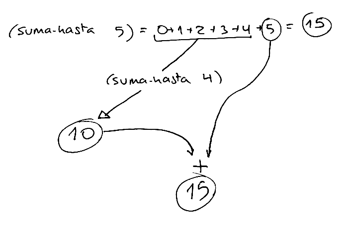

Generalizamos este ejemplo y lo expresamos en Scheme de la siguiente
forma:

```scheme
(suma-hasta x) = (+ (suma-hasta (- x 1)) x)
```

Nos falta el caso base de la recursión. Debemos preguntarnos **¿cuál
es el caso más sencillo del problema, que podemos calcular sin hacer
ninguna llamada recursiva?**. En este caso podría ser el caso en el
que `x` es 0, en el que devolveríamos 0.

Podemos ya escribirlo todo en Scheme:

```scheme
(define (suma-hasta x)
   (if (= 0 x)
      0
      (+ (suma-hasta (- x 1)) x)))
```

Una aclaración sobre el caso general. En la implementación anterior la
llamada recursiva a `suma-hasta` se realiza en el primer argumento de
la suma:

```scheme
(+ (suma-hasta (- x 1)) x)
```

La expresión anterior es totalmente equivalente a la siguiente
en la que la llamada recursiva aparece como segundo argumento

```scheme
(+ x (suma-hasta (- x 1)))
```

Ambas expresiones son equivalentes porque en programación funcional no
importa el orden en el que se evalúan los argumentos. Da lo mismo
evaluarlos de derecha a izquierda que de izquierda a derecha. La
transparencia referencial garantiza que el resultado es el mismo.


#### 2.5.3. Función `(alfabeto-hasta char)` ####

Vamos con otro ejemplo. Queremos diseñar una función `(alfabeto-hasta
char)` que devuelva una cadena que empieza en la letra `a` y termina
en el carácter que le pasamos como parámetro.

Por ejemplo:

```scheme
(alfabeto-hasta #\h) ; ⇒ "abcdefgh"
(alfabeto-hasta #\z) ; ⇒ "abcdefghijklmnopqrstuvwxyz"
```

Pensamos en el caso general: ¿cómo podríamos invocar a la propia
función `alfabeto-hasta` para que (confiando en la recursión) nos haga
gran parte del trabajo (construya casi toda la cadena con el
alfabeto)?

Podríamos hacer que la llamada recursiva devolviera el alfabeto hasta
el carácter previo al que nos pasan como parámetro y después nosotros
añadir ese carácter a la cadena que devuelve la recursión.

Veamos un ejemplo concreto:

```txt
(alfabeto-hasta #\h) = (alfabeto-hasta #\g) + \#h
```

La llamada recursiva `(alfabeto-hasta #\g)` devolvería la cadena
`"abcdefg"` (confiando en la recursión) y sólo faltaría añadir la
última letra.

Para implementar esta idea en Scheme lo único que necesitamos es usar
la función `string-append` para concatenar cadenas y una función
auxiliar `(anterior char)` que devuelve el carácter anterior a uno
dado.


```scheme
(define (anterior char)
  (integer->char (- (char->integer char) 1)))
```

El caso general quedaría como sigue:

```scheme
(alfabeto-hasta char) =
    (string-append (alfabeto-hasta (anterior char)) (string char))
```

Faltaría el caso base. ¿Cuál es el caso más sencillo posible que nos
pueden pedir? El caso del alfabeto hasta la `#\a`. En ese caso basta
con devolver la cadena `"a"`.

La función completa quedaría así:

```scheme
(define (alfabeto-hasta char)
  (if (equal? char #\a)
      "a"
      (string-append (alfabeto-hasta (anterior char)) (string char))))
```


### <a name="2-6"></a> 2.6. Recursión y listas

La utilización de la recursión es muy útil para trabajar con
estructuras secuenciales, como listas. Vamos a empezar viendo unos
sencillos ejemplos y más adelante veremos algunos más complicadas.

#### 2.6.1 Función recursiva `suma-lista`

Veamos un primer ejemplo, la función `(suma-lista
lista-nums)` que recibe como parámetro una lista de números y devuelve
la suma de todos ellos.

Siempre tenemos que empezar escribiendo un ejemplo de la función:

```
(suma-lista '(12 3 5 1 8)) = 29
```

Para diseñar una implementación recursiva de la función tenemos que
pensar en cómo descomponer el ejemplo en una llamada recursiva a un
problema más pequeño y en cómo tratar el valor devuelto por la
recursión para obtener el valor esperado.

Por ejemplo, en este caso podemos pensar que para sumar la lista de
números `(12 3 5 1 8)` podemos obtener un problema más sencillo (una
lista más pequeña) haciendo el `cdr` de la lista de números y llamando
a la recursión con el resultado. La llamada recursiva devolverá la
suma de esos números (confiamos en la recursión) y a ese valor basta
con sumarle el primer número de la lista. Lo podemos representar en el
siguiente dibujo:

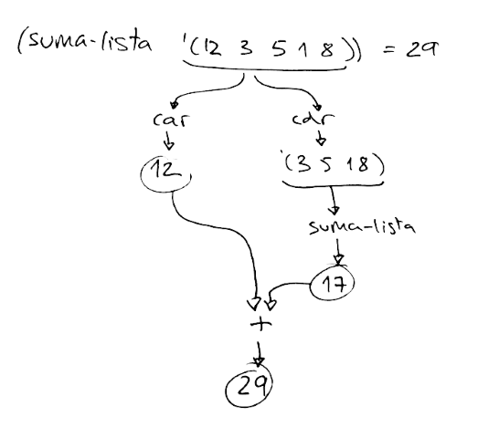

Podemos generalizar este ejemplo y expresarlo en Scheme de la siguiente forma:

```
(suma-lista lista) = (+ (car lista) (suma-lista (cdr lista)))
```

Falta el caso base, que es el caso más sencillo en que podemos
devolver un valor sin llamar a la recursión. En este caso, podría ser
cuando le pesamos a la función una lista sin elementos, en donde hay
que devolver 0.

Con todo junto, quedaría la recursión como sigue

```scheme
(define (suma-lista lista)
   (if (null? lista)
       0
	   (+ (car lista) (suma-lista (cdr lista)))))
```

#### 2.6.2 Función recursiva `veces`

Como último ejemplo vamos a definir la función `(veces lista id)` que
cuenta el número de veces que aparece un identificador en una lista.

¿Cómo planteamos el caso general? Llamaremos a la recursión con el
resto de la lista. Esta llamada nos devolverá el número de veces que
aparece el identificador en este resto de la lista. Y después sumamos
al valor devuelto 1 si el primer elemento de la lista coincide con el
identificador.

En Scheme:

```
(veces lista identificador) = (if (equal? (car lista) identificador)
                                   (+ 1 (veces (cdr lista) identificador))
                                   (veces (cdr lista) identificador))
```

Como caso base, si la lista es vacía devolvemos 0.

La versión completa:

```scheme
(define (veces lista id)
  (cond
    ((null? lista) 0)
    ((equal? (car lista) id) (+ 1 (veces (cdr lista) id)))
    (else (veces (cdr lista) id))))

(veces '(a b a a b b) 'a) ; ⇒ 3 
```


## <a name="3"></a> 3. Tipos de datos compuestos en Scheme

### <a name="3-1"></a> 3.1. El tipo de dato pareja

#### 3.1.1. Función de construcción de parejas `cons`

Ya hemos visto en el seminario de Scheme que el tipo de dato compuesto
más simple es la pareja: una entidad formada por dos elementos. Se
utiliza la función `cons` para construirla:

```scheme
(cons 1 2) ; ⇒ {1 . 2}
(define c (cons 1 2))
```

Dibujamos la pareja anterior y la variable `c` que la referencia de la
siguiente forma:

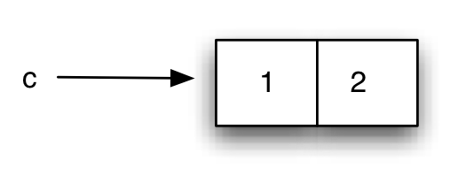

*Tipo compuesto pareja*

La instrucción `cons` construye un dato compuesto a partir de otros
dos datos (que llamaremos izquierdo y derecho). La expresión `{1 . 2}`
es la forma que el intérprete tiene de imprimir las parejas.

#### 3.1.2. Funciones de acceso `car` y `cdr`

Una vez construida una pareja, podemos obtener el elemento
correspondiente a su parte izquierda con la función `car` y su parte
derecha con la función `cdr`:

```scheme
(define c (cons 1 2))
(car c) ; ⇒ 1
(cdr c) ; ⇒ 2
```

##### Definición declarativa

Las funciones `cons`, `car` y `cdr` quedan perfectamente definidas con
las siguientes ecuaciones algebraicas:

```scheme
(car (cons x y)) = x
(cdr (cons x y)) = y
```

##### ¿De dónde vienen los nombres `car` y `cdr`?

Inicialmente los nombres eran CAR y CDR (en mayúsculas). La historia
se remonta al año 1959, en los orígenes del Lisp y tiene que ver con
el nombre que se les daba a ciertos registros de la memoria del IBM
709.

Podemos leer la explicación completa en
[The origin of CAR and CDR in LISP](http://www.iwriteiam.nl/HaCAR_CDR.html).

#### 3.1.3. Función pair?

La función `pair?` nos dice si un objeto es atómico o es una pareja:

```scheme
(pair? 3) ; ⇒ #f
(pair? (cons 3 4)) ; ⇒ #t
```

#### 3.1.4. Las parejas pueden contener cualquier tipo de dato

Ya hemos comprobado que Scheme es un lenguaje *débilmente
tipado*. Las funciones pueden devolver y recibir distintos tipos de
datos.

Por ejemplo, podríamos definir la siguiente función `suma` que sume
tanto números como cadenas:

```scheme
(define (suma x y)
  (cond 
    ((and (number? x) (number? y)) (+ x y))
    ((and (string? x) (string? y)) (string-append x y))
    (else 'error)))
```

En la función anterior los parámetros `x` e `y` pueden ser números o
cadenas (o incluso de cualquier otro tipo). Y el valor devuelto por la
función será un número, una cadena o el símbolo `'error`.

Sucede lo mismo con el contenido de las parejas. Es posible guardar en
las parejas cualquier tipo de dato y combinar distintos tipos. Por
ejemplo:

```scheme
(define c (cons 'hola #f))
(car c) ; ⇒ 'hola
(cdr c) ; ⇒ #f
```


#### 3.1.5. Las parejas son objetos inmutables

Recordemos que en los paradigmas de programación declarativa y
funcional no existe el *estado mutable*. Una vez declarado un valor,
no se puede modificar. Esto debe suceder también con las parejas: una
vez creada una pareja no se puede modificar su contenido.

En Lisp y Scheme estándar (R6RS) las parejas sí que pueden ser
mutadas. Pero durante toda esta primera parte de la asignatura no lo
contemplaremos, para no salirnos del paradigma funcional.

En Swift y otros lenguajes de programación es posible definir
**estructuras de datos inmutables** que no pueden ser modificadas una
vez creadas. Lo veremos también más adelante.

### <a name="3-2"></a> 3.2. Las parejas son objetos de primera clase

En un lenguaje de programación un elemento es de primera clase cuando puede:

* Asignarse a variables
* Pasarse como argumento
* Devolverse por una función
* Guardarse en una estructura de datos mayor

Las parejas son objetos de primera clase.

Una pareja puede asignarse a una variable:

```scheme
(define p1 (cons 1 2))
(define p2 (cons #f "hola"))
```

Una pareja puede pasarse como argumento y devolverse en una función:

```scheme
(define (suma-parejas p1 p2)
    (cons (+ (car p1) (car p2))
          (+ (cdr p1) (cdr p2))))

(suma-parejas '(1 . 5) '(4 . 12)) ; ⇒ {5 . 17}
```

Una vez definida esta función `suma-parejas` podríamos ampliar la
función `suma` que vimos previamente con este nuevo tipo de datos:

```scheme
(define (suma x y)
  (cond 
    ((and (number? x) (number? y)) (+ x y))
    ((and (string? x) (string? y)) (string-append x y))
    ((and (pair? x) (pair? y)) (suma-parejas p1 p2))
    (else 'error)))
```


Y, por último, las parejas *pueden formar parte de otras parejas*. Es
lo que se denomina la propiedad de clausura de la función `cons`:

> El resultado de un `cons` puede usarse como parámetro de nuevas llamadas a `cons`.

Ejemplo:

```scheme
(define p1 (cons 1 2))
(define p2 (cons 3 4))
(define p (cons p1 p2))
```

Expresión equivalente:

```scheme
(define p (cons (cons 1 2)
                (cons 3 4)))
```
 
 Podríamos representar esta estructura así:


*Propiedad de clausura: las parejas pueden contener parejas*

Pero se haría muy complicado representar muchos niveles de
anidamiento. Por eso utilizamos la siguiente representación:

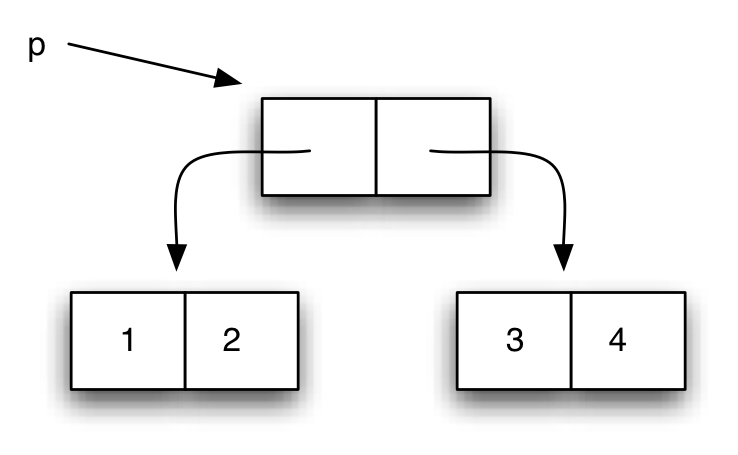

Llamamos a estos diagramas *diagramas caja-y-puntero*
(*box-and-pointer* en inglés).

### <a name="3-3"></a> 3.3. Diagramas *caja-y-puntero*

Al escribir expresiones complicadas con `cons` anidados es conveniente
para mejorar su legibilidad utilizar el siguiente formato:

```scheme
(define p (cons (cons 1
                      (cons 3 4))
                2))
```

Para entender la construcción de estas estructuras es importante
recordar que las expresiones se evalúan *de dentro a afuera*.

¿Qué figura representaría la estructura anterior?

Solución:

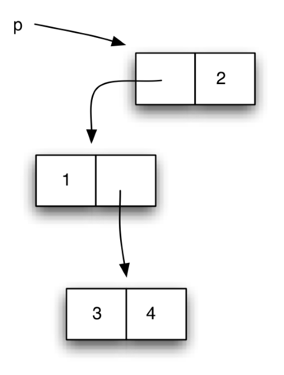

Es importante tener en cuenta que cada caja del diagrama representa
una pareja creada en la memoria del intérprete con la instrucción
`cons` y que el resultado de evaluar una variable en la que se ha
guardado una pareja devuelve la pareja recién creada. Por ejemplo, si
el intérprete evalúa `p` después de haber hecho la sentencia anterior
devuelve la pareja contenida en `p`, no se crea una pareja nueva.

Por ejemplo, si después de haber evaluado la sentencia anterior
evaluamos la siguiente:

```scheme
(define p2 (cons 5 (cons p 6)))
```

El diagrama caja y puntero resultante sería el siguiente:

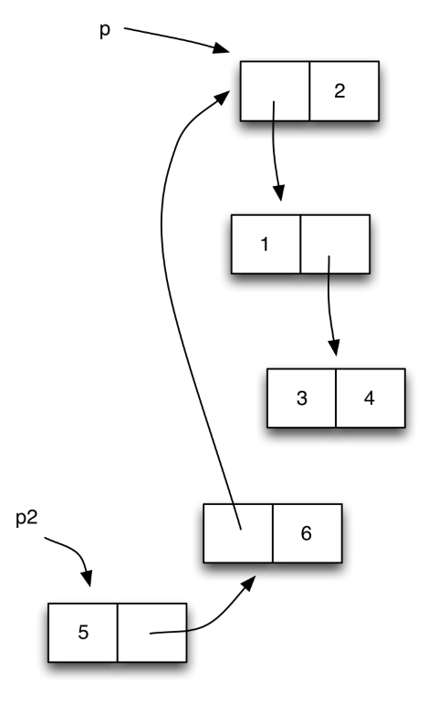

Vemos que en la pareja que se crea con `(cons p 6)` se guarda en la
parte izquierda **la misma pareja que hay en `p`**. Lo representamos
con una flecha que apunta a la misma pareja que `p`.

**IMPORTANTE**: El funcionamiento de la evaluación de las parejas es
  similar al de los objetos en lenguajes orientados a objetos como
  Java. Cuando se evalúa una variable que contiene una pareja se
  devuelve la propia pareja, no una copia. En programación funcional,
  como el contenido de las parejas es inmutable, no hay problemas de
  *efectos laterales* por el hecho de que una pareja esté
  compartida. Veremos que cuando introduzcamos la mutación en Scheme
  aparecerán estos efectos laterales.

Es conveniente que pruebes a crear distintas estructuras de parejas
con parejas y a dibujar su diagrama caja y puntero. Y también a
recuperar un determinado dato (pareja o dato atómico) una vez creada
la estructura.

La siguiente función `print-pareja` puede ser útil a la hora de
mostrar por pantalla los elementos de una pareja

```scheme
(define (print-pareja pareja)
    (if (pair? pareja)
        (begin 
            (display "{")
            (print-dato (car pareja))
            (display " . ")
            (print-dato (cdr pareja))
            (display "}"))))

(define (print-dato dato)
    (if (pair? dato)
        (print-pareja dato)
        (display dato)))
```

**!Cuidado¡**: la función anterior contiene sentencias como `begin` o
   llamadas a `display` dentro del código de la función, que son
   propias de la programación imperativa. **No hacerlo en programación
   funcional**.

#### 3.3.1. Funciones c????r

Al trabajar con estructuras de parejas anidades es muy habitual
realizar llamadas del tipo:

```scheme
(cdr (cdr (car p))) ; ⇒ 4
```

Es equivalente a la función `cadar` de Scheme:

```scheme
(cddar p) ; ⇒ 4
```

El nombre de la función se obtiene concatenando a la letra "c", las
letras "a" o "d" según hagamos un car o un cdr y terminando con la
letra "r".

Hay definidas 2^4 funciones de este tipo: `caaaar`, `caaadr`, …,
`cddddr`.


## <a name="4"></a> 4. Listas en Scheme 

### <a name="4-1"></a> 4.1. Implementación de listas en Scheme

Recordemos que Scheme permite manejar listas como un tipo de datos
básico. Hemos visto funciones para crear, añadir y recorrer listas.

Como repaso, podemos ver las siguientes expresiones. Fijaros que las
funciones `car`, `cdr` y `cons` son exactamente las mismas funciones
que las vistas anteriormente.

¿Por qué? ¿Qué relación hay entre las parejas y las listas?

Hagamos algunas pruebas, probando si los resultados son listas o
parejas usando las funciones `list?` y `pair?`.

Por ejemplo, una pareja formada por dos números es una pareja, pero no
es una lista:

```scheme
(define p1 (cons 1 2))
(pair? p1) ; ⇒ #t
(list? p1) ; ⇒ #f
```

Y una lista vacía es una lista, pero no es una pareja:

```scheme
(list? '()) ; ⇒ #t
(pair? '()) ; ⇒ #f
```

¿Una lista es una pareja? Pues sí:

```scheme
(define lista '(1 2 3))
(list? lista) ; ⇒ #t
(pair? lista) ; ⇒ #t
```

Por último, una pareja con una lista vacía como segundo elemento es
una pareja y una lista:

```scheme
(define p1 (cons 1 '()))
(pair? p1) ; ⇒ #t
(list? p1) ; ⇒ #t
```

Con estos ejemplos ya tenemos pistas para deducir la relación entre
listas y parejas en Scheme (y Lisp). Vamos a explicarlo.

#### 4.1.1. Definición de listas con parejas

Una lista es (definición recursiva):

* Una pareja que contiene en su parte izquierda el primer elemento de
  la lista y en su parte derecha el resto de la lista
* Un símbolo especial `'()` que denota la lista vacía

Por ejemplo, una lista muy sencilla con un solo elemento, `{1}`, se
define con la siguiente pareja:

```scheme
(cons 1 '())
```
	
La pareja cumple las condiciones anteriores: 

* La parte izquierda de la pareja es el primer elemento de la lista
  (el número 1)
* La parte derecha es el resto de la lista (la lista vacía)

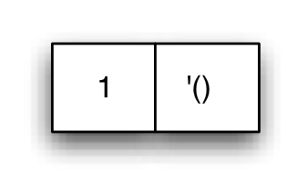

*La lista {1}*

El objeto es al mismo tiempo una pareja y una lista. La función
`list?` permite comprobar si un objeto es una lista:

```scheme
(define l (cons 1 '()))
(pair? l)
(list? l)
```

Por ejemplo, la lista '(1 2 3 4) se construye con la siguiente
secuencia de parejas:

```scheme
(cons 1
      (cons 2
            (cons 3
                  (cons 4 
                        '()))))
```

La primera pareja cumple las condiciones de ser una lista:

* Su primer elemento es el 1
* Su parte derecha es la lista '(2 3 4)

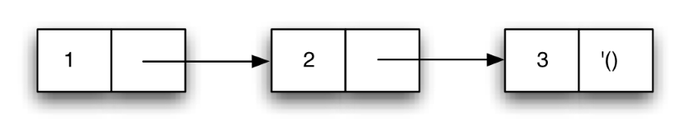

*Parejas formando una lista*

Al comprobar la implementación de las listas en Scheme, entendemos por
qué las funciones `car` y `cdr` nos devuelven el primer elemento y el
resto de la lista.

#### 4.1.2. Lista vacía

La lista vacía es una lista:

```scheme
(list? '()) ; ⇒ #t
```

Y no es un símbolo ni una pareja:

```scheme
(symbol? '()) ; ⇒ #f
(pair? '()) ; ⇒ #f
```

Para saber si un objeto es la lista vacía, podemos utilizar la función
`null?`:

```scheme
(null? '()) ; ⇒ #t
```	

### <a name="4-2"></a> 4.2. Listas con elementos compuestos

Las listas pueden contener cualquier tipo de elementos, incluyendo
otras parejas.

La siguiente estructura se denomina *lista de asociación*. Son listas
cuyos elementos son parejas (*clave*, *valor*):

```scheme
(list (cons 'a 1)
      (cons 'b 2)
      (cons 'c 3)) ; ⇒ {{a . 1} {b . 2} {c . 2}}
```


¿Cuál sería el diagrama *box and pointer* de la estructura anterior?

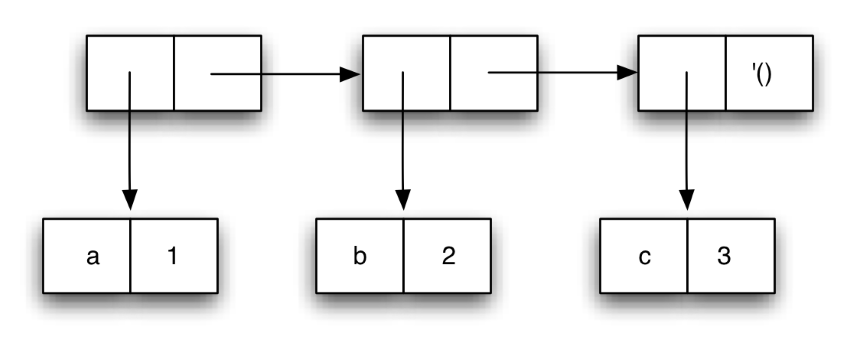

La expresión equivalente utilizando conses es:

```scheme
(cons (cons 'a 1)
      (cons (cons 'b 2)
            (cons (cons 'c 3)
                  '())))
```

#### 4.2.1. Listas de listas

Hemos visto que podemos construir listas que contienen otras listas:

```scheme
(define lista (list 1 (list 1 2 3) 3))
```

La lista anterior también se puede definir con quote:

```scheme
(define lista '(1 (1 2 3) 3))
```

La lista resultante contiene tres elementos: el primero y el último
son elementos atómicos (números) y el segundo es otra lista.

Si preguntamos por la longitud de la lista Scheme nos dirá que es una
lista de 3 elementos:

```scheme
(length lista) ; ⇒ 3
```

Y el segundo elemento de la lista es otra lista:

```scheme
(car (cdr lista)) ; ⇒ {1 2 3}
```

¿Cómo implementa Scheme esta lista usando parejas?

Al ser una lista de tres elementos lo hará con tres parejas enlazadas
que terminan en una lista vacía en la parte derecha de la última
pareja. En las partes izquierdas de esas tres parejas tendremos los
elementos de la lista propiamente dichos: un 1 y un 3 en la primera y
última pareja y una lista en la segunda pareja.

El diagrama *box and pointer*:

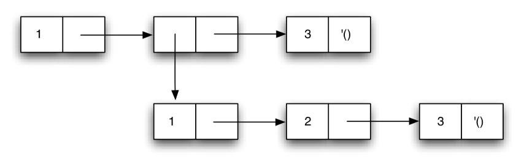

*Lista que contiene otra lista como segundo elemento*

#### 4.2.2. Distintos niveles de abstracción

Es muy importante utilizar el nivel de abstracción correcto a la hora
de trabajar con listas que contienen otros elementos compuestos, como
otras parejas u otras listas.

Sólo hace falta *bajar* al nivel de caja y puntero cuando estemos
definiendo funciones de bajo nivel que tratan la estructura de datos
para obtener elementos concretos de las parejas.

Si, por el contrario, estamos recorriendo la lista principal y
queremos tratar sus elementos, debemos *verla* como una lista normal y
recorrerla con las funciones `car` para obtener su primer elemento y
`cdr` para obtener el resto. O `list-ref` para obtener un elemento
determinado (que puede ser atómico o compuesto).

Por ejemplo, la lista anterior `{1 {1 2 3} 3}` es una lista de 3
elementos. Si queremos obtener su segundo elemento (la lista `{1 2
3}`) bastaría con:

```scheme 
(define lista '(1 (1 2 3) 3))
(car (cdr lista)) (list-ref lista 1)
```


### <a name="4-3"></a> 4.3. Funciones recursivas y listas

#### 4.3.1. Implementación recursiva de funciones sobre listas

Vamos a ver cómo se implementan de forma recursiva alguna de funciones
que trabajan con listas, incluyendo algunas de las funciones de
Scheme. Para no solapar con las definiciones de Scheme pondremos el
prefijo `mi-` en todas ellas:

- `mi-list-ref`: implementación de la función `list-ref`
- `mi-append`: implementación de la funión `append` 


##### Función `mi-list-ref`

La función `(mi-list-ref n lista)` devuelve el elemento `n` de una
lista (empezando a contar por 0):

```scheme
(define lista '(a b c d e f g))
(mi-list-ref lista 2) ; ⇒ c
```

Veamos con el ejemplo anterior cómo hacer la formulación recursiva.

Hemos visto que, en general, cuando queremos resolver un problema de
forma recursiva tenemos que hacer una llamada recursiva a un problema
más sencillo, **confiar en que la llamada nos devuelva el resultado
correcto** y usar ese resultado para resolver el problema original.

En este caso nuestro problema es obtener el número que está en la
posición 2 de la lista `{a b c d e f g}`. Suponemos que la función que
nos devuelve una posición de la lista ya la tenemos implementada y que
la llamada recursiva nos va a devolver el resultado correcto. ¿Cómo
podemos simplificar el problema original? Veamos la solución para este
caso concreto:

> Para devolver el elemento 2 (empezando a contar por 0) de la lista
> `{a b c d e f g}` podemos hacer el `cdr` de la lista (obtendríamos
> `{b c d e f g}`) y devolver su elemento 1. Sería el valor `c`.

Generalizamos el ejemplo anterior, para cualquier `n` y cualquier lista:

> Para devolver el elemento que está en la posición `n` de una lista,
> hago el cdr de la lista y devuelvo su elemento n-1.

Y, por último, formulamos el caso base de la recursión, el problema
más sencillo que se puede resolver directamente, sin hacer una llamada
recursiva:

> Para devolver el elemento que está en la posición 0 de una lista,
> devuelvo el `car` de la lista

La implementación de todo esto en Scheme sería la siguiente:

```scheme
(define (mi-list-ref lista n)
   (if (= n 0) 
      (car lista)
      (mi-list-ref (cdr lista) (- n 1))))
```

##### Función `list-tail`

La función `(mi-list-tail lista n)` devuelve la lista resultante de
quitar n elementos de la lista original:

```scheme
(mi-list-tail '(1 2 3 4 5 6 7) 2) ; ⇒ {3 4 5 6 7}
```

Piensa en cómo se implementaría de forma recursiva. Esta vez vamos a
mostrar directamente la implementación, sin dar explicaciones de cómo
se ha llegado a ella:

```scheme
(define (mi-list-tail lista n)
   (if (= n 0) 
       lista
       (mi-list-tail (cdr lista) (- n 1))))
```

##### Función `mi-append` 

Veamos ahora cómo podríamos implementar de forma recursiva la función
`append` que une dos listas. La llamaremos `(mi-append lista1
lista2)`.

Por ejemplo:

```scheme
(mi-append '(a b c) '(d e f)) ; ⇒ {a b c d e f}
```

Para resolver el problema de forma recursiva, haremos el `cdr` de la
primera lista, llamaremos a la recursión para que una el resultado con
la segunda lista`:

```
(mi-append (cdr '(a b c)) '(d e f)) =
(mi-append '(b c) '(d e f) = {b c d e f}
```

Y añadiremos el primer elemento a la lista resultante usando un `cons`:

```
(cons (car '(a b c)) (mi-append (cdr '(a b c)) '(d e f))) =
(cons 'a '(b c d e f)) = {a b c d e f}
```

En general:

```
(mi-append lista1 lista2) = (cons (car lista1) (mi-append (cdr lista1) lista2))
```

El caso base, el caso en el que la función puede devolver un valor
directamente sin llamar a la recursión, es aquel en el que `lista1` es
`null?`. En ese caso devolvemos `lista2`:

```scheme
(mi-append '() '(a b c)) = '{a b c}
```

La formulación recursiva completa queda como sigue:

```scheme
(define (mi-append l1 l2)
    (if (null? l1)
        l2
        (cons (car l1)
              (mi-append (cdr l1) l2))))
```

##### Función `mi-reverse`

Veamos cómo implementar de forma recursiva la función `mi-reverse` que
invierte una lista

```scheme
(mi-reverse '(1 2 3 4 5 6)) ; ⇒ {6 5 4 3 2 1}
```

La idea es sencilla: llamamos a la recursión para hacer la inversa del
`cdr` de la lista y añadimos el primer elemento a la lista resultante
que devuelve ya invertida la llamada recursiva.

Podemos definir una función auxiliar `(añade-al-final dato lista)` que
añade un dato al final de una lista usando `append`:

Veamos directamente su implementación, usando `mi-append` para añadir
un elemento al final de la lista:

```scheme
(define (añade-al-final dato lista)
    (append lista (list dato)))
```

La función `mi-reverse` quedaría entonces como sigue:

```scheme
(define (mi-reverse lista)
    (if (null? lista) '()
    (añade-al-final (car lista) (mi-reverse (cdr lista)))))
```

#### 4.3.2. Ejemplos de funciones recursivas que usan listas

##### Función `cuadrados-hasta`

La función `(cuadrados-hasta x)` devuelve una lista con los cuadrados
de los números hasta x:

> Para construir una lista de los cuadrados hasta x, añado el cuadrado
> de x a la lista de los cuadrados hasta x-1

El caso base de la recursión es el caso en el que x es 1, entonces
devolvemos una lista formada por el 1.

En Scheme:

```scheme
(define (cuadrados-hasta x)
   (if (= x 1)
      '(1)
      (cons (cuadrado x)
            (cuadrados-hasta (- x 1)))))
```

Ejemplo:

```scheme
(cuadrados-hasta 10) ; ⇒ {100 81 64 49 36 25 16 9 4 1}
```

##### Función `filtra-pares`

Es muy habitual recorrer una lista y comprobar condiciones de sus
elementos, construyendo una lista con los que cumplan una determinada
condición.

Por ejemplo, la siguiente función `filtra-pares` construye una lista
con los números pares de la lista que le pasamos como parámetro:

```scheme
(define (filtra-pares lista)
   (cond
      ((null? lista) '())
	  ((even? (car lista)) (cons (car lista)
       (filtra-pares (cdr lista))))
      (else (filtra-pares (cdr lista)))))
```

Ejemplo:

```scheme
(filtra-pares '(1 2 3 4 5 6)) ; ⇒ {2 4 6}
```

##### Función `primo?`

El uso de listas es uno de los elementos fundamentales de la
programación funcional.

Como ejemplo, vamos a ver cómo trabajar con listas para construir una
función que calcula si un número es primo. La forma de hacerlo será
calcular la lista de divisores del número y comprobar si su longitud
es dos. En ese caso será primo.

Por ejemplo:

```scheme
(divisores 8) ; ⇒ {1 2 4 8} longitud = 4, no primo
(divisores 9) ; ⇒ {1 3 9} longitud = 3, no primo
(divisores 11) ; ⇒ {1 11} longitud = 2, primo
```

Podemos definir entonces la función `(primo? x)` de la siguiente forma:

```scheme
(define (primo? x)
   (=  2 
      (length (divisores x))))
```

¿Cómo implementamos la función `(divisores x)` que nos devuelve la
lista de los divisores de un número `x`. Vamos a construirla de la
siguiente forma:

1. Creamos una lista de todos los números del 1 a x
2. Filtramos la lista para dejar los divisores de x

La función `(lista-hasta x)` devuelve una lista de números 1..x:

```scheme
(define (lista-hasta x)
   (if (= x 0)
      '()
      (cons x (lista-hasta (- x 1)))))
```

Ejemplos:

```scheme
(lista-hasta 2) ; ⇒ {1 2}
(lista-hasta 10) ; ⇒ {1 2 3 4 5 6 7 8 9 10}
```

Definimos la función `(divisor? x y)` que nos diga si x es divisor de
y:

```scheme
(define (divisor? x y)
      (= 0 (mod y x)))
```

Ejemplos:

```scheme
(divisor 2 10) ; ⇒ #t
(divisor 3 10) ; ⇒ #f
```

Una vez que hemos definido La función `divisor?` podemos utilizarla
para definir la función recursiva `(filtra-divisores lista x)` que
devuelve una lista con los números de `lista` que son divisores de
`x`:

```scheme
(define (filtra-divisores lista x)
   (cond
      ((null? lista) '())
      ((divisor? (car lista) x) (cons (car lista)
                                      (filtra-divisores (cdr lista) x)))
      (else (filtra-divisores (cdr lista) x))))
```

Ya podemos implementar la función que devuelve los divisores de un
número `x` generando los números hasta `x` y filtrando los divisores
de ese número. Por ejemplo, para calcular los divisores de 10:

```scheme
(filtra-divisores {1 2 3 4 5 6 7 8 9 10} 10) ; ⇒ {1 2 5 10}
```

Se puede implementar de una forma muy sencilla:

```scheme
(define (divisores x)
   (filtra-divisores (lista-hasta x) x))
```

Y una vez definida esta función, ya puede funcionar correctamente la
función `primo?`.


### <a name="4-4"></a> 4.4. Funciones con número variable de argumentos

Hemos visto algunas funciones primitivas de Scheme, como `+` o `max`
que admiten un número variable de argumentos. ¿Podemos hacerlo también
en funciones definidas por nosotros?

La respuesta es sí, utilizando lo que se denomina notación
*dotted-tail* (punto-cola) para definir los parámetros de la
función. En esta notación se coloca un punto antes del último
parámetro. Los parámetros antes del punto (si existen) tendrán como
valores los argumentos usados en la llamada y el resto de argumentos
se pasarán en forma de lista en el último parámetro.

Por ejemplo, si tenemos la definición

```scheme
(define (funcion-dos-o-mas-args x y . lista-args) 
    <cuerpo>)
```

podemos llamar a la función anterior con dos o más argumentos:

```scheme
(funcion-dos-o-mas-args 1 2 3 4 5 6)
```
	
En la llamada, los parámetros `x` e `y` tomarán los valores 1 y 2. El
parámetro `lista-args` tomará como valor una lista con los argumentos
restantes `(3 4 5 6)`.

También es posible permitir que todos los argumentos sean opcionales
no poniendo ningún argumento antes del punto::

```scheme
(define (funcion-cualquier-numero-args . lista-args) 
    <cuerpo>)
```
	
Si hacemos la llamada

```scheme
(funcion-cualquier-numero-args 1 2 3 4 5 6)
```
	
el parámetro `lista-args` tomará como valor la lista `(1 2 3 4 5 6)`.

Veamos un sencillo ejemplo.

Podemos implementar una función `mi-suma` que tome al menos dos
argumentos y después un número variable de argumentos y devuelva la
suma de todos ellos. Es muy sencillo: recogemos todos los argumentos
en la lista de argumentos variables y llamamos a la función
`suma-lista` que suma una lista de números:

```scheme
(define (mi-suma x y . lista-nums)
    (if (null? lista-nums)
        (+ x y)
        (+ x (+ y (suma-lista lista-nums)))))
```

## <a name="5"></a>5. Funciones como tipos de datos de primera clase

Hemos visto que la característica fundamental de la programación
funcional es la definición de funciones. Hemos visto también que no
producen efectos laterales y no tienen estado. Una función toma unos
datos como entrada y produce un resultado como salida.

Para simbolizar el hecho de que las funciones toman parámetros de
entrada y devuelven una única salida, vamos a representar las
funciones como un símbolo especial, una pequeña casa invertida con
unas flechas en la parte superior que representan las entradas y una
única flecha que representa la salida. Por ejemplo, podemos
representar de la siguiente forma la función que eleva al cuadrado un
número:

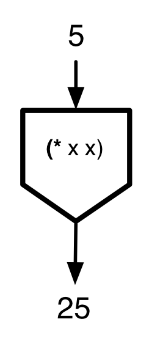

También podemos representar la función que suma dos parejas:

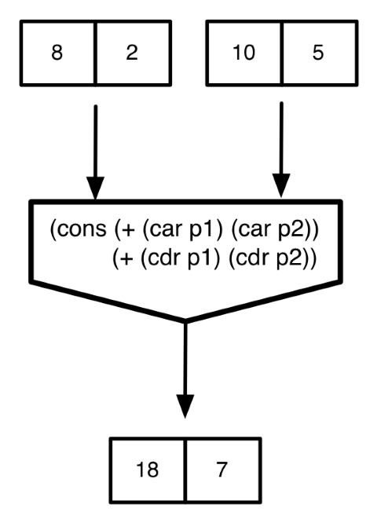

Una de las características fundamentales de la programación funcional
es considerar a las funciones como *objetos de primera
clase*. Recordemos que un tipo de primera clase es aquel que:

1. Puede ser asignado a una variable
2. Puede ser pasado como argumento a una función
3. Puede ser devuelto como resultado de una invocación a una función
4. Puede ser parte de un tipo mayor

Vamos a ver que las funciones son ejemplos de todos los casos
anteriores: vamos a poder crear funciones sin nombre y asignarlas a
variables, pasarlas como parámetro de otras funciones, devolverlas
como resultado de invocar a otra función y guardarlas en
tipos de datos compuestos como listas.

La posibilidad de usar funciones como objetos de primera clase es una
característica fundamental de los lenguajes funcionales. Es una
característica de muchos lenguajes multi-paradigma con características
funcionales como
[JavaScript](http://helephant.com/2008/08/19/functions-are-first-class-objects-in-javascript/),
[Python](https://thenewcircle.com/static/bookshelf/python_fundamentals_tutorial/functional_programming.html),
[Swift](https://developer.apple.com/library/ios/documentation/Swift/Conceptual/Swift_Programming_Language/Closures.html)
o incluso en la última versión de Java,
[Java 8](http://docs.oracle.com/javase/tutorial/java/javaOO/lambdaexpressions.html),
(donde se denominan *expresiones lambda*).

### <a name="5-1"></a>5.1. Forma especial `lambda`

Vamos a empezar explicando la forma especial `lambda` de Scheme, que
nos permite crear funciones anónimas en tiempo de ejecución.

De la misma forma que podemos usar cadenas o enteros sin darles un
nombre, en Scheme es posible usar una función sin darle un
nombre mediante esta forma especial.

#### Sintaxis de la forma especial `lambda`

La sintaxis de la forma especial `lambda` es:

```
(lambda (<arg1> ... <argn>) 
    <cuerpo>)
```

El cuerpo del lambda define un *bloque de código* y sus argumentos son
los parámetros necesarios para ejecutar ese bloque de código. Llamamos
a la función resultante una *función anónima*.

Algunos ejemplos:

Una función anónima que suma dos parejas:

```scheme
(lambda (p1 p2)
    (cons (+ (car p1) (car p2))
          (+ (cdr p1) (cdr p2))))
```

Una función anónima que devuelve el mayor de dos números:

```scheme
(lambda (a b)
    (if (> a b)
        a
        b))
```

#### Semántica de la forma especial `lambda`

La invocación a la forma especial `lambda` construye una función
anónima en tiempo de ejecución.

Por ejemplo, si ejecutamos una expresión lambda en el intérprete
veremos que devuelve un procedimiento:

```scheme
(lambda (x) (* x x)) ; ⇒ #<procedure>
```

El procedimiento construido es un bloque de código que devuelve el
cuadrado de un número.

¿Qué podemos hacer con este procedimiento? 

Podemos asignarlo a un identificador. Por ejemplo, en la siguiente
expresión, primero se evalúa la *expresión lambda* y el procedimiento
resultante se asocia al identificador `f`.

```scheme
(define f (lambda (x) (* x x)))
```

El ejemplo anterior funciona de una forma idéntica al siguiente:

```scheme
(define x (+ 2 3))
```

En ambos casos se evalúa la expresión derecha y el resultado se guarda
en un identificador. En el primer caso la expresión que se evalúa
devuelve un procedimiento, que se guarda en la variable `f` y en el
segundo un número, que se guarda en la variable `x`.

Si escribimos los identificadores `f` y `x` en el intérprete Scheme los
evalúa y muestra los valores guardados:

```scheme
f ; ⇒ #<procedure:f>
x ; ⇒ 5
```

En el primer caso se devuelve un procedimiento y en el segundo un
número. Fíjate que Scheme trata a los procedimientos y a los números
de la misma forma; son lo que se denominan datos de primera clase.

Una vez asignado un procedimiento a un identificador, lo podemos
utilizar como de la misma forma que invocamos habitualmente a una
función:

```scheme
(f 3) ; ⇒ 9
```

No es necesario un identificador para invocar a una función; podemos
crear la función con una expresión lambda e invocar a la función
anónima recién creada:

```scheme
((lambda (x) (* x x)) 3) ; ⇒ 9
```

La llamada a `lambda` crea un procedimiento y el paréntesis a su
izquierda lo invoca con el parámetro 3:

```scheme
((lambda (x) (* x x)) 3) = (#<procedure> 3) ⇒ 9
```

Es importante remarcar que con `lambda` estamos creando una función en
*tiempo de ejecución*. Es código que creamos para su posterior
invocación.

Cada lenguaje de programación tiene su sintaxis propia de expresiones
lambda. Por ejemplo, las siguientes expresiones crean una función que
devuelve el cuadrado de un número:

**Java 8**

```java
Integer x -> {x*x}
```

**Scala**

```scala
(x:Int) => {x*x}
```

**Objective C**

```objective-c
^int (int x)
{
   x*x
};
```

**Swift**

```swift
{ (x: Int) -> Int in return x*x }
```

#### Identificadores y funciones

Tras conocer `lambda` ya podemos explicarnos por qué cuando escribimos
en el intérprete de Scheme el nombre de una función, se evalúa a un
*procedure*:

```scheme
+ ; ⇒ <procedure:+>
```

El identificador se evalúa y devuelve el *objeto función* al que está
ligado. En Scheme los nombres de las funciones son realmente símbolos
a los que están ligados *objetos de tipo función*.

Podemos asignar funciones ya existentes a nuevos identificadores
usando `define`, como en el ejemplo siguiente:

```scheme
+ ; ⇒ <procedure:+>
(define suma +)
(suma 1 2 3 4) ; ⇒ 10
```

Es muy importante darse cuenta que la expresión `(define suma +)` se
evalúa de forma idéntica a `(define y x)`. Primero se evalúa el
identificador `+`, que devuelve el *objeto función* suma, que se
asigna a la variable `suma`. El resultado final es que tanto `+` como
`suma` tienen como valor el mismo procedimiento:

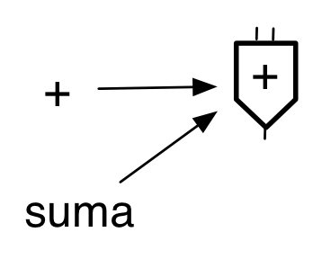

La forma especial `define` para definir una función no es más que
*azucar sintáctico*.

```
(define (<nombre> <args>)
    <cuerpo>)
```

siempre se convierte internamente en:

```
(define <nombre> 
    (lambda (<args>)
        <cuerpo>))
```

Por ejemplo

```scheme
(define (cuadrado x)
    (* x x))
```

es equivalente a:

```scheme
(define cuadrado 
    (lambda (x) (* x x)))
```

#### Predicado `procedure?`

Podemos comprobar si algo es una función utilizando el predicado de
Scheme `procedure?`.

Por ejemplo:

```scheme
(procedure? (lambda (x) (* x x))) ; ⇒ #t
(define suma +)
(procedure? suma) ; ⇒ #t
(procedure? '+) ; ⇒ #f
```

Hemos visto que las funciones pueden asignarse a variables. También
cumplen las otras condiciones necesarias para ser consideradas objetos
de primera clase.

### <a name="5-2"></a> 5.2. Funciones argumentos de otras funciones 

Hemos visto ya un ejemplo de cómo pasar una función como parámetro de
otra. Veamos algún otro.

Por ejemplo, podemos definir la función `aplica` que recibe una
función en el parámetro `func` y dos valores en los parámetros `x` e
`y` y devuelve el resultado de invocar a la función que pasamos como
parámetro con `x` e `y`. La función que se pase como parámetro debe
tener dos argumentos

Para realizar la invocación a la función que se pasa como parámetro
basta con usar `func` como su nombre. La función se ha ligado al
nombre `func` en el momento de la invocación a `aplica`, de la misma
forma que los argumentos se ligan a los parámetros `x` e `y`:

```scheme
(define (aplica f x y)
   (f x y))
```

Algunos ejemplos de invocación, usando funciones primitivas, funciones
definidas y expresiones lambda:

```scheme
(aplica + 2 3) ; ⇒ 5
(aplica * 4 5) ; ⇒ 10
(aplica string-append "hola" "adios") ; ⇒ "holaadios"

(define (string-append-con-guion s1 s2)
    (string-append s1 "-" s2))

(aplica string-append-con-guion "hola" "adios") ; ⇒ "hola-adios"

(aplica (lambda (x y) (sqrt (+ (* x x) (* y y)))) 3 4) ; ⇒ 5
```

Otro ejemplo, la función `aplica-2` que toma dos funciones `f` y `g` y
un argumento `x` y devuelve el resultado de aplicar `f` a lo que
devuelve la invocación de `g` con `x`:

```scheme
(define (aplica-2 f g x)
   (f (g x)))

(define (suma-5 x)
   (+ x 5))
(define (doble x)
   (+ x x))
(aplica-2 suma-5 doble 3) ; ⇒ 11
```


### 5.2.1. Generalización ###

La posibilidad de pasar funciones como parámetros de otras es una
poderosa herramienta de abstracción. Por ejemplo, supongamos que
queremos calcular el sumatorio de `a` hasta `b`:

```scheme
(define (sum-x a b)
    (if (> a b)
        0
        (+ a (sum-x (+ a 1) b))))

(sum-x 1 10) ; ⇒ 55
```

Supongamos ahora que queremos calcular el sumatorio de `a` hasta `b`
sumando los números al cuadrado:

```scheme
(define (sum-cuadrado-x a b)
    (if (> a b)
        0
        (+ (* a a) (sum-cuadrado-x (+ a 1) b))))

(sum-cuadrado-x 1 10) ; ⇒ 385
```

Y el sumatorio de `a` hasta `b` sumando los cubos:

```scheme
(define (sum-cubo-x a b)
    (if (> a b)
        0
        (+ (* a a a) (sum-cubo-x (+ a 1) b))))

(sum-cubo-x 1 10) ; ⇒ 3025
```

Vemos que el código de las tres funciones anteriores es muy similar,
cada función la podemos obtener haciendo un *copy-paste* de otra
previa. Lo único que cambia es la función a aplicar a cada número de
la serie.

Siempre que hagamos *copy-paste* al programar tenemos que empezar a
sospechar que no estamos generalizando suficientemente el código. Un
*copy-paste* arrastra también *bugs* y obliga a realizar múltiples
modificaciones del código cuando en el futuro tengamos que cambiar
cosas.

La posibilidad de pasar una función como parámetro es una herramienta
poderosa a la hora de generalizar código. En este caso, lo único que
cambia en las tres funciones anteriores es la función a aplicar a los
números de la serie. Podemos tomar esa función como un parámetro
adicional y definir una función genérica `sum-f-x` que generaliza las
tres funciones anteriores. Tendríamos el sumatorio desde `a` hasta `b`
de `f(x)`:

```scheme
(define (sum-f-x f a b)
    (if (> a b)
        0
        (+ (f a) (sum-f-x f (+ a 1) b))))
```

Las funciones anteriores son casos particulares de esta función que
las generaliza. Por ejemplo, para calcular el sumatorio desde 1 hasta
10 de `x` al cubo:

```scheme
(define (cubo x)
    (* x x x))

(sum-f-x cubo 1 10) ; ⇒ 3025
```


También podemos utilizar una expresión lambda en la invocación a
`sum-f` que construya la función que queremos aplicar a cada
número. Por ejemplo, podemos sumar la expresión (n/(n-1)) para todos
los números del 2 al 100:
  
```scheme
(sum-f-x (lambda (n) (/ n (- n 1))) 2 100)
```


### <a name="5-3"></a> 5.3. Funciones que devuelven funciones

Cualquier objeto de primera clase puede ser devuelto por una
función; enteros, booleanos, parejas, etc. son objetos primitivos y
podemos definir funciones que los devuelven.

En el paradigma funcional lo mismo sucede con las funciones. Podemos
definir una función que cuando se invoque construya otra función y la
devuelva como resultado. 

Esta es una de la características más importantes que diferencia los
lenguajes de programación funcionales de otros que no lo
son. En lenguajes como C, C++ o Java (antes de Java 8) no es posible
hacer esto.

Para devolver una función en Scheme basta con usar la forma especial
`lambda` en el cuerpo de una función. Así, cuando se invoca a esta
función se evalúa `lambda` y se devuelve la función resultante. Es una
función que creamos en tiempo de ejecución, durante la evaluación de
la función principal.

La función que se devuelve se denomina **clausura**
([Wikipedia](https://es.wikipedia.org/wiki/Clausura_(informática))). Y
decimos que la función que ha construido la clausura es una **función
constructora**.


#### Función `sumador`

Vamos a empezar con un ejemplo muy sencillo. Definimos una función
constructora que crea en su ejecución una función que suma
`k` a un número:

```scheme
(define (construye-sumador k)
   (lambda (x)
       (+ x k)))
```

El cuerpo de la función `(construye-sumador k)` está formado por una
expresión lambda. Cuando se invoca a `construye-sumador` se evalúa
esta expresión lambda y se devuelve el procedimiento creado. 

En este caso se construye otra función de 1 argumento que suma `k` al
argumento. 

Por ejemplo, podemos invocar a `construye-sumador` pasando 10 como parámetro:

```scheme
(construye-sumador 10) ; => #<procedure>
```

Como hemos dicho, se devuelve un procedimiento, una función. Esta
función devuelta debe invocarse con un argumento y devolverá el
resultado de sumar 10 a ese argumento:

```scheme
(define f (construye-sumador 10))
(f 3) ; => 13
```

También podemos invocar directamente a la función que devuelve la
función constructora, sin guardarla en una variable:

```scheme
((construye-sumador 10) 3) ; => 13
```

Dependiendo del parámetro que le pasemos a la función constructora
obtendremos una función sumadora que sume un número u otro. Por
ejemplo para obtener una función sumadora que suma 100:
  
```scheme
(define g (construye-sumador 100))
(g 3) ; => 103
```

¿Cómo funciona la clausura? ¿Por qué la invocación a `(g 3)`
devuelve 103?.

Aquí hay que apartarse bastante del modelo de evaluación de
sustitución que hemos visto y utilizar un nuevo modelo en el que se
tiene en cuenta los ámbitos de las variables.

No vamos a explicar en detalle este modelo, pero sí dar unas breves
pinceladas.

Recordemos la definición de `construye-sumador`:

```scheme
(define (construye-sumador k)
   (lambda (x)
       (+ x k)))
```

Y supongamos que realizamos las siguientes invocaciones:

```scheme
(define g (construye-sumador 100))
(g 3) ; => 103
```

Podemos explicar lo que sucede en la evaluación de estas funciones de
la siguiente forma:

- Cuando invocamos a `construye-sumador` con un valor concreto para
  `k` (por  ejemplo 100), queda vinculado el valor de 100 al parámetro
  `k` en el ámbito local de la función.
- En este ámbito local la expresión lambda crea una función. Esta
  función creada en el ámbito local **captura** este ámbito local, con
  sus variables y sus valores (en este caso la variable `k` y su valor
  100).
- Cuando se invoca a la función desde fuera (cuando llamamos a `g` en
  el ejemplo) se ejecuta el cuerpo de la función `(+ x k)` con `x`
  valiendo el parámetro (3) y el valor de `k` se obtiene del ámbito
  capturado (100).

El hecho de que función creada en el ámbito local capture este ámbito
es lo que hace que se denomine una **clausura** (del inglés
**closure**). La función _se cierra_ sobre el ámbito capturado y puede
utilizar sus variables.


#### Función `componedor` 

Otro ejemplo de una función que devuelve otra función es la función
siguiente `(componedor f g)` que recibe dos funciones de un argumento
y devuelve otra función que realiza la composición de ambas:

```scheme
(define (componedor f g)
    (lambda (x)
	    (f (g x))))
```

La función devuelta invoca primero a `g` y el resultado se lo pasa a
`f`. Veamos un ejemplo. Supongamos que tenemos definidas la función
`cuadrado` y `doble` que calculan el cuadrado y el doble de un número
respectivamente. Podremos entonces llamar a `componedor` con esas dos
funciones para construir otra función que primero calcule el cuadrado y
después el doble de una número:

```scheme
(define h (componendor doble cuadrado))
```

La variable `h` contiene la función devuelta por `componedor`. Una
función de un argumento que devuelve el doble del cuadrado de un
número:

```scheme
(h 4) ; => 32
```

#### Usos reales de las funciones constructoras ####

Las funciones que construyen otras funciones permiten un alto nivel de
configuración y de generalización en la programación.

Por ejemplo, un par de ejemplos de uso en problemas reales:

1. Posibilidad de definir funciones configurables sin tener que
  depender de variables globales o parámetros adicionales.
2. Posibilidad de modificar funciones ya construidas, añadiéndoles condiciones
  a comprobar antes o cálculos a realizar después.


##### Ejemplo de funciones constructoras para definir funciones configurables #####

Supongamos que queremos definir una función `logger` a la que le
llamemos con una cadena para que imprima un mensaje de log.

Queremos poder configurar el prefijo del mensaje de log, de forma que
sólo tengamos que definirlo una vez, al crear la función
`logger`. Después llamaremos a la función `logger` pasándole
únicamente el mensaje de log.

Lo podemos hacer con la siguiente función constructora:

```scheme
(define (construye-logger str-prefijo)
  (lambda (x)
    (display (string-append str-prefijo x "\n"))))
```

Por ejemplo, definimos distintos loggers y los probamos:

```scheme
(define logger (construye-logger "Módulo acceso red: "))

(logger "Error en el acceso a BD")
(logger "Intentando conexión a red")
; Módulo acceso red: Error en el acceso a BD
; Módulo acceso red: Intentando conexión a red

(define logger2 (construye-logger "Módulo correo electrónico: "))

(logger2 "Enviando e-mail")
(logger2 "Problemas al recibir mensaje")
; Módulo correo electrónico: Enviando e-mail
; Módulo correo electrónico: Problemas al recibir mensaje

(define logger3 (construye-logger "Módulo acceso a SO: "))

(logger3 "Intentando abrir fichero")
(logger3 "Sin espacio de memoria")
; Módulo acceso a SO: Intentando abrir fichero
; Módulo acceso a SO: Sin espacio de memoria
```


##### Ejemplo de funciones constructoras para modificar funciones ya construidas #####

Recordemos la función `divisores`:

```scheme
(define (lista-hasta x)
   (if (= x 0)
      '()
      (cons x (lista-hasta (- x 1)))))

(define (divisor? x y)
      (= 0 (mod y x)))

(define (filtra-divisores lista x)
   (cond
      ((null? lista) '())
      ((divisor? (car lista) x) (cons (car lista)
                                      (filtra-divisores (cdr lista) x)))
      (else (filtra-divisores (cdr lista) x))))

(define (divisores x)
   (filtra-divisores (lista-hasta x) x))
```

Un problema de la función anterior `divisores` es que si le pasamos un
número negativo entra en un bucle infinito.

Podemos definir la siguiente función general a la que le pasamos una
función de un argumento `f` y devuelve la función f "segura" a la que
sólo se va a invocar si el parámetro es mayor o igual que 0:

```scheme
(define (construye-segura-menor-cero f)
  (lambda (x)
    (if (>= x 0)
        (f x)
        'error)))
```

Podemos entonces "segurizar" la función `divisores`:

```scheme
(define divisores-segura (construye-segura-menor-cero divisores))
(divisores-segura 10) ; => {10 5 2 1}
(divisores-segura -10) ; => error
```

La función `(construye-segura-menor-cero f)` se puede aplicar para
"segurizar" cualquier función, no sólo `divisores`:

```scheme
(define sqrt-segura (construye-segura-menor-cero sqrt))
(sqrt-segura 100) ; => 10
(sqrt-segura -100) ; => error
```

Se podría generalizar aún más la función "segurizadora" haciendo que
la condición a cumplir por el número sea otra función que también pasamos:
  
```scheme
(define (construye-segura condicion f)
  (lambda (x)
    (if (condicion x)
        (f x)
        'error)))
```

La forma de definir una función `divisores` segura con esta nueva
función sería:
  
```scheme
(define divisores-segura2 (construye-segura (lambda (x) (>= x 0)) divisores))
```


### <a name="5-4"></a> 5.4. Funciones en estructuras de datos

La última característica de los tipos de primera clase es que pueden
formar parte de tipos de datos compuestos, como listas.

Para construir una lista de funciones debemos llamar a `list` con las
funciones:

```scheme
(define lista (list cuadrado suma-1 doble))
lista ; ⇒ {#<procedure:cuadrado>  #<procedure:suma-1>  #<procedure:doble>}
```

También podemos evaluar una expresión lambda y añadir el procedimiento
resultante. Por ejemplo, para añadir otra función a la lista anterior
podemos llamar a `cons`:

```scheme
(define lista2 (cons (lambda (x) (+ x 5)) lista))
lista2 ; ⇒ {#<procedure> #<procedure:cuadrado> #<procedure:suma-1> #<procedure:doble>}
```

Una vez creada una lista con funciones, ¿cómo podemos invocar a alguna
de ellas?. Debemos tratarlas de la misma forma que tratamos cualquier
otro dato guardado en la lista, las recuperamos con las funciones
`car` o `list-ref` y las invocamos. Por ejemplo, para invocar a la
primera función de `lista2`:

```scheme
((car lista2) 10) ; ⇒ 15
```

#### Funciones que trabajan con listas de funciones

Veamos un ejemplo de una función `(aplica-funcs lista-funcs x)` que
recibe una lista de funciones en el parámetro `lista-funcs` y las
aplica todas al número que pasamos en el parámetro `x`.

Por ejemplo, si construimos una lista con las funciones `cuadrado`,
`cubo` y `suma-1`:

```scheme
(define lista (list cuadrado cubo suma-1))
```

la llamada a `(aplica-funcs lista 5)` debería devolver el resultado de
aplicar primero `suma-1` a 5, después `cubo` al resultado y después
`cuadrado`:

```scheme
(cuadrado (cubo (suma-1 5)) ; ⇒ 46656
```

Para implementar `aplica-funcs` tenemos que usar una recursión. Si
vemos el ejemplo, podemos comprobar que es sencillo definir el caso
general:

```
(aplica-funcs (cuadrado cubo suma-1) 5) = (cuadrado (aplica-funcs (cubo suma-1) 5))
= (cuadrado 216) = 46656
```

El caso general de la recursión de la función `aplica-funcs` se define
entonces como:

```
(aplica-funcs lista-funcs x) = ((car lista-funcs) (aplica-funcs (cdr lista-funcs) x))
```

El caso base sería en el que la lista de funciones tiene sólo una
función:

```scheme
(if (null? (cdr lista-funcs)) ; la lista de funciones solo tiene una función
    ((car lista-funcs) x) ; invocamos a la función con el parámetro x
    ...
```

La implementación completa es:

```scheme
(define (aplica-funcs lista-funcs x)
    (if (null? lista-funcs)
        x
        ((car lista-funcs)
            (aplica-funcs (cdr lista-funcs) x))))
```

Un ejemplo de uso:

```scheme
(define lista-funcs (list (lambda (x) (* x x))
                          (lambda (x) (* x x x))
                          (lambda (x) (+ x 1))))
(aplica-funcs lista-funcs 5) ; ⇒ 46656
```


### <a name="5-5"></a> 5.5. Funciones de orden superior

Llamamos funciones de orden superior (*higher order functions* en
inglés) a las funciones que toman otras como parámetro o devuelven
otra función. Permiten generalizar soluciones con un alto grado de
abstracción.

Los lenguajes de programación funcional como Scheme, Scala o Java 8
tienen ya predefinidas algunas funciones de orden superior que
permiten tratar listas o *streams* de una forma muy concisa y
compacta.

Las funciones que veremos son:

- `map`
- `filter`
- `exists`
- `for-all`
- `fold-right` y `fold-left`

Para las tres primeras funciones veremos también una implementación
recursiva que nos ayudará a comprobar su funcionamiento. 

Y después de explicar estas funciones terminaremos con un ejemplo de
su aplicación en el que comprobaremos cómo la utilización de funciones
de orden superior es una excelente herramienta de la programación
funcional que permite hacer código muy conciso y expresivo.

La combinación de funciones de nivel superior con listas es una de las
características más potentes de la programación funcional.

#### 5.5.1. Función `map`

Comenzamos con la función `map`. La palabra `map` viene del inglés
`mapping` o transformación. Se trata de una función que **transforma**
una lista aplicando a todos sus elementos una función de
transformación que se pasa como parámetro.

En concreto, la función recibe otra función y una lista:

```scheme
(map funcion lista)
```

Y devuelve la lista resultante de aplicar la función a todos los
elementos de la lista.

Por ejemplo:

```scheme
(map cuadrado '(1 2 3 4 5)) ; ⇒ {1 4 9 16 25}
```

La lista resultante es el resultado de construir una lista nueva
aplicando la función `cuadrado` a todos los elementos de la lista
original.

La función de transformación debe ser compatible con los elementos de
la lista original. Por ejemplo, si la lista es una lista de parejas,
la función de transformación debe recibir una pareja. Veamos un
ejemplo de este caso, en el que a partir de una lista de parejas
obtenemos una lista con las sumas de cada pareja:

```scheme
(define (suma-pareja pareja)
    (+ (car pareja) (cdr pareja)))

(map suma-pareja '((2 . 4) (3 . 6) (5 . 3))) ; ⇒ {6 9 8}
```

También podríamos hacerlo con una expresión lambda:

```scheme
(map (lambda (pareja)
         (+ (car pareja) (cdr pareja))) '((2 . 4) (3 . 6) (5 . 3))) 
; ⇒ {6 9 8}
```


Un último ejemplo, en el que usamos `map` para transformar una lista
de símbolos en una lista con sus longitudes:

```scheme
(map (lambda (s) 
        (string-length (symbol->string s))) '(Esta es una lista de símbolos))
; => {4 2 3 5 2 8}
```


> CONSEJO DE USO  
> La función `map` recibe una lista de *n* elementos y devuelve otra
> de *n* elementos transformados.

##### Implementación de `map`

¿Cómo se podría implementar `map` de forma recursiva? Definimos la
función `mi-map`. La implementación es la siguiente:

```scheme
(define (mi-map f lista)
    (if (null? lista)
        '()
        (cons (f (car lista))
              (mi-map f (cdr lista)))))
```

##### Función `map` con más de una lista

Es posible pasar más de una lista como parámetro de la función
`map`. Todas las listas deben tener la misma longitud:

```scheme
(map f lista-1 ... lista-n)
```

En ese caso, la función de mapeado `f` debe tener tantos parámetros
como listas. El resultado es el mismo que antes: la función `f` coge
sus argumentos de los elementos de las listas y se devuelve la lista
con los resultados.

Ejemplos:

```scheme
(map + '(1 2 3) '(10 20 30)) ; ⇒ {11 22 33}
(map cons '(1 2 3) '(10 20 30)) ; ⇒ {{1 . 10} {2 . 20} {3 . 30}}
(map > '(12 3 40) '(20 0 10)) ; ⇒ {#f #t #t}
(map (lambda (x y)
	    (if (> x y) x y)) '(12 3 40) '(20 0 10)) ; ⇒ {20 3 40}
```


#### 5.5.2. Función `filter`

Veamos otra función de orden superior que trabaja sobre listas.

La función `(filter predicado lista)` toma como parámetro un predicado
y una lista y devuelve como resultado los elementos de la lista que
cumplen el predicado.

Un ejemplo de uso:

```scheme
(filter even? '(1 2 3 4 5 6 7 8)) ; ⇒ {2 4 6 8}
```

Otro ejemplo: supongamos que queremos filtrar una lista de parejas de
números, devolviendo aquellas que parejas que cumplen que su parte
izquierda es mayor o igual que la derecha. Lo podríamos hacer con la
siguiente expresión:

```scheme
(filter (lambda (pareja)
            (>= (car pareja) (cdr pareja))) '((10 . 4) (2 . 4) (8 . 8) (10 . 20)))
; ⇒ {{10 . 4} {8 . 8}}
```

Y un último ejemplo: filtramos todos los símbolos con longitud menor
de 4.

```scheme
(filter (lambda (s) 
           (>= (string-length (symbol->string s)) 4))
           '(Esta es una lista de símbolos))
; => {Esta lista símbolos}
```


> CONSEJO DE USO  
> La función `filter` recibe una lista de *n* elementos y devuelve
> otra de con *n* o menos elementos originales filtrados por una
> condición.


##### Implementación de `filter`

Podemos implementar la función `filter` de forma recursiva:

```scheme
(define (mi-filter pred lista)
  (cond
    ((null? lista) '())
    ((pred (car lista)) (cons (car lista)
                              (mi-filter pred (cdr lista))))
    (else (mi-filter pred (cdr lista)))))
```

#### 5.5.3. Función `exists`

La función de orden superior `exists` recibe un predicado y una lista
y comprueba si algún elemento de la lista cumple ese predicado.

Ejemplo de uso:

```scheme
(exists even? '(1 2 3 4 5 6)) ; ⇒ #t
(exists (lambda (x)
             (> x 10)) '(1 3 5 8)) ; ⇒ #f
```

¿Cuál sería la implementación recursiva de la función `exists`? 

#### 5.5.4. Función `for-all`

La función de orden superior `for-all` recibe un predicado y una lista
y comprueba que todos los elementos de la lista cumplen ese predicado.

Ejemplo de uso:

```scheme
(for-all even? '(2 4 6)) ; ⇒ #t
(for-all (lambda (x)
             (> x 10)) '(12 30 50 80)) ; ⇒ #t
```

¿Cuál sería la implementación recursiva de la función `for-all`?


#### 5.5.5. Función `fold-right`

Veamos ahora la función `(fold-right func base lista)` que permite
recorrer una lista aplicando una función binaria de forma acumulativa
a sus elementos. El nombre `fold` significa *plegado*. Utilizaremos la
función cuando necesitemos obtener un dato a partir de los elementos
de una lista.

La explicación de su funcionamiento es la siguiente:

Por ejemplo, supongamos que la función de plegado es una función que
suma dos valores.

```scheme
(define (suma dato resultado)
    (+ dato resultado))
```

Llamamos a los parámetros `dato` y `resultado` para remarcar que el
primer parámetro se va a coger de la lista y el segundo del resultado
calculado.

Veamos qué pasa cuando hacemos un `fold-right` con esta función suma y
la lista '(1 2 3) y con el número 0 como base:
  
```scheme
(fold-right suma 0 '(1 2 3)) ; => 6
```

La función `suma` se va a ir aplicando a todos los elementos de la
lista de derecha a izquierda, empezando por el valor base (0) y el
último elemento de la lista (3) y cogiendo el resultado obtenido y
utilizándolo como nuevo parámetro `resultado` en la siguiente llamada.

En concreto, la secuencia de llamadas a la función `suma` serán las
siguientes:

```scheme
(suma 3 0) ; => 3
(suma 2 3) ; => 5
(suma 1 5) ; => 6
```

Otro ejemplo de uso:

```scheme
(fold-right string-append "****" '("hola" "que" "tal")) ; ⇒ "holaquetal****"
```

En este caso la secuencia de llamadas a `string-append` que se van a
producir son:
  
```scheme
(string-append "tal" "****") ; => "tal****"
(string-append "que" "tal****") ; => "quetal****"
(string-append "hola" "quetal****") ; => "holaquetal****"
```

Otros ejemplos:

```scheme
(fold-right (lambda (x y) (* x y)) 1 '(1 2 3 4 5 6 7 8)) ; ⇒ 40320
(fold-right cons '() '(1 2 3 4)) ; ⇒ {1 2 3 4}
```

Un último ejemplo:

```scheme
(define (suma-parejas lista-parejas)
    (fold-right (lambda (pareja resultado)
                   (+ (car pareja) (cdr pareja) resultado)) 0 lista-parejas))

(suma-parejas (list (cons 3 6) (cons 2 9) (cons -1 8) (cons 9 3))) ; ⇒ 39
```

##### Función `fold-left` #####

La función `fold-left` es similar a `fold-right` con la diferencia de
que la secuencia de aplicaciones de la función de plegado se hace de
izquierda a derecha en lugar de derecha a izquierda.

La función de plegado también cambia, porque tiene invertidos sus
argumentos:

```scheme
(f resultado dato)
```

Por ejemplo:

```scheme
(fold-left - 0 '(1 2 3)) ; => -6
```

La secuencia de llamadas a `-` son:

```scheme
(- 0 1) ; => -1
(- -1 2) ; => -3
(- -3 3) ; => -6
```


> CONSEJO DE USO  
> Las funciones `fold-right` o `fold-left` reciben una lista de datos y devuelven un único resultado


##### Implementación de `fold-right` y `fold-left`

Podríamos implementar de forma recursiva la función `fold-right`:

```scheme
(define (mi-fold-right func base lista)
  (if (null? lista)
      base
      (func (car lista) (mi-fold-right func base (cdr lista)))))
```

Y la función `fold-left`:

```scheme
(define (mi-fold-left func base lista)
  (if (null? lista)
      base
      (func (mi-fold-left func base (cdr lista)) (car lista))))
```


#### 5.5.6. Uso de funciones de orden superior

El uso de funciones de orden superior y las expresiones lambda
proporciona muchísima expresividad en un lenguaje de programación. Es
posible escribir código muy conciso, que hace cosas complicadas en
pocas líneas.


##### Función `(suma-n n lista)`

Como hemos visto en las clausuras, es posible utilizar en el cuerpo de
las expresiones lambda los parámetros de la función principal en la
que se usa esta expresión. Veamos un ejemplo.

Supongamos que queremos definir una función `(suma-n n lista)` que
devuelve la lista resultante el resultado de sumar un número `n` a
todos los elementos de una lista.

Podemos hacerlo de forma recursiva:

```scheme
(define (suma-n n lista)
    (if (null? lista)
        '()
        (cons (+ (car lista) n)
              (suma-n n (cdr lista)))))
```

Funciona de la siguiente manera:

```scheme
(suma-n 10 '(1 2 3 4)) ; ⇒ (11 12 13 14)
```

**Implementacion con `map`**

Pero si utilizamos funciones de orden superior, podemos implementar la
misma función de una forma mucho más concisa y expresiva. 

Lo podemos hacer utilizando la función de orden superior `map` y una
expresión lambda que sume el número `n` a los elementos de la lista:

```scheme
(define (suma-n n lista)
    (map (lambda (x) (+ x n)) lista))
```

Vemos que utilizamos el parámetro `n` en el cuerpo de la expresión
lambda. De esta forma la función que se aplica a los elementos de la
lista es una función que suma este número a cada elemento. La variable
`x` en el parámetro de la expresión lambda es la que va tomando el
valor de los elementos de la lista.

```scheme
(suma-n 10 '(1 2 3 4) 10) => (map #<prodedure-que-suma-10-a-x> (1 2 3 4)) =  (11 12 13 14)
```

##### Composición de funciones de orden superior

Dado que muchas de las anteriores funciones de orden superior
devuelven listas, es muy común componer las llamadas, de forma que la
salida de una haga de entrada de otra.

Por ejemplo, podemos implementar una función que sume un número
`n` a todos los elementos de una lista (igual que la anterior) y
después que sume todos los elementos resultantes.

Lo podríamos hacer reutilizando el código del ejemplo anterior, y
añadiendo una llamada a `fold-right` para que haga la suma:

```scheme
(define (suma-n-total n lista)
   (fold-right + 0
       (map (lambda (x) (+ x n)) lista)))
```

Funcionaría de la siguiente forma:

```scheme
(suma-n-total 100 '(1 2 3 4))  => 410
```

Otro ejemplo. Supongamos que tenemos una lista de parejas de números y
queremos contar aquellas parejas cuya suma de ambos números es mayor
que un umbral (por ejemplo, 10).

```scheme
(define lista-parejas (list (cons 1 2) 
                            (cons 3 8) 
                            (cons 2 3) 
                            (cons 9 6)))
(cuenta-mayores-que 10 lista-parejas) ; => 2
```

Se podría implementar de una forma muy concisa componiendo una llamada
a `map` para realizar la suma de cada pareja junto con una llamada a
`filter` que compruebe que el resultado sea mayor de `n`. Y al final
llamamos a `length` para contar la longitud de la lista resultante:

```scheme
(define (cuenta-mayores-que n lista-parejas)
  (length
   (filter (lambda (x)
             (> x n)) (map (lambda (pareja)
                             (+ (car pareja) (cdr pareja))) lista-parejas))))
```								 


##### Función `(contienen-letra caracter lista-pal)`

Veamos otro ejemplo. Supongamos que queremos definir la función
`(contienen-letra caracter lista-pal)` que devuelve las palabras de
una lista que contienen un determinado carácter.

Por ejemplo:

```scheme
(contienen-letra #\a '("En" "un" "lugar" "de" "la" "Mancha")) ⇒ ("lugar" "la" "Mancha")
```

Podemos implementar `contienen-letra` usando la función de orden
superior `filter`, con una expresión lambda que se aplicará a cada una
de las palabras de la lista para comprobar si la palabra contiene el
carácter:

```scheme
(define (contienen-letra caracter lista-pal)
   (filter (lambda (pal)
              (letra-en-pal? caracter pal)) lista-pal))
```

El parámetro `pal` de la expresión lambda irá cogiendo el valor de
todas las palabras de `lista-pal` y la función `(letra-en-pal?
caracter pal)` comprobará si la cadena contiene el carácter.

La función `(letra-en-pal? caracter pal)` es una función auxiliar que
tenemos que implementar.

Por ejemplo:

```scheme
(letra-en-pal? #\a "Hola") ; ⇒ #t
(letra-en-pal? #\a "Pepe") ; ⇒ #f
```

La podemos implementar de una forma muy elegante obteniendo una lista
de caracteres a partir de la cadena y usando la función de orden
superior `exists`:

```scheme
(define (letra-en-pal? caracter palabra)
  (exists (lambda (c)
            (equal? c caracter)) (string->list palabra)))
```


##### Función divisores #####

Un último ejemplo en el que implementamos la función `(divisores n)`
utilizando una función de orden superior.

Suponemos que tenemos definidas las funciones `(numeros-hasta n)` y
`(divisor? x n)`:

```scheme
(define (numeros-hasta n)
  (if (= 0 n)
      '()
      (cons n (numeros-hasta (- n 1)))))

(define (divisor? x n)
  (= 0 (mod n x)))
```

Entonces la función `(divisores n)` se implementaría de la siguiente forma:


```scheme
(define (divisores n)
  (filter (lambda (x)
            (divisor? x n)) (numeros-hasta n)))
```


----

Lenguajes y Paradigmas de Programación, curso 2017-18  
© Departamento Ciencia de la Computación e Inteligencia Artificial, Universidad de Alicante  
Domingo Gallardo, Cristina Pomares, Antonio Botía, Francisco Martínez
