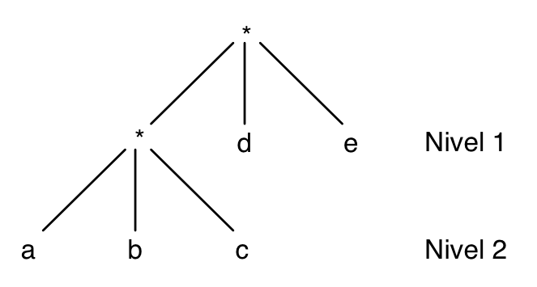
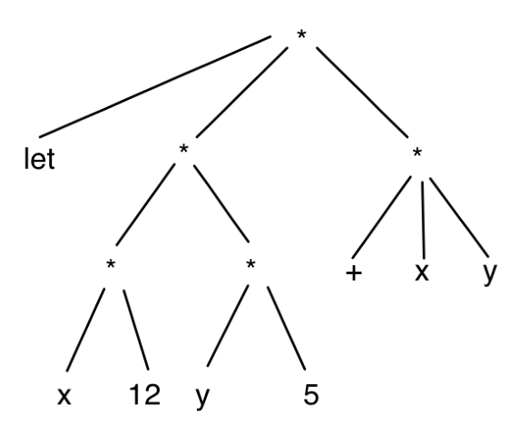
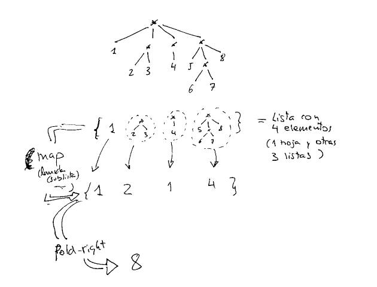
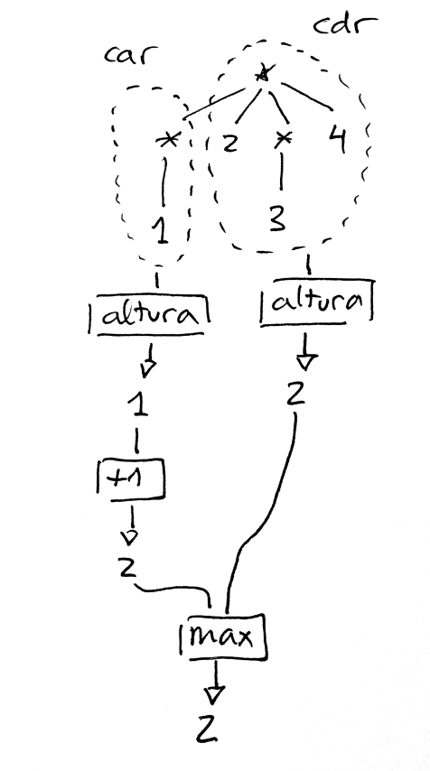
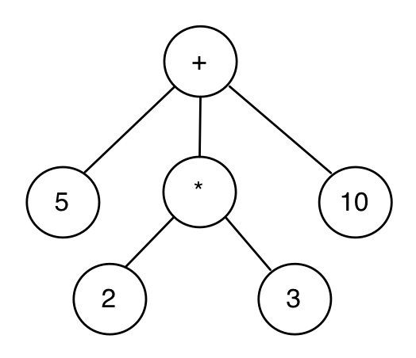
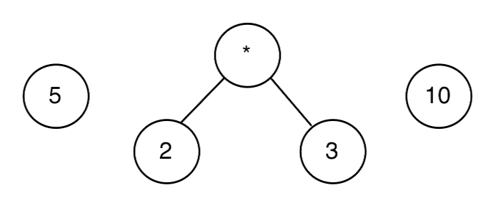
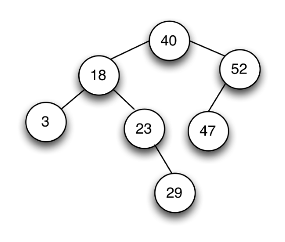
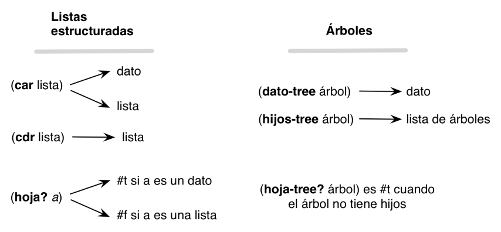

# Tema 4: Estructuras de datos recursivas

## Contenidos

- [1 Listas estructuradas](#1)
    - [1.1 Definición y ejemplos](#1-1)
    - [1.2 Funciones recursivas sobre listas estructuradas](#1-2)
- [2 Árboles](#2)
    - [2.1 Definición de árboles en Scheme](#2-1)
    - [2.2 Funciones recursivas sobre árboles](#2-2) 
- [3 Árboles binarios](#3)
    - [3.1 Definición de árboles binarios en Scheme](#3-1)
	- [3.2 Funciones recursivas sobre árboles binarios](#3-2) 

## Bibliografía - SICP

En este tema explicamos conceptos de los siguientes capítulos del libro *Structure and Intepretation of Computer Programs*:

- [1.2.2 - Tree Recursion](https://mitpress.mit.edu/sicp/full-text/book/book-Z-H-11.html#%_sec_1.2.2)
- [2.2.2 - Hierarchical Structures](https://mitpress.mit.edu/sicp/full-text/book/book-Z-H-15.html#%_sec_2.2.2)


## <a name="1"></a> 1 Listas estructuradas

Hemos visto que las listas en Scheme se implementan como un estructura
de datos recursiva, formada por una pareja que enlaza en su parte
derecha el resto de la lista y que termina con una parte derecha en la
que hay una lista vacía.

En este apartado vamos a volver a estudiar las listas desde un nivel
de abstracción alto, usando las funciones:

- `(car lista)` para obtener el primer elemento de una lista
- `(cdr lista)` para obtener el resto de la lista
- `(cons dato lista)` para construir una nueva lista con el dato como
  primer elemento

En la mayoría de funciones y ejemplos que hemos visto hasta ahora las
listas están formadas por datos y el recorrido por la lista es un
recorrido lineal, iterando por sus elementos.

En este apartado vamos a ampliar este concepto y estudiar cómo
trabajar con *listas que contienen otras listas*.

Veremos que esto cambia fundamentalmente la estructura de las listas y
de las funciones que van a operar con ellas. El cambio fundamental es
que la función `car lista` puede devolver dos tipos de elementos: 

- Un elemento de la lista (del tipo de elementos que hay en la lista)
- Otra lista (formada por el tipo de elementos de la lista)

### <a name="1-1"></a> 1.1 Definición y ejemplos

Las listas en Scheme pueden tener cualquier tipo de elementos,
incluido otras listas.

Llamaremos **lista estructurada** a una lista que contiene otras
sublistas. Lo contrario de lista estructurada es una **lista plana**,
una lista formada por elementos que no son listas. Llamaremos
**hojas** a los elementos de una lista que no son sublistas.

A las listas estructuradas cuyas hojas son símbolos se les denomina en
el contexto de la programación funcional _expresiones-S_
([S-expression](http://en.wikipedia.org/wiki/S-expression)).

Por ejemplo, la lista estructurada:

```
'(a b (c d e) (f (g h)))
```

es una lista estructurada con 4 elementos:

- El elemento `'a`, una hoja
- El elemento `'b`, otra hoja
- La lista plana `'(c d e)`
- La lista estructurada `'(f (g h))`

Se puede construir con cualquiera de las siguientes expresiones:

```
(define lista (list 'a 'b (list 'c 'd 'e) (list 'f (list 'g 'h))))
(define lista '(a b (c d e) (f (g h))))
```

Una lista formada por parejas la consideraremos una lista plana, ya
que no contiene ninguna sublista. Por ejemplo, la lista

```
'((a . 3) (b . 5) (c . 12))
```

es una lista plana de tres elementos (hojas) que son parejas.

#### 1.1.1. Definiciones en Scheme

Vamos a escribir las definiciones anteriores de `hoja`, `plana` y
`estructurada` usando código de Scheme.

##### Función `(hoja? dato)`

Un dato es una hoja si no es una lista:

```
(define (hoja? dato)
   (not (list? dato)))
```

Utilizaremos esta función para comprobar si un determinado elemento de
una lista es o no una hoja. Por ejemplo, supongamos la siguiente
lista:

```
'((1 2) 3 4 (5 6))
```

Es una lista de 4 elementos, siendo el primero y el último otras
sublistas y el segundo y el tercero hojas. Podemos comprobar si son o
no hojas sus elementos:

```
(define lista '((1 2) 3 4 (5 6)))
(hoja? (car lista)) ; ⇒ #f
(hoja? (cadr lista)) ; ⇒ #t
(hoja? (caddr lista)) ; ⇒ #t
(hoja? (cadddr lista)) ; ⇒ #f
```

La lista vacía no es una hoja

```
(hoja? '()) ; ⇒ #f
```

##### Función `(plana? lista)`

Una definición recursiva de lista plana:

>Una lista es plana si y solo si el primer elemento es una hoja y el
>resto es plana.

Y el caso base:

>Una lista vacía es plana.

Usando esta definición recursiva, podemos implementar en Scheme la
función `(plana? lista)` que comprueba si una lista es plana:

```
(define (plana? lista)
   (or (null? lista)
       (and (hoja? (car lista))
            (plana? (cdr lista)))))
```

Ejemplos:

```scheme
(plana? '(a b c d e f)) ; ⇒ #t
(plana? (list (cons 'a 1) "Hola" #f)) ; ⇒ #t
(plana? '(a (b c) d)) ; ⇒ #f
(plana? '(a () b)) ; ⇒ #f
```


##### Función `(estructurada? lista)`

Una lista es estructurada cuando alguno de sus elementos es otra lista:

```
(define (estructurada? lista)
   (if (null? lista)
      #f
      (or (list? (car lista))
          (estructurada? (cdr lista)))))
```

Ejemplos:

```scheme
(estructurada? '(1 2 3 4)) ; ⇒ #f
(estructurada? (list (cons 'a 1) (cons 'b 2) (cons 'c 3))) ; ⇒ #f
(estructurada? '(a () b)) ; ⇒ #t
(estructurada? '(a (b c) d)) ; ⇒ #t
```

Realmente bastaría con haber hecho una de las dos definiciones y
escribir la otra como la negación de la primera:

```
(define (estructurada? lista)
   (not (plana? lista)))
```

#### 1.1.2 Ejemplos de listas estructuradas

Las listas estructuradas son muy útiles para representar información
jerárquica en donde queremos representar elementos que contienen otros
elementos.

Por ejemplo, las expresiones de Scheme son listas estructuradas:

```scheme
(= 4 (+ 2 2))
(if (= x y) (* x y) (+ (/ x y) 45))
(define (factorial x) (if (= x 0) 1 (* x (factorial (- x 1)))))
```

El análisis sintáctico de una oración puede generar una lista
estructurada de símbolos, en donde se agrupan los distintos elementos
de la oración:

```scheme
'((Juan) (compró) (la entrada (de los Miserables)) (el viernes por la tarde))
```

Una página HTML, con sus distintos elementos, unos dentro de otros,
también se puede representar con una lista estructurada:

```scheme
'((<h1> Mi lista de la compra </h1>)
  (<ul> (<li> naranjas </li>)
        (<li> tomates </li>)
        (<li> huevos </li>} </ul>))
```


#### 1.1.3 *Pseudo árboles* con niveles

Las listas estructuradas definen una estructura de niveles, donde la
lista inicial representa el primer nivel, y cada sublista representa
un nivel inferior. Los datos de las listas representan las hojas.

Por ejemplo, la representación en forma de niveles de la lista `((a b
c) d e)` es la siguiente:



Las hojas `d` y `e` están en el nivel 1 y en las posiciones 2 y 3 de
la lista y las hojas `a`, `b` y `c` en el nivel 2 y en la posición 1
de la lista.

> UNA LISTA ESTRUCTURADA NO ES UN ÁRBOL  
> Una lista estructurada no es un árbol propiamente dicho, porque
> todos los datos están en las hojas.

Otro ejemplo. ¿Cuál sería la representación en niveles de la siguiente
lista estructurada?:

```scheme
'(let ((x 12)
       (y 5))
    (+ x y))
```



### <a name="1-2"></a> 1.2 Funciones recursivas sobre listas estructuradas

#### 1.2.1 Número de hojas

Veamos como primer ejemplo la función `(num-hojas lista)` que cuenta
el número de hojas de una lista estructurada.

Por ejemplo:

```
(num-hojas '((1 2) (3 4 (5) 6) (7))) ⇒ 7
```

Como hemos comentado antes, una cuestión clave en las funciones que
vamos a construir sobre listas estructuradas es que el `car` de una
lista estructurada puede ser a su vez otra lista.

Para calcular el número de hojas de una lista podemos obtener el
primer elemento y el resto de la lista, y contar recursivamente el
número de hojas del primer elemento y del resto. Al ser una lista
estructurada, el primer elemento puede ser a su vez otra lista, por lo
que llamamos a la recursión para contar sus hojas.

La definición de este caso general usando _pseudocódigo_ es:

> El número de hojas de una lista estructurada es la suma del número
> de hojas de su primer elemento (que puede ser otra lista) y del
> número de hojas del resto.


Como casos base, podemos considerar cuando la lista es vacía (el
número de hojas es 0) y cuando la lista no es tal, sino que es un dato
(una hoja), en cuyo caso es 1.

En la implementación siguiente llamamos siempre a la recursión por el
`car` y por el `cdr`. Si el `car` es una lista o una hoja se
determinará dentro de esa llamada recursiva.

```scheme
(define (num-hojas x)
   (cond
      ((null? x) 0)
      ((hoja? x) 1)
      (else (+ (num-hojas (car x))
               (num-hojas (cdr x))))))
```

Hay que hacer notar que el parámetro `x` puede ser tanto una lista
como un dato atómico (una hoja). Estamos aprovechándonos de la
característica de Scheme de ser débilmente tipeado para hacer un
código bastante conciso.


##### Versión con funciones de orden superior

Podemos usar también las funciones de orden superior `map` y
`fold-right` para obtener una versión más concisa.

Una lista estructurada tiene como elementos en un primer nivel hojas o
otras sublistas. Podemos entonces mapear una expresión lambda que se
aplica a cada uno de esos elementos. En la expresión lambda
comprobamos si el elemento (el parámetro `sublista` de la expresión
lambda) es una hoja o una lista. En el primero caso devolvemos 1. En
el segundo aplicaremos _la propia función que estamos definiendo_
sobre la sublista, con lo que se devolverá el número de hojas de esa
sublista.

El resultado del map será una lista de números (el número de hojas de
cada componente), que podemos sumar haciendo un `fold-right` con la
función `+`:

```scheme
(define (num-hojas-fos lista)
    (fold-right + 0 (map (lambda (elem)
                           (if (hoja? elem)
                               1
                               (num-hojas-fos elem))) lista)))
```

Una explicación gráfica de cómo funciona la función sobre la lista `'(1 (2 3) (4) (5 (6 7) 8))`:




#### 1.2.2 Altura de una lista estructurada

La *altura* de una lista estructurada viene dada por su número de
niveles: una lista plana tiene una altura de 1, la lista `'((1 2 3) 4
5)` tiene una altura de 2.

Para calcular la altura de una lista estructurada tenemos que obtener
(de forma recursiva) la altura de su primer elemento, y la altura del
resto de la lista, sumarle 1 a la altura del primer elemento y
devolver el máximo de los dos números.



Como casos base, la altura de una lista vacía o de una hoja (dato) es 0.

En Scheme:

```scheme
(define (altura x)
   (cond 
      ((null? x) 0)
      ((hoja? x) 0)
      (else (max (+ 1 (altura (car x)))
                 (altura (cdr x))))))
```
Por ejemplo:

```scheme
(altura '(1 (2 3) 4)) ⇒ 2
(altura '(1 (2 (3)) 3)) ⇒ 3
```

##### Versión con funciones de orden superior

Y la segunda versión, usando las funciones de orden superior `map`
para obtener la altura de sus elementos del primer nivel (puedes ser
hojas o sublistas) y `fold-right` para quedarse con el máximo de la
lista de valores que devuelve el map.

```scheme
(define (altura-fos lista)
   (+ 1 (fold-right max 0 (map (lambda (elem)
                                 (if (hoja? elem)
                                     0
                                     (altura-fos elem))) lista))))
```

#### 1.2.3 Otras funciones recursivas

Vamos a diseñar otras funciones recursivas que trabajan con la
estructura jerárquica de las listas estructuradas.

- `(aplana lista)`: devuelve una lista plana con todas las hojas de la lista
- `(pertenece-lista? dato lista)`: busca una hoja en una lista
  estructurada
- `(nivel-hoja dato lista)`: devuelve el nivel en el que se encuentra
  un dato en una lista
- `(cuadrado-lista lista)`: eleva todas las hojas al cuadrado
  (suponemos que la lista estructurada contiene números)
- `(map-lista f lista)`: similar a map, aplica una función a todas las
  hojas de la lista estructurada y devuelve el resultado (otra lista
  estructurada)

##### `(aplana lista)`

Devuelve una lista plana con todas las hojas de la lista.

```scheme
(define (aplana x)
  (cond
    ((null? x) '())
    ((hoja? x) (list x))
    (else 
     (append (aplana (car x))
             (aplana (cdr x))))))
```
Por ejemplo:

```scheme
(aplana '(1 2 (3 (4 (5))) (((6)))))
; ⇒ {1 2 3 4 5 6}
```

Con funciones de orden superior:

```scheme
(define (aplana-fos lista)
  (fold-right append
              '()
              (map (lambda (elem)
                     (if (hoja? elem)
                         (list elem)
                         (aplana-fos elem))) lista)))
```

##### `(pertenece-lista? dato lista)`

Comprueba si el `dato` aparece en la lista estructurada. 

```scheme
(define (pertenece? dato x)
  (cond 
    ((null? x) #f)
    ((hoja? x) (equal? dato x))
    (else (or (pertenece? dato (car x))
              (pertenece? dato (cdr x))))))
```

Ejemplos:

```scheme
(pertenece? 'a '(b c (d (a)))) ⇒ #t
(pertenece? 'a '(b c (d e (f)) g)) ⇒ #f
```
Con funciones de orden superior:

```scheme
(define (pertenece-fos? dato lista)
  (exists (lambda (elem)
             (if (hoja? elem)
                 (equal? dato elem)
                 (pertenece-fos? dato elem))) lista))
```

##### `(nivel-hoja dato lista)`

Veamos como última función que explora una lista estructurada la
función `(nivel-hoja dato lista)` que recorre la lista buscando el
dato y devuelve el nivel en que se encuentra. Si el dato no se
encuentra en la lista, se devolverá -1. Si el dato se encuentra en más
de un lugar de la lista se devolverá el nivel mayor.

Ejemplos:

```scheme
(nivel-hoja 'b '(a b (c))) ; ⇒ 1
(nivel-hoja 'b '(a (b) c)) ; ⇒ 2
(nivel-hoja 'b '(a (b) d ((b)))) ; ⇒ 3
(nivel-hoja 'b '(a c d ((e)))) ; ⇒ -1
```

```scheme
(define (nivel-hoja dato x)
  (cond
    ((null? x) -1)
    ((hoja? x) (if (equal? x dato) 0 -1))
    (else (max (suma-1-si-mayor-igual-que-0 (nivel-hoja dato (car x)))
               (nivel-hoja dato (cdr x))))))
```

La función auxiliar se define de la siguiente forma:

```scheme
(define (suma-1-si-mayor-igual-que-0 x)
  (if (>= x 0)
      (+ x 1)
      x))
```

Con funciones de orden superior:

```scheme
(define (nivel-hoja-fos dato lista)
  (suma-1-si-mayor-igual-que-0
       (fold-right max -1
                   (map (lambda (elem)
                          (if (hoja? elem)
                              (if (equal? elem dato) 0 -1)
                              (nivel-hoja-fos dato elem)))  lista))))
```

##### `(cuadrado-lista lista)`

Devuelve una lista estructurada con la misma estructura y sus números
elevados al cuadrado.

```scheme
(define (cuadrado-lista x)
  (cond ((null? x) '())
        ((hoja? x) (* x x))
        (else (cons (cuadrado-lista (car x))
                    (cuadrado-lista (cdr x))))))
```

Por ejemplo:

```scheme
(cuadrado-lista '(2 3 (4 (5)))) ⇒ (4 9 (16 (25))
```

Es muy interesante la versión de esta función con funciones de orden
superior:

```scheme
(define (cuadrado-lista-fos lista)
    (map (lambda (elem)
           (if (hoja? elem)
               (* sublista elem)
               (cuadrado-lista-fos elem))) lista))
```

Como una lista estructurada está compuesta de datos o de otras
sublistas podemos aplicar `map` para que devuelva la lista resultante
de transformar la original con la función que le pasamos como
parámetro.

##### `(map-lista f lista)`

Devuelve una lista estructurada igual que la original con el resultado
de aplicar a cada uno de sus hojas la función f
 
```scheme
(define (map-lista f x)
  (cond ((null? x) '())
        ((hoja? x) (f x))
        (else (cons (map-lista f (car x))
                    (map-lista f (cdr x))))))
```
	
Por ejemplo:

```scheme
(map-lista (lambda (x) (* x x)) '(2 3 (4 (5)))) ⇒ (4 9 (16 (25))
```

## <a name="2"></a>2 Árboles

### <a name="2-1"></a>2.1 Definición de árboles en Scheme

#### 2.1.1 Definición de árbol

Un **árbol** es una estructura de datos definida por un valor raíz,
que es el padre de toda la estructura, del que salen otros subárboles
hijos
([Wikipedia](https://en.wikipedia.org/wiki/Tree_(data_structure))).

Un **árbol** se puede definir recursivamente de la siguiente forma:

- Una colección de un **dato** (el valor de la raíz del árbol) y una
  **lista de hijos** que también son árboles.
- Una **hoja** será un árbol sin hijos (un dato con una lista de hijos
  vacía).

Un ejemplo de árbol:



El árbol anterior tiene como dato de la raíz es el símbolo `+` y tiene
3 árboles hijos:



- El primer hijo es un árbol hoja, con valor 5 y sin hijos
- El segundo hijo es un árbol con valor `*` y dos hijos hoja, el 2 y
  el 3
- El tercer hijo es otro árbol hoja, con valor 10

#### 2.1.2 Representación de árboles con listas

En Scheme tenemos como estructura de datos principal la lista. ¿Cómo
construimos un árbol usando listas?

La forma de hacerlo será usar **una lista de _n+1_ elems** para
representar un árbol con n hijos:

- el primer elemento la lista será el dato de la raíz
- el resto serán los árboles hijos

> Árbol: '(dato hijo-1 hijo-2 ... hijo-n)

Los nodos hoja serán por tanto listas de un elemento, el propio dato
(no tiene más elementos porque no tiene hijos)

> Nodo hoja: '(dato)

Por ejemplo, el árbol anterior lo representaremos en Scheme con la
siguiente lista:

```scheme
'(+ (5) (* (2) (3)) (10))
```

Los elementos de esta lista son:

- El primer elemento es el símbolo `+`, el dato valor de la raíz del
  árbol
- El segundo elemento es la lista `'(5)`, que representa el árbol hoja
  formado por un 5
- El tercer elemento es la lista `'(* (2) (3))`, que representa el
  árbol con un dato `*` y dos hijos
- El cuarto elemento es la lista `'(10)`, que representa el árbol hoja
  formado por un 10

Podríamos definir el árbol con la siguiente sentencia:

```scheme
(define arbol1 '(+ (5) (* (2) (3)) (10)))
```

Otro ejemplo más. ¿Cómo se implementa en Scheme el árbol de la siguiente figura?



Se haría con la lista de la siguiente sentencia:

```scheme
(define arbol2 '(40 (18 (3) (23 (29))) (52 (47))))
```

#### 2.1.2 Barrera de abstracción

Una vez definida la forma de representar árboles, vamos a definir las
funciones para manejarlos. Veremos las funciones para obtener el dato
y los hijos y la función para construir un árbol nuevo. Estas
funciones proporcionarán lo que se denomina _barrera de abstracción_
del tipo datos *árbol*.

En todos los nombres de las funciones de la barrera de abstracción
añadimos el sufijo `-arbol`.

Definimos dos conjuntos de funciones: constructores para construir un
nuevo árbol y selectores para obtener los elementos del árbol. Vamos a
empezar por los selectores.

Las funciones que permiten obtener los elementos que constituyen un
dato compuesto reciben el nombre de **selectores**.

**Selectores**

Funciones que obtienen los elementos de un árbol:

```scheme
(define (dato-arbol arbol) 
    (car arbol))

(define (hijos-arbol arbol) 
    (cdr arbol))

(define (hoja-arbol? arbol) 
   (null? (hijos-arbol arbol)))
```

Es importante tener claro los tipos devueltos por las dos primeras
funciones:

- `(dato-arbol arbol)`: devuelve el dato de la raíz del árbol.
- `(hijos-arbol arbol)`: devuelve una lista de árboles hijos. En
  algunas ocasiones llamaremos *bosque* a una lista de árboles.

Por ejemplo, en el árbol `arbol1` las funciones anteriores devuelven
los siguientes valores:

```scheme
(dato-arbol arbol1) ; ⇒ +
(hijos-arbol arbol1) ; ⇒ {{5} {* {2} {3}} {10}}
(hoja-arbol? (car (hijos-arbol arbol1))) ; ⇒ #t
```

- La llamada `(dato-arbol arbol1)` devuelve el dato que hay en la raíz
  del árbol, el símbolo `+`
- La invocación `(hijos-arbol arbol1)` devuelve una lista de tres
  elementos, los árboles hijos: `'((5) (* (2) (3)) (10))`:
    - El primer elemento es la lista `'(5)`, que representa el árbol
      hoja formado por el `5`
    - El segundo es la lista `'(* (2) (3))`, que representa el árbol
      formado por el `*` en su raíz y las hojas `2` y `3`
    - El tercero es la lista `'(10)`, que representa el árbol hoja
      `10`.
- El primer elemento de la lista de hijos es un árbol hoja:
  `(hoja-arbol? (car (hijos-arbol arbol1))) ⇒ #t`
				   
Es muy importante considerar en cada caso con qué tipo de dato estamos
trabajando y usar la barrera de abstracción adecuada en cada caso:

- La función `hijos-arbol` siempre devuelve una lista de árboles, que
  podemos recorrer usando `car` y `cdr`.
- El `car` de una lista de árboles (devuelta por `hijos-arbol`) siempre
  es un árbol y debemos de usar las funciones de su barrera de
  abstracción: `dato-arbol` e `hijos-arbol`.
- La función `dato-arbol` devuelve un dato de árbol, del tipo que
  guardemos en el árbol.

Por ejemplo, para obtener el número 2 en el árbol anterior tendríamos
que hacer lo siguiente: acceder al segundo elemento de la lista de
hijos, después al primer hijo de éste y por último acceder a su
dato. Recordemos que `hijos-arbol` devuelve la lista de árboles hijos,
por lo que utilizaremos las funciones `car` y `cdr` para recorrerlas y
obtener los elementos que nos interesen:

```scheme
(dato-arbol (car (hijos-arbol (cadr (hijos-arbol arbol1))))) ; ⇒ 2
```


**Constructor**

Definimos una función constructora que abstrae la construcción de un
árbol y encapsula su implementación concreta. Para construir un árbol
necesitamos un dato y una lista de árboles hijos. Si la lista de
árboles hijos es vacía, tendremos un nodo hoja.

```scheme
(define (construye-arbol dato lista-arboles)  
   (cons dato lista-arboles))
```

Llamaremos a la función `construye-arbol` pasando su dato
(obligatorio) y la lista de arboles hijos. Si se pasa una lista vacía
como parámetro se estará definiendo un nodo hoja.

Por ejemplo, para definir un nodo hoja con el dato 2:

```scheme
(define arbol3 (construye-arbol 2 '()))
```

Y para definir un árbol con 3 hijos:

```scheme
(define arbol4 (construye-arbol 10 (list (construye-arbol 2 '())
                                         (construye-arbol 5 '()) 
                                         (construye-arbol 9 '())))
```
El árbol 1 anterior se puede construir con las siguientes llamadas al constructor:

```scheme
(construye-arbol '+ (list (construye-arbol 5 '())
                          (construye-arbol '* (list (construye-arbol 2 '())
                                                    (construye-arbol 3 '())))
                          (construye-arbol 10 '()))
```

#### 2.1.3 Diferencia entre árboles y listas estructuradas

Es importante diferenciar la barrera de abstracción de los árboles de
la de las listas estructuradas. Aunque un árbol se implementa en
Scheme con una lista estructurada, a la hora de definir funciones
sobre árboles hay que trabajar con las funciones definidas arriba.

El siguiente esquema resumen las características de los selectores de
la barrera de abstracción de listas y árboles:



### <a name="2-2"></a>2.2 Funciones recursivas sobre árboles

Vamos a diseñar las siguientes funciones recursivas:

* `(suma-datos-arbol arbol)`: devuelve la suma de todos los nodos
* `(to-list-arbol arbol)`: devuelve una lista con los datos del árbol
* `(cuadrado-arbol arbol)`: eleva al cuadrado todos los datos de un
  árbol manteniendo la estructura del árbol original
* `(map-arbol f arbol)`: devuelve un árbol con la estructura del árbol
  original aplicando la función f a subdatos.
* `(altura-arbol arbol)`: devuelve la altura de un árbol

Todas comparten un patrón similar de recursión mutua.

#### 2.2.1 `(suma-datos-arbol arbol)`

Vamos a implementar una función recursiva que sume todos los datos de
un árbol.

Un árbol siempre va a tener un dato y una lista de hijos (que puede
ser vacía) que obtenemos con las funciones `dato-arbol` e
`hijos-arbol`. Podemos plantear entonces el problema de sumar los datos
de un árbol como la suma del dato de su raíz y lo que devuelva la
llamada a una función auxiliar que sume los datos de su lista de hijos
(un bosque):

```scheme
(define (suma-datos-arbol arbol)
    (+ (dato-arbol arbol)
       (suma-datos-bosque (hijos-arbol arbol))))
```

Esta función suma los datos de **UN** árbol. La podemos utilizar
entonces para construir la siguiente función que suma una lista de
árboles:

```scheme
(define (suma-datos-bosque bosque)
   (if (null? bosque)
       0
       (+ (suma-datos-arbol (car bosque)) (suma-datos-bosque (cdr bosque)))))
```

Tenemos una **recursión mutua**: para sumar los datos de una lista de
árboles llamamos a la suma de un árbol individual que a su vez llama a
la suma de sus hijos, etc. La recursión termina cuando calculamos la
suma de un árbol hoja. Entonces se pasa a `suma-datos-bosque` una
lista vacía y ésta devolverá 0.


```scheme
(suma-datos-arbol arbol2) ; ⇒ 212
```

**Versión alternativa con funciones de orden superior**

Al igual que hacíamos con las listas estructuradas, es posible
conseguir una versión más concisa y elegante utilizando funciones de
orden superior:

```scheme
(define (suma-datos-arbol-fos arbol)
   (fold-right + (dato-arbol arbol) 
       (map suma-datos-arbol-fos (hijos-arbol arbol))))
```	

La función `map` aplica la propia función que estamos definiendo a
cada uno de los árboles de `(hijos-arbol arbol)`, devolviendo una lista
de números. Esta lista de número la sumamos haciendo un `fold-right +
0`. Una traza de su funcionamiento sería la siguiente:

```scheme
(suma-datos-arbol-fos '(1 (2 (3) (4)) (5) (6 (7)))) ⇒
   (fold-right + 1 (map suma-datos-arbol-fos '((2 (3) (4)) 
                                                (5)
                                                (6 (7))))) ⇒
(fold-right + 1 '(9 5 13)) ⇒
28
```

#### 2.2.2 `(to-list-arbol arbol)`

Queremos diseñar una función `(to-list-arbol arbol)` que devuelva una
lista con los datos del árbol en un recorrido *preorden*.

```scheme
(define (to-list-arbol arbol)
   (cons (dato-arbol arbol)
         (to-list-bosque (hijos-arbol arbol))))

(define (to-list-bosque bosque)
   (if (null? bosque)
       '()
       (append (to-list-arbol (car bosque))
               (to-list-bosque (cdr bosque)))))
```

La función utiliza una *recursión mutua*: para listar todos los nodos,
añadimos el dato a la lista de nodos que nos devuelve la función
`to-list-bosque`. Esta función coge una lista de árboles (un *bosque*)
y devuelve la lista *preorden* de sus nodos. Para ello, concatena la
lista de los nodos de su primer elemento (el primer árbol) a la lista
de nodos del resto de árboles (que devuelve la llamada recursiva).

Ejemplo:

```scheme
(to-list-arbol '(* (+ (5) (* (2) (3)) (10)) (- (12)))) 
; ⇒ (* + 5 * 2 3 10 - 12)
```

Una definición alternativa usando funciones de orden superior:

```scheme
(define (to-list-arbol-fos arbol)
    (cons (dato-arbol arbol)
          (fold-right append '() (map to-list-arbol-fos (hijos-arbol arbol)))))
```

Esta versión es muy elegante y concisa. Usa la función `map` que
aplica una función a los elementos de una lista y devuelve la lista
resultante. Como lo que devuelve `(hijos-arbol arbol)` es precisamente
una lista de árboles podemos aplicar a sus elementos cualquier función
definida sobre árboles. Incluso la propia función que estamos
definiendo (¡confía en la recursión!).

#### 2.2.3 `(cuadrado-arbol arbol)`

Veamos ahora la función `(cuadrado-arbol arbol)` que toma un árbol de
números y devuelve un árbol con la misma estructura y sus datos
elevados al cuadrado:

```scheme
(define (cuadrado-arbol arbol)
   (construye-arbol (cuadrado (dato-arbol arbol))
                    (cuadrado-bosque (hijos-arbol arbol))))  

(define (cuadrado-bosque bosque)
   (if (null? bosque)
       '()
       (cons (cuadrado-arbol (car bosque))
               (cuadrado-bosque (cdr bosque)))))
```

Ejemplo:

```scheme
(cuadrado-arbol '(2 (3 (4) (5)) (6))) 
; ⇒ (4 (9 (16) (25)) (36))
```

Versión 2, con la función de orden superior `map`:

```scheme
(define (cuadrado-arbol-fos arbol)
   (construye-arbol (cuadrado (dato-arbol arbol))
   	                (map cuadrado-arbol-fos (hijos-arbol arbol))))
```

#### 2.2.4 `map-arbol`

La función `map-arbol` es una función de orden superior que generaliza
la función anterior. Definimos un parámetro adicional en el que se
pasa la función a aplicar a los elementos del árbol.

```scheme
(define (map-arbol f arbol)
   (construye-arbol (f (dato-arbol arbol))
              (map-bosque f (hijos-arbol arbol))))  

(define (map-bosque f bosque)
   (if (null? bosque)
       '()
       (cons (map-arbol f (car bosque))
             (map-bosque f (cdr bosque)))))
```

Ejemplos:

```scheme
(map-arbol cuadrado '(2 (3 (4) (5)) (6)))
; ⇒ (4 (9 (16) (25)) (36))
(map-arbol (lambda (x) (+ x 1)) '(2 (3 (4) (5)) (6)))
; ⇒ (3 (4 (5) (6)) (7))
```

Con `map`:

```scheme
(define (map-arbol-fos f arbol)
  (construye-arbol (f (dato-arbol arbol))
             (map (lambda (x)
                    (map-arbol-fos f x)) (hijos-arbol arbol))))
```


#### 2.2.5. `altura-arbol`

Vamos por último a definir una función que devuelve la altura de un
árbol (el nivel del nodo de mayor nivel). Un nodo hoja tiene de altura
0.

Solución 1:

```scheme
(define (altura-arbol arbol)
   (if (hoja-arbol? arbol)
       0
       (+ 1 (max-altura-bosque (hijos-arbol arbol)))))  

(define (max-altura-bosque bosque)
    (if (null? bosque)
        0
        (max (altura-arbol (car bosque))
             (max-altura-bosque (cdr bosque)))))
```

Ejemplos:


```scheme
(altura-arbol '(2)) ;  ⇒ 0
(altura-arbol '(4 (9 (16) (25)) (36))) ; ⇒ 2
```

Solución con funciones de orden superior:

```scheme
(define (altura-arbol-fos arbol)
   (if (hoja-arbol? arbol)
       0
       (+ 1 (fold-right max 0
               (map altura-arbol-fos (hijos-arbol arbol))))))
```
	
La función `map` mapea sobre los árboles hijos la propia función que
calcula la altura del hijo (será uno menos que la altura del padre, 0
si se trata de una hoja).

La función `map` devuelve entonces una lista altura de los hijos, de
la que obtenemos el máximo plegando la lista con la función `max`. 

Por último sumamos 1 para devolver la altura del árbol completo (un
nivel más que el nivel máximo de los hijos).

## <a name="3"></a> 3 Arboles binarios

### <a name="3-1"></a>3.1 Definición de árboles binarios en Scheme

Los árboles binarios son árboles cuyos nodos tienen 0, 1 o 2
hijos. Por ejemplo, el árbol mostrado en la siguiente figura es un
árbol binario.


A diferencia de los árboles genéricos vistos anteriormente un árbol
binario no puede tener más de dos hijos.

Los representaremos en Scheme utilizando una lista de tres elementos:

- Dato
- Hijo izquierdo (otro árbol binario)
- Hijo derecho (otro árbol binario)

En el caso en que no exista el hijo izquierdo o el derecho (o ambos)
utilizaremos una lista vacía para indicar un nodo vacío.

De esta manera, un nodo hoja con el dato 10 se representará en Scheme con la lista:

```scheme
'(10 () ())
```

Por ejemplo, representamos el árbol de la figura anterior con la
siguiente lista:

```scheme
'(40 (18 (3 () ())
         (23 ()
             (29 () ())))
     (52 (47 () ())
         ()))
```

#### 3.1.2 Barrera de abstracción ####

Definimos la siguiente barrera de abstracción para los árboles
binarios. Terminamos todos los nombres de las funciones con el sufijo
`-arbolb` (árbol binario).

**Selectores**

```scheme
(define (dato-arbolb arbol)
   (car arbol))
   
(define (hijo-izq-arbolb arbol)
   (cadr arbol))

(define (hijo-der-arbolb arbol)
   (caddr arbol))
   
(define (vacio-arbolb? arbol)
   (null? arbol))

(define (hoja-arbolb? arbol)
   (and (vacio-arbolb? (hijo-izq-arbolb arbol))
        (vacio-arbolb? (hijo-der-arbolb arbol))))
   
(define arbolb-vacio '())
```

**Constructor**

```scheme
(define (construye-arbolb dato hijo-izq hijo-der)
    (list dato hijo-izq hijo-der))
```

Por ejemplo, para construir un árbol con 10 en la raíz y 8 en su hijo
izquierdo y 15 en su derecho utilizando el constructor de la barrera
de abstracción:

```scheme
(define arbolb1
   (construye-arbolb 10 (construye-arbolb 8 arbolb-vacio arbolb-vacio)
                        (construye-arbolb 15 arbolb-vacio arbolb-vacio)))
```

Otro ejemplo, el árbol binario de la figura anterior utilizando el
constructor de la barrera de abstracción:

```scheme
(define arbolb2
   (construye-arbolb 40 
                    (construye-arbolb 18
                                      (construye-arbolb 3 arbolb-vacio arbolb-vacio)
                                      (construye-arbolb 23 
                                                        arbolb-vacio
                                                        (construye-arbolb 29 
                                                                          arbolb-vacio
                                                                          arbolb-vacio)))
                    (construye-arbolb 52
                                      (construye-arbolb 47 arbolb-vacio arbolb-vacio)
                                      arbolb-vacio)))
```

### <a name="3-2"></a>3.2 Funciones recursivas sobre árboles binarios

Veamos las siguientes funciones recursivas sobre árboles binarios:

* `(suma-datos-arbolb arbol)`: devuelve la suma de todos los nodos
* `(to-list-arbolb arbol)`: devuelve una lista con los datos del árbol
* `(cuadrado-arbolb arbol)`: eleva al cuadrado todos los datos de un
  árbol manteniendo la estructura del árbol original

**suma-datos-arbolb**

```scheme
(define (suma-datos-arbolb arbol)
   (if (vacio-arbolb? arbol)
      0
      (+ (dato-arbolb arbol)
         (suma-datos-arbolb (hijo-izq-arbolb arbol))
         (suma-datos-arbolb (hijo-der-arbolb arbol)))))

(suma-datos-arbolb arbolb2) ; ⇒ 212
```


**to-list-arbolb**

```scheme
(define (to-list-arbolb arbol)
   (if (vacio-arbolb? arbol)
      '()
      (cons (dato-arbolb arbol)
            (append (to-list-arbolb (hijo-izq-arbolb arbol))
                    (to-list-arbolb (hijo-der-arbolb arbol))))))

(to-list-arbolb arbolb2) ; ⇒ (40 18 3 23 29 52 47)
```


**cuadrado-arbolb**

```scheme
(define (cuadrado-arbolb arbol)
   (if (vacio-arbolb? arbol)
      arbolb-vacio
      (construye-arbolb (cuadrado (dato-arbolb arbol))
                        (cuadrado-arbolb (hijo-izq-arbolb arbol))
                        (cuadrado-arbolb (hijo-der-arbolb arbol)))))

(cuadrado-arbolb arbolb1) ; ⇒ (100 (64 () ()) (225 () ()))
```
----

Lenguajes y Paradigmas de Programación, curso 2017-18  
© Departamento Ciencia de la Computación e Inteligencia Artificial, Universidad de Alicante  
Domingo Gallardo, Cristina Pomares, Antonio Botía, Francisco Martínez

