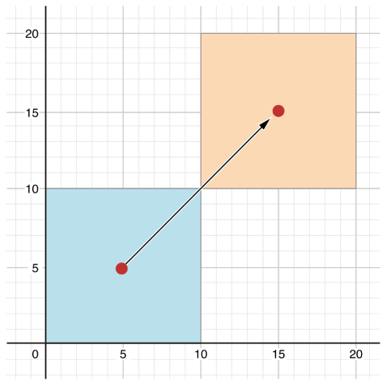

<!--

Para el curso que viene:
 - Incluir modificador 'opcional' en protocolos

Cosas importantes que no contamos, que habría que contar (si hubiera 
tiempo en la última sesión):

- Un protocolo puede extender otro protocolo (o más de uno)
https://developer.apple.com/library/content/documentation/Swift/Conceptual/Swift_Programming_Language/Protocols.html#//apple_ref/doc/uid/TP40014097-CH25-ID280

- Ampliar el tema de genéricos con type constraints y cláusula where

-->

## Tema 6: Programación Orientada a Objetos con Swift

### Contenidos

- [1. Introducción, historia y características](#1)
- [2. Clases y estructuras](#2)
- [3. Propiedades](#3)
- [4. Métodos](#4)
- [5. Herencia](#5)
- [6. Inicialización](#6)
- [7. Protocolos](#7)
- [8. Casting de tipos](#8)
- [9. Extensiones](#9)
- [10. Funciones operador](#10)
- [11. Genericos](#11)

----

### Bibliografía

- Swift Language Guide
    - [Classes and Structures](https://developer.apple.com/library/ios/documentation/Swift/Conceptual/Swift_Programming_Language/ClassesAndStructures.html#//apple_ref/doc/uid/TP40014097-CH13-ID82)
    - [Properties](https://developer.apple.com/library/ios/documentation/Swift/Conceptual/Swift_Programming_Language/Properties.html#//apple_ref/doc/uid/TP40014097-CH14-ID254)
    - [Methods](https://developer.apple.com/library/ios/documentation/Swift/Conceptual/Swift_Programming_Language/Methods.html#//apple_ref/doc/uid/TP40014097-CH15-ID234)
    - [Inheritance](https://developer.apple.com/library/ios/documentation/Swift/Conceptual/Swift_Programming_Language/Inheritance.html#//apple_ref/doc/uid/TP40014097-CH17-ID193=)
    - [Initialization](https://developer.apple.com/library/ios/documentation/Swift/Conceptual/Swift_Programming_Language/Initialization.html#//apple_ref/doc/uid/TP40014097-CH18-ID203)
    - [Protocolos](https://developer.apple.com/library/ios/documentation/Swift/Conceptual/Swift_Programming_Language/Protocols.html#//apple_ref/doc/uid/TP40014097-CH25-ID267)
    - [Casting de tipos](https://developer.apple.com/library/ios/documentation/Swift/Conceptual/Swift_Programming_Language/TypeCasting.html#//apple_ref/doc/uid/TP40014097-CH22-ID338)
    - [Extensiones](https://developer.apple.com/library/ios/documentation/Swift/Conceptual/Swift_Programming_Language/Extensions.html#//apple_ref/doc/uid/TP40014097-CH24-ID151)
    - [Funciones operador](https://developer.apple.com/library/ios/documentation/Swift/Conceptual/Swift_Programming_Language/AdvancedOperators.html#//apple_ref/doc/uid/TP40014097-CH27-ID28)
    - [Genéricos](https://developer.apple.com/library/content/documentation/Swift/Conceptual/Swift_Programming_Language/Generics.html#//apple_ref/doc/uid/TP40014097-CH26-ID179)

### <a name="1"></a> 1. Introducción, historia y características de la Programación Orientada a Objetos

#### Nacimiento

- La Programación Orientada a Objetos es un paradigma de programación
  que explota en los 80 pero nace a partir de ideas a finales de los
  60 y 70
- Primer lenguaje con las ideas fundamentales de POO: Simula
- Smalltalk (1980) como lenguaje paradigmática de POO
- Alan Kay es el creador del término “Object-Oriented” y una de las
  figuras fundamentales de la historia de la informática
  moderna. Trabajó en Xerox Park y desarrolló allí ideas que han sido
  clave para la informática personal (como el Dynabook, precursor de
  tablets y dispositivos móviles y el lenguajes de programación Smalltalk)
- Artículo de Alan Kay:
  [“The Early History of Smalltalk”](http://gagne.homedns.org/%7etgagne/contrib/EarlyHistoryST.html),
  ACM SIGPLAN, March 1993

#### Alan Kay

> “I invented the term Object-Oriented and I can tell you I did not
> have C++ in mind.”

> “Smalltalk is not only NOT its syntax or the class library, it is
> not even about classes. I'm sorry that I long ago coined the term
> objects for this topic because it gets many people to focus on the
> lesser idea. The big idea is messaging.”

> “Smalltalk's design–and existence–is due to the insight that
> everything we can describe can be represented by the recursive
> composition of a single kind of behavioral building block that hides
> its combination of state and process inside itself and can be dealt
> with only through the exchange of messages.”

#### ¿Interesados en Smalltalk?

Visitar:

- [http://www.squeak.org/](http://www.squeak.org/)
- [http://swiki.agro.uba.ar/small_land](http://swiki.agro.uba.ar/small_land)
- [http://www.squeakland.org](http://www.squeakland.org)

#### Lenguajes OO

- Smalltalk, Java, Scala, Ruby, Python, C#, C++, Swift, ...

#### Del paradigma imperativo al OO

- Programación procedural: estado abstracto (tipos de datos y barrera
  de abstracción) + funciones
- Siguiente paso: agrupar estado y funciones en una única entidad
- Los objetos son estas entidades


#### Características de la POO

- Objetos (creados/instanciados en tiempo de ejecución) y clases
  (plantillas estáticas/tiempo de compilación)
- Los objetos agrupan estado y conducta (métodos)
- Los métodos se invocan mediante mensajes
- *Dispatch dinámico*: cuando una operación es invocada sobre un
  objeto, el propio objeto determina qué código se ejecuta. Dos
  objetos con la misma interfaz pueden tener implementaciones
  distintas.
- Herencia: las clases se pueden definir utilizando otras clases como
  plantillas y modificando sus métodos y/o variables de instancia.

#### Clases y objetos

Objeto:

- Un objeto contiene un estado (propiedades, atributos o variables de
  instancia) y un conjunto de funciones (métodos) que se ejecutan en
  el ámbito del objeto e implementan las funcionalidades soportadas
- Al ejecutar un método, el objeto modifica su estado
- Pedimos a un objeto que ejecute un método

Clase:

- Una clase es la plantilla que sirve para definir los objetos
- En una clase se define los elementos que componen el objeto (sus
  atributos o campos) y sus métodos
- En algunos lenguajes se pueden definir también en las clases
  variables (variables de clase) compartidas por todos los objetos de
  esa clase

#### Lenguajes POO dinámicos vs. estáticos

Dos tendencias:

- Lenguajes **dinámicos**: muchas características del programa se
  obtienen en tiempo de ejecución
    - Mayor flexibilidad y generalidad del código
    - Dispatch dinámico
    - Reflexión (posibilidad de consultar características de la
      instancia (nombres de métodos, propiedades, etc.) en tiempo de
      ejecución)
    - Ejemplos: Smalltalk, Ruby, Python, JavaScript, Java (en menor
      medida)

- Lenguajes **estáticos**: la mayoría de características del programa
  se obtienen en tiempo de compilación
    - Mayor eficiencia
    - Se conoce a priori el tipo de la mayor parte de instancias del
      programa
    - Fuertemente tipeado
    - Ejemplos: C++, Swift


Vamos a detallar a continuación las **características de Programación
Orientada a Objetos de Swift**. Para tener una introducción rápida
puedes empezar leyendo los últimos apartados del [seminario de
Swift](https://github.com/domingogallardo/apuntes-lpp/blob/master/seminarios/seminario2-swift/seminario2-swift.md)
(los apartados **Objetos, clases y estructuras**, **Protocolos y
extensiones** y **Genéricos**).

### <a name="2"></a> 2. Clases y estructuras

En el caso de Swift, las clases y las estructuras son muchas más
cercanas en funcionalidad que en otros lenguajes, como C o C++, y
tienen muchas características comunes. Muchas características de las
instancias de una clase se pueden aplicar también a las instancias de
una estructura. Por eso en Swift se suele hablar de _instancias_ (un
término más general) en lugar de _objetos_.

Las clases y las estructuras en Swift tienen muchas cosas en
común. Ambos pueden:

- Definir propiedades y almacenar valores
- Definir métodos para proporcionar funcionalidad
- Definir subíndices para proporcionar acceso a sus valores usando una
  sintaxis de subíndice
- Definir inicializadores para configurar el estado inicial
- Ser extendidas para expandir su funcionalidad más allá de una
  implementación por defecto
- Ajustarse a un protocolo 

Las clases tienen características adicionales que no tienen las
estructuras:

- Mediante la herencia una clase puede heredar las características de
  otra
- El casting de tipos permite comprobar e interpretar el tipo de una
  instancia de una clase en tiempo de ejecución
- Los deinicializadores permiten a una instancia de una clase liberar
  los recursos que ha asignado
- Mediante el conteo de referencias se permite que exista más de una
  referencia a una instancia de una clase

#### Definición

```swift
class UnaClase {
    // definición de clase
}
struct UnaEstructura {
    // definición de una estructura
}
```

```swift
struct CoordsPantalla {
    var posX = 0
    var posY = 0
}

class Ventana {
    var esquina = CoordsPantalla()
    var altura = 0
    var anchura = 0
    var visible = true
    var etiqueta: String?
}
```

El ejemplo define una nueva estructura llamada `CoordsPantalla`, que
describe una coordenada de pantalla con posiciones basadas en
píxeles. La estructura tiene dos propiedades almacenadas llamadas
`posX` y `posY`. Las propiedades son constantes o variables que se
almacenan en la instancia de la clase o de la estructura. El
compilador infiere que estas dos propiedades son `Int` al
inicializarlas a los valores iniciales de 0.

El ejemplo también define una nueva clase llamada `Ventana` que
describe una ventana en una pantalla. Esta clase tiene cinco
propiedades variables. La primera, `esquina`, se inicializa con una
instancia nueva de una estructura `CoorsPantalla` y se infiere que es
de tipo `CoordsPantalla`. Representa la posición superior izquierda de
la pantalla. Las propiedades `altura` y `anchura` representan el
número de píxeles de las dimensiones de la pantalla. Se inicializan
a 0. La propiedad `visible` es un `Bool` que indica si la ventana es
visible en pantalla. Por ejemplo, una ventana que esté minimizada no
será visible. Por último, `etiqueta` representa el nombre que aparece
en la parte superior de la ventana. Es un `String` opcional que se
inicializa a `nil` porque no se le asigna un valor inicial.

#### Instancias de clases y estructuras

La definición de las estructuras y las clases únicamente definen sus
aspectos generales. Para describir una configuración específica (una
resolución o un modo de vídeo concreto) es necesario crear una
instancia de una estructura o una clase. La sintaxis para crear ambas
es similar:

```swift
let unasCoordsPantalla = CoordsPantalla()
let unaVentana = Ventana()
```

La forma más sencilla de inicialización es la anterior. Se utiliza el
nombre del tipo de la clase o estructura seguidos de paréntesis
vacíos. Esto crea una nueva instancia de una clase o estructura, con
sus propiedades inicializadas a sus valores por defectos. Más adelante
comentaremos otras formas más elaboradas de inicialización.

Todas las propiedades de una instancia deben estar definidas después
de haberse inicializado, a no ser que la propiedad se un opcional.

#### Acceso a propiedades

Se puede acceder y modificar las propiedades usando la _sintaxis de
punto_:

```swift
print("La posición x de unasCoordsPantalla es \(unasCoordsPantalla.posX)")
// Imprime "La posición x de unasCoordsPantalla es 0"
print("La posición y de la esquina de la venana es \(unaVentana.esquina.posY)")
// Imprime "La posición y de la esquina de la venana es 0")
unaVentana.esquina.posY = 900
print("La posición y de la esquina de la venana es ahora \(unaVentana.esquina.posY)")
// Imprime "La posición y de la esquina de la venana es ahora 900")
```

#### Inicialización de las estructuras por sus propiedades

Podemos inicializar las estructuras el **inicializador por defecto**,
en el que damos valor a todas sus propiedades. En las clases no se
puede usar esta inicialización por defecto.

```swift
let coords = CoordsPantalla(posX: 200, posY: 400)
```

#### Estructuras y enumeraciones son tipos valor

Un _tipo valor_ es un tipo cuyo valor se copia cuando se asigna a una
variable o constante, o cuando se pasa a una función.

Todos los tipos básicos de Swift -enteros, números en punto flotante,
cadenas, arrays y diccionarios- son tipos valor y se implementan como
estructuras. Las estructuras y las enumeraciones son tipos valor en
Swift.

```swift
let coords1 = CoordsPantalla(posX: 600, posY: 600)
var coords2 = coords1
coords2.posX = 1000
print("coords2 tiene ahora como posición x: \(coords2.posX)")
// imprime: "coords2 tiene ahora como posición x: 1000"
print("coords1 tiene todavía la posición x: \(coords1.posX)")
// imprime: "coords1 tiene todavía la posición x: 600"
```

En el ejemplo se declara una constante llamada `coords1` y se asigna a una
instancia de `CoordsPantalla` inicializada con la posición x de 600 y
la posición y de 600. Después se declara una variable llamada
`coords2` y se asigna al valor actual de `coors1`. Debido a que `CoordsPantalla`
es una estructura, se crea _una copia_ de la instancia existente y
esta nueva copia se asigna a `coords2`. Aunque ahora `coords2` y `coords1` tienen
las mismas `posX` y `posY`, son dos instancias completamente
distintas. Después, la propiedad `posX` de `coords2` se actualiza a 1000.

Podemos comprobar que la propiedad se modifica, pero que el valor de
`posX` en `coords1` sigue siendo el mismo.

#### Las clases son tipos referencia

A diferencia de los tipos valor, los tipos de referencias no se copian
cuando se asignan o se pasan a funciones. En su lugar se usa una
referencia a la misma instancia existente.

Veamos un ejemplo:

```swift
let ventana1 = Ventana()
ventana1.esquina = coords1
ventana1.altura = 800
ventana1.anchura = 800
ventana1.etiqueta = "Finder"
let ventana2 = ventana1
ventana2.anchura = 1000
print("La propiedad anchura de ventana1 es ahora \(ventana1.anchura)")
// imprime "La propiedad anchura de ventana1 es ahora 1000"
```

Declaramos una constante llamada `ventana1` inicializada con una
instancia nueva de la clase `Ventana`. Le asignamos a la propiedad
`esquina` una copia de la resolución anterior `coords1`. Después
declaramos la altura, anchura y etiqueta de la ventana.

Después, `ventana1` se asigna a una nueva constante llamada
`ventan2`, y la anchura se modifica. Debido a que son
tipos de referencia, `ventana1` y `ventana2` se refieren
a la misma instancia de `Ventana`. Son sólo dos nombres distintos
para la misma única instancia.

Hay que hacer notar que `ventana1` y `ventana2` se
declaran con `let` como constantes. Sin embargo, podemos modificar sus
propiedades debido a que no se ha reasignado su instancia a la que se
refieren". Esas variables no "almacenan" instancias de `Ventana`, sino que se
"refieren" a una instancia de la clase. Es la propiedad `anchura`
de la instancia subyacente la que se cambia, no los valores de las
referencias constantes a la instancia de `Ventana`.

A diferencia de las clases, una instancia de un `struct` definida con
un `let` define como constantes todas sus propiedades. Por ejemplo, el
siguiente código generaría un error:

```swift
let coords3 = CoordsPantalla(posX: 400, posY: 400)
coords3.posX = 800
// error: cannot assign to property: 'coords3' is a 'let' constant
```

#### Operadores de identidad

A veces puede ser útil descubrir si dos constantes o variables se
refieren exactamente a la misma instancia de una clase. Para permitir
esto, Swift proporciona dos operadores de identidad:

- Idéntico a (`===`)
- No idéntico a (`!==`)

```swift
if ventana1 === ventana2 {
    print("ventana1 y ventana2 se refierena a la misma instancia de ventana.")
}
// Imprime "ventana1 y ventana2 se refierena a la misma instancia de ventana."
```

Estos operadores "idéntico a" no son los mismos que los de "igual a"
(representado por dos signos iguales `==`):

- "Idéntico a" significa que dos constantes o variables de una clase
  se refieren exactamente a la misma instancia de la clase.
- "Igual a" significa que dos instancias se consideran "iguales" o
  "equivalentes" en su valor. Es responsabilidad del diseñador de la
  clase definir la implementación de estos operadores.

Si tienes experiencia con C, C++, o Objective-C, puedes saber que
estos lenguajes usan punteros para referirse a una dirección de
memoria. Una constante o variable en Swift que se refiere a una
instancia de un tipo referencia es similar a un puntero en C, pero no
es un puntero que apunta a una dirección de memoria y no requiere que
se escriba un asterisco (*) para indicar que estas creando una
referencia. En su lugar, estas referencias se definen como cualquier
otra constante o variable en Swift.

#### Criterios para usar estructuras y clases

Podemos usar tanto clases como estructuras para definir nuestros tipos
de datos y utilizarlos como bloques de construcción del código de
nuestros programas. Sin embargo, se utilizan para distintos tipos de
tareas.

Como regla general, utilizaremos una estructura cuando se cumplen una
o más de las siguientes condiciones:

- El principal objetivo de la estructura es encapsular unos pocos
  datos relativamente sencillos.
- Es razonable esperar que los valores encapsulados serán copiados,
  más que referenciados, cuando asignamos o pasamos una instancia de
  esa estructura.
- Todas las propiedades almacenadas en la estructura son a su vez
  tipos valor, que también se espera que sean copiados más que
  referenciados.
- La estructura no necesita heredar propiedades o conducta de otro
  tipo existente.

Ejemplos de buenos candidatos de estructuras incluyen:

- El tamaño de una forma geométrica, encapsulando por ejemplo las
  propiedades `ancho` y `alto` de tipo `Double`.
- Una forma de referirse a rangos dentro de una serie, encapsulando
  por ejemplo, una propiedad `comienzo` y otra `longitud`, ambos del
  tipo `Int`.
- Un punto en un sistema de coordenadas 3D, encapsulando quizás las
  propiedades `x`, `y` y `z`, todos ellos de tipo `Double`.

En el resto de casos, definiremos una clase y crearemos instancias de
esa clase que tendrán que ser gestionadas y pasadas por referencia. En
la práctica, esto representa que la mayoría de datos que construiremos
en nuestros programas deberían clases, no estructuras. Aunque usaremos
muchas de las estructuras estándar de Swift.

### <a name="3"></a> 3. Propiedades

Las _propiedades_ asocian valores con una clase, estructura o
enumeración particular. Las propiedades almacenadas (_stored
properties_) almacenan valores constantes y variables como parte de
una instancia, mientras que las propiedades calculadas (_computed
properties_) calculan (en lugar de almacenar) un valor. Las
propiedades calculadas se definen en clases, estructuras y
enumeraciones. Las propiedades almacenadas se definen sólo en clases y
estructuras.

- Enumeraciones: pueden contener sólo propiedades calculadas.
- Clases y estructuras: pueden contener propiedades almacenadas y calculadas.

Las propiedades calculadas y almacenadas se asocian habitualmente con
instancias de un tipo particular. Sin embargo, las propiedades también
pueden asociarse con el propio tipo. Estas propiedades se conocen como
propiedades del tipo (_type properties_).

Además, en Swift es posible definir observadores de propiedades que
monitoricen cambios en los valores de una propiedad, a los que podemos
responder con acciones programadas. Los observadores de propiedades
pueden añadirse tanto a propiedades almacenadas definidas por nosotros
como a propiedades heredadas de la superclase.

#### Propiedades almacenadas

En su forma más simple, una propiedad almacenada es una constante o
variable que está almacenada como parte de una instancia de una clase
o estructura particular. Las propiedades almacenadas pueden ser o bien
variables (usando la palabra clave `var`) o bien constantes (usando la
palabra clave `let`).

Podemos proporcionar un valor por defecto para la inicialización de
las propiedades almacenadas, tanto variables como constantes.

El siguiente ejemplo define una estructura llamada `RangoLongitudFija`
que describe un rango de valores enteros cuya longitud no puede ser
modificada una vez que se crea:

```swift
struct RangoLongitudFija {
    var primerValor: Int
    let longitud: Int
}
var rangoDeTresItemss = RangoLongitudFija(primerValor: 0, longitud: 3)
// el rango representa ahora valores enteros the range represents integer values 0, 1, and 2
rangoDeTresItemss.primerValor = 6
// el rango representa ahora valores enteros 6, 7 y 8
```

Las instancias de `RangoLongitudFija` tienen una propiedad almacenada
variable llamada `primerValor` y una propiedad almacenada constante
llamada `longitud`. En el ejemplo, `longitud` se inicializa cuando se
crea el nuevo rango y no puede ser cambiada en el futuro, por ser una
propiedad constante.

Si creamos una instancia de una estructura y la asignamos a una
constante, no podremos modificar las propiedades de la instancia,
incluso si han sido declaradas como propiedades variables:

```swift
let rangoDeCuatroItems = RangoLongitudFija(primerValor: 0, longitud: 4)
// este rango representa valores enteros 0, 1, 2 y 3
rangoDeCuatroItems.primerValor = 6
// esto producirá un error, incluso aun siendo primerValor una propiedad variable
```

Debido a que `rangoDeCuatroItems` se ha declarado como constante (con
la palabra clave `let`), no es posible cambiar su propiedad
`primerValor`, incluso aunque sea una propiedad variable. Esta
conducta se debe a que las estructuras son _tipos valor_. Cuando una
instancia de un tipo valor se marca como constante, también lo son
todas sus propiedades.

Esto no sucede así con las clases, que son _tipos referencia_. Si
asignamos una instancia de un tipo referencia a una constante, puedes
seguir cambiando las propiedades variables de esa instancia.

#### Propiedades calculadas

Además de las propiedades almacenadas, las clases, estructuras y
enumeraciones pueden definir _propiedades calculadas_, que no
almacenan realmente un valor. En su lugar, proporcionan un _getter_ y
un opcional _setter_ que devuelven y modifican otras propiedades y
valores de forma indirecta.

```swift
struct Punto {
    var x = 0.0, y = 0.0
}
struct Tamaño {
    var ancho = 0.0, alto = 0.0
}
struct Rectangulo {
    var origen = Punto()
    var tamaño = Tamaño()
    var centro: Punto {
        get {
            let centroX = origen.x + (tamaño.ancho / 2)
            let centroY = origen.y + (tamaño.alto / 2)
            return Punto(x: centroX, y: centroY)
        }
        set(centroNuevo) {
            origen.x = centroNuevo.x - (tamaño.ancho / 2)
            origen.y = centroNuevo.y - (tamaño.alto / 2)
        }
    }
}
var cuadrado = Rectangulo(origen: Punto(x: 0.0, y: 0.0),
                  tamaño: Tamaño(ancho: 10.0, alto: 10.0))
let centroCuadradoInicial = cuadrado.centro
cuadrado.centro = Punto(x: 15.0, y: 15.0)
print("cuadrado.origen está ahora en (\(cuadrado.origen.x), \(cuadrado.origen.y))")
// Prints "cuadrado.origen está ahora en (10.0, 10.0)"
```

Este ejemplo define tres estructuras para trabajar con formas
geométricas:

- `Punto` encapsula una coordenada `(x, y)`
- `Tamaño` encapsula un ancho y un alto
- `Rectangulo` define una rectángulo por un punto de origen y un
  tamaño

La estructura `Rectangulo` proporciona una propiedad calculada llamada
`centro`. La posición actual del centro de un `Rectangulo` puede ser
siempre determinada a partir de su origen y su tamaño, por lo que no
necesitamos almacenarlo como un `Punto` explícito. En su lugar,
`Rectangulo` define un _getter_ y un _setter_ programado para una
variable calculada llamada `centro`, para permitirnos trabajar con el
centro del rectángulo como si fuera una propiedad almacenada.

En el ejemplo se crea una variable `Rectangulo` llamada `cuadrado`. La
variable `cuadrado` se inicializa un un punto origen de `(0, 0)` y un
ancho y tamaño de `10`. Este cuadrado está representado por el
cuadrado azul en el diagrama de abajo.

Accedemos entonces a la propiedad `centro` de la variable `cuadrado`
usando la sintaxis del punto (`square.centro`), lo que causa que se
llame al _getter_ de `centro` para devolver el valor actual de la
propiedad. En lugar de devolver los valores existentes, el _getter_
calcula realmente y devuelve un nuevo `Punto` para representar el
centro del cuadrado. Como puede verse arriba, el _getter_ devuelve
correctamente un punto con los valores `(5, 5)`.

Después la propiedad centro se actualiza al nuevo valor de `(15, 15)`
lo que mueve el cuadrado arriba a la derecha, a la nueva posición
mostrada por el cuadrado naranja en el diagrama de abajo. Al asignar
el nuevo valor a la propiedad se llama al _setter_ del centro, lo que
modifica los valores `x` e `y` de las propiedades almacenadas
originales, y mueve el cuadrado a su nueva posición.



Se puede definir una versión acortada del _setter_ usando la variable
por defecto `newValue` que contiene el nuevo valor asignado en el
_setter_:

```swift
struct Rectangulo {
    var origen = Punto()
    var tamaño = Tamaño()
    var centro: Punto {
        get {
            let centroX = origen.x + (tamaño.ancho / 2)
            let centroY = origen.y + (tamaño.alto / 2)
            return Punto(x: centroX, y: centroY)
        }
        set {
            origen.x = newValue.x - (tamaño.ancho / 2)
            origen.y = newValue.y - (tamaño.alto / 2)
        }
    }
}
```

#### Propiedades solo-lectura

Una propiedad calculada con un _getter_ y sin _setter_ se conoce como
una propiedad calculada de solo-lectura. Una propiedad calculada de
solo-lectura siempre devuelve un valor, y puede accederse a ella
usando la sintaxis de punto, pero no puede modificarse a un valor
distinto.

Es posible simplificar la declaración de una propiedad calculada de
solo-lectura eliminando la palabra clave `get` y sus llaves:

```swift
struct Cuboide {
    var ancho = 0.0, alto = 0.0, profundo = 0.0
    var volumen: Double {
        return ancho * alto * profundo
    }
}
let cuatroPorCincoPorDos = Cuboide(ancho: 4.0, alto: 5.0, profundo: 2.0)
print("el volumen de cuatroPorCincoPorDos es \(cuatroPorCincoPorDos.volumen)")
// Imprime "el volumen de cuatroPorCincoPorDos es 40.0"
```

Este ejemplo define una nueva estructura llamada `Cubiode`, que
representa una caja rectangular 3D con propiedades `ancho`, `alto` y
`profundo`. Esta estructura tiene una propiedad calculada llamada
`volumen`, que calcula y devuelve el volumen actual del cuboide. No
tendría sentido que el volumen fuera modificable, porque no sería
ambiguo determinar qué valores concretos de ancho, alto y profundo
deberían usarse para un valor particular del volumen.


#### Observadores de propiedades

Los observadores de propiedades (_property observers_) observan y
responden a cambios en el valor de una propiedad. Los observadores de
propiedades se llaman cada vez que el valor de una propiedad es
actualizado, incluso si el nuevo valor es el mismo que el valor actual
de la propiedad.

Se pueden añadir observadores a cualquier propiedad almacenada que se
definan. Se pueden también añadir observadores a cualquier propiedad
heredada (ya sea almacenada o calculada) sobreescribiendo la propiedad
en la subclase. No es necesario definir observadores de propiedades
calculadas no sobreescritas porque siempre es posible observar y
responder a cambios en su valor en el _setter_ de la propiedad.

Es posible definir alguno o ambos de estos observadores sobre una propiedad:

- `willSet` es llamado justo antes de que el nuevo valor se almacena
  en la propiedad.
- `didSet` es llamado inmediatamente después de que el nuevo valor es
  almacenado en la propiedad.

Si implementamos un observador `willSet`, se le pasa el nuevo valor de
la propiedad como un parámetro constante. Podemos especificar un
nombre para este parámetro como parte de la implementación de
`willSet`. Si no escribimos el nombre del parámetro y los paréntesis
dentro de la implementación, el parámetro estará disponible con el
nombre por defecto de `newValue`.

De forma similar, si implementamos un observador `didSet`, se pasa
como un parámetro constante que contiene el valor antiguo de la
propiedad. Podemos darle nombre al parámetro o usar el nombre por
defecto de `oldValue`. Si asignamos un valor a la propiedad dentro de
su propio observador `didSet`, el nuevo valor que asignamos reemplaza
el que acaba de añadirse a la propiedad.

A continuación podemos ver un ejemplo de `willSet` y `didSet` en
acción. En el definimos una clase nueva llamada `CuentaPasos`, que
hace un seguimiento del número total de pasos que una persona hace al
caminar. Esta clase puede usarse con datos de entrada de un
_podómetro_ o cualquier otro sistema de seguir el ejercicio de la
persona durante sus rutina diaria.

```swift
class ContadorPasos {
    var totalPasos: Int = 0 {
        willSet(nuevoTotalPasos) {
            print("A punto de actualizar totoalPasos a \(nuevoTotalPasos)")
        }
        didSet {
            if totalPasos > oldValue  {
                print("Añadidos \(totalPasos - oldValue) pasos")
            }
        }
    }
}
let contadorPasos = ContadorPasos()
contadorPasos.totalPasos = 200
// Imprime: "A punto de actualizar totalPasos a 200"
// Imprime: "Añadidos 200 pasos"
contadorPasos.totalPasos = 360
// Imprime: "A punto de actualizar totalPasos a 360"
// Imprime: "Añadidos 160 pasos"
contadorPasos.totalPasos = 896
// Imprime: "A punto de actualizar totalPasos a 896"
// Imprime: "Añadidos 536 pasos"
```

La clase `CuentaPasos` declara la propiedad `totalPasos` de tipo
`Int`. Esta es una propiedad almacenada con observadores `willSet` y
`didSet`.

Los observadores `willSet` y `didSet` de `totalPasos` se llaman
siempre que se le asigna un nuevo valor a la propiedad. Esto es así
incluso si el nuevo valor es el mismo que el valor actual.

El observador `willSet` usa un parámetro definido por nosotros con el
nombre de `nuevoTotalPasos` para el valor que llega. En el ejemplo,
sencillamente imprime el valor que está a punto de establecer.

El observador `didSet` se llama después de que el valor de
`totalPasos` se ha actualizado. Compara el nuevo valor de `totalPasos`
con el valor antiguo. Si el número total de pasos se ha incrementado,
se imprime un mensaje indicando cuántos pasos se han tomado. El
observador `didSet` no proporciona un parámetro definido por nosotros
para el valor antiguo, sino que usa el nombre por defecto `oldValue`.

#### Variables locales y globales

Las capacidades anteriores de propiedades calculadas y de observadores
también están disponibles para variables globales y locales.

El siguiente ejemplo muestra un ejemplo con una variable calculada a
partir de otras dos:

```swift
var x = 10  {
   didSet {
      print("El nuevo valor: \(x) y el valor antiguo: \(oldValue)")
   }
}
var y = 2 * x
var z : Int {
   get {
      return x + y
   }
   set {
      x = newValue / 2
      y = newValue / 2
   }
}

print(z)
z = 100
print(x)
```

#### Propiedades del tipo

Las propiedades de las instancias son propiedades que pertenecen a una
instancia de un tipo particular. Cada vez que creamos una nueva
instancia de ese tipo, tiene su propio conjunto de valores de
propiedades, separados de los de cualquier otra instancia.

Podemos definir también propiedades que pertenecen al tipo propiamente
dicho, no a ninguna de las instancias de ese tipo. Sólo habrá una
copia de estas propiedades, sea cual sea el número de instancias de
ese tipo que creemos. Estos tipos de propiedades se llaman propiedades
del tipo (_type propierties_). Se pueden definir en tanto en
estructuras, clases como en enumeraciones.

Las propiedades del tipo son útiles para definir valores que son
universales a todas las instancias de un tipo particular, como una
propiedad constante que todas las instancias pueden usar (como una
constante estática en C), o una propiedad variable que almacena un
valor que es global a todas las instancias de ese tipo (como una
variable estática en C).

Las propiedades del tipo almacenadas pueden ser variables o
constantes. Las propiedades del tipo calculadas se declaran siempre
como propiedades variables, de la misma forma que las propiedades
calculadas de instancias.

A diferencia de las propiedades almacenadas de instancias, debemos
siempre proporcionar un valor por defecto para las propiedades
almacenadas de tipo. Esto es debido a que el tipo por si mismo no
tiene un inicializador que pueda asignar un valor en tiempo de
inicialización.

En Swift, las propiedades del tipo se definen como parte de la
definición del tipo, dentro de las llaves del tipo. Las propiedades
del tipo toman valor en el ámbito del tipo. Para definir una propiedad
del tipo hay que usar la palabra clave `static`. Para propiedades de
tipo calculadas de clases, podemos usar en su lugar la palabra clave
`class` para permitir a las subclases que sobreescriban la
implementación de la superclase.

Las propiedades del tipo pueden ser también constantes (`let`) o
variables (`var`).

Ejemplo:

```swift

struct UnaEstructura {
    static let propiedadTipoAlmacenada = "Algún valor."
    static var propiedadTipoCalculada : Int {
        return 1
    }
}
enum UnaEnumeracion {
    static var propiedadTipoAlmacenada = "Algún valor."
    static var propiedadTipoCalculada: Int {
        return 6
    }
}
class UnaClase {
    static var propiedadTipoAlmacenada = "Algún valor."
    static var propiedadTipoCalculada: Int {
        return 27
    }
    class var propiedadTipoCalculadaSobreescribible: Int {
        return 107
    }
}
```

Las propiedades del tipo se consultan y actualizan usando también la
sintaxis de punto, pero sobre _el tipo_, no sobre una instancia:

```swift
print(UnaEstructura.propiedadTipoAlmacenada)
// Imprime "Algún valor."
UnaEstructura.propiedadTipoAlmacenada = "Otro valor."
print(UnaEstructura.propiedadTipoAlmacenada)
// Imprime "Otro valor."
print(UnaEnumeracion.propiedadTipoCalculada)
// Imprime "6"
print(UnaClase.propiedadTipoCalculada)
// Imprime "27"
```

Un ejemplo:

```swift
struct Valor {
   var valor: Int = 0 {
      didSet {
         Valor.sumaValores += valor
      }
   }
   static var sumaValores = 0
}

var c1 = Valor()
var c2 = Valor()
var c3 = Valor()
c1.valor = 10
c2.valor = 20
c3.valor = 30
print("Suma de los cambios de valores: \(Valor.sumaValores)")
// Imprime 60
```

### <a name="4"></a> 4. Métodos

Los _métodos_ son funciones que están asociadas a un tipo
particular. Las clases, estructuras y enumeraciones pueden definir
todas ellas métodos de instancia, que encapsulan tareas y
funcionalidades específicas que trabajan con una instancia de un tipo
dado. Las clases, estructuras y enumeraciones también pueden definir
métodos del tipo, que están asociados con el propio tipo. Los métodos
del tipo son similares a los métodos de clase en Java.

El hecho de que las estructuras y las enumeraciones puedan definir
métodos en Swift es una diferencia importante con C y Objective-C.

#### Métodos de instancia

Los métodos de instancia son funciones que pertenecen a instancias de
una clase, estructura o enumeración. Proporcionan la funcionalidad de
esas instancias, bien proporcionando formas de acceder y modificar
propiedades de las instancias, o bien proporcionando funcionalidades
relacionadas con el propósito de la instancia. Los métodos de
instancia tienen exactamente la misma sintaxis que las funciones.

Los métodos de instancia se escriben dentro de las llaves del tipo al
que pertenecen. Un método de instancia tiene acceso implícito a todos
los otros métodos de instancia y propiedades del tipo. Un método de
instancia puede ser invocado sólo sobre una instancia específica del
tipo al que pertenece. No puede ser invocado de forma aislada sin una
instancia existente.

A continuación podemos ver un ejemplo que define una sencilla clase
`Contador`, que puede usarse para contar el número de veces que sucede
una acción:

```swift
class Contador {
    var veces = 0
    func incrementa() {
        veces += 1
    }
    func incrementa(en cantidad: Int) {
        veces += cantidad
    }
    func reset() {
        veces = 0
    }
}
```

Y un ejemplo de uso:

```swift
let contador = Contador()
// el valor inicial del contador es 0
contador.incrementa()
// el valor del contador es ahora 1
contador.incrementa(en: 5)
// el valor del contador es ahora 6
contador.reset()
// el valor del contador es ahora 0
```

#### Nombres locales y externos de parámetros

Ya vimos que los parámetros de las funciones pueden tener un nombre
interno y un nombre externo. Lo mismo sucede con los métodos, porque
los métodos no son más que funciones asociadas con un tipo.

Los nombres de los métodos en Swift se refieren normalmente al primer
parámetro usando una preposición como `con`, `en`, `a` o `por`, como
hemos visto en el ejemplo anterior `incrementa(en:)`. El uso de la
preposición permite que el método se lea como una frase.

El nombre de una parámetro se utiliza también como etiqueta del
argumento (nombre externo). Al igual que en las funciones, es posible
definir dos nombres del parámetro, uno externo y otro interno. Y el
nombre externo puede ser un `_` para indicar que no es necesario usar
la etiqueta del argumento.

Esta forma de invocar a los métodos hace que el lenguaje sea más
expresivo, sin necesidad de nombres largos de métodos o funciones.

Consideremos por ejemplo esta versión alternativa de la clase
`Contador`, que define una forma más compleja del método
`incrementa(en:)`:

```swift
class Contador {
    var valor: Int = 0
    func incrementa(en cantidad: Int, numeroDeVeces: Int) {
        valor += cantidad * numeroDeVeces
    }
}
```

El método `incrementa(en:numeroDeVeces:)` tiene dos parámetros:
`cantidad` y `numeroDeVeces`. El primer parámetro tiene un nombre
externo y otro interno. En el cuerpo del método se utiliza el nombre
interno (`cantidad`). El segundo parámetro `numeroDeVeces` es tanto
nombre externo como interno. Podemos llamar al método de la siguiente
forma:

```swift
let contador = Contador()
contador.incrementa(en: 5, numeroDeVeces: 3)
// el valor del contador es ahora 15
```

Al igual que en las funciones, podemos definir explícitamente los
nombres externos de los parámetros y usar el subrayado (`_`) para
indicar que ese parámetro no tendrá nombre externo.

#### La propiedad `self`

Toda instancia de un tipo tiene una propiedad implícita llamada
`self`, que es exactamente equivalente a la instancia misma. Podemos
usar la propiedad `self` para referirnos a la instancia actual dentro
de sus propios métodos de instancia.

El método `increment()` en el ejemplo anterior podría haberse escrito
de esta forma:

```swift
func incrementa() {
    self.veces += 1
}
```

En la práctica no es necesario usar `self` casi nunca. Swift asume que
cualquier referencia a una propiedad dentro de un método se refiere a
la propiedad de la instancia. El único caso en que es obligado usarlo
es cuando el nombre de la propiedad coincide con el nombre de un
parámetro. En esta situación el nombre del parámetro toma precedencia
y es necesario usar `self` para poder referirse a la propiedad de la
instancia.

Un ejemplo:

```swift
struct Punto {
    var x = 0.0, y = 0.0
    func estaAlaDerecha(de x: Double) -> Bool {
        return self.x > x
    }
}
let unPunto = Punto(x: 4.0, y: 5.0)
if unPunto.estaAlaDerecha(de: 1.0) {
    print("Este punto está a la derecha de la línea donde x == 1.0")
}
// Imprime "Este punto está a la derecha de la línea donde x == 1.0"
```

### Modificación de tipos valor desde dentro de la instancia

Las estructuras y las enumeraciones son tipos valor. Por defecto, las
propiedades de un tipo valor no pueden ser modificadas desde dentro de
los métodos de instancia.

Sin embargo, si necesitamos modificar las propiedades de nuestra
estructura o enumeración dentro de un método particular, podemos
conseguir una conducta _mutadora_ para ese método. El método puede
mutar (esto es, cambiar) sus propiedades desde dentro del método, así
como asignar una instancia completamente nueva a su propiedad
implícita `self`, con lo que esta nueva instancia reemplazará la
existente cuando el método termine.

Podemos conseguir esta conducta colocando la palabra clave `mutating`
antes de la palabra `func` del método:

```swift
struct Punto {
    var x = 0.0, y = 0.0
    mutating func incrementa(incX: Double, incY: Double) {
        x += incX
        y += incY
    }
}
var unPunto = Punto(x: 1.0, y: 1.0)
unPunto.incrementa(incX: 2.0, incY: 3.0)
print("El punto está ahora en (\(unPunto.x), \(unPunto.y))")
// Imprime "El punto está ahora en (3.0, 4.0)"
```

La estructura `Punto` anterior define un método mutador
`increment(incX:incY:)` que mueve una instancia de `Punto` una cierta
cantidad. En lugar de devolver un nuevo punto, el método modifica
realmente el punto en el que es llamado. La palabra clave `mutating`
se añade a su definición para permitirle modificar sus propiedades.

Hay que hacer notar que no es posible llamar a un método mutador sobre
una constante de un tiempo estructura, porque sus propiedades no se
pueden cambiar, incluso aunque sean propiedades variables:

```swift
let puntoFijo = Punto(x: 3.0, y: 3.0)
puntoFijo.incrementa(incX: 2.0, incY: 3.0)
// esto provocará un error
```

#### Asignación a `self` en un método mutador

Los métodos mutadores pueden asignar una nueva instancia completamente
nueva a la propiedad `self`. El anterior ejemplo `Punto` podría habers
escrito de la siguiente forma:

```swift
struct Punto {
    var x = 0.0, y = 0.0
    mutating func incrementa(incX: Double, incY: Double) {
        self = Punto(x: x + incX, y: y + incY)
    }
}
```

Esta versión del método mutador `incrementa(incX:incY:)` crea una
estructura nueva cuyos valores `x` e `y` se inicializan a los valores
desados. El resutado final de llamar a esta versión alternativa será
exactamente el mismo que llamar a la versión anterior (aunque con una
pequeña penalización de eficiencia: este método es 1,3 veces más lento
que el anterior en la versión 2.2 del compilador de Swift).

Los métodos mutadores de enumeraciones pueden establecer el parámetro
`self` implícito para que tenga un subtipo distinto de la misma
enumeración:

```swift
enum InterruptorTriEstado {
    case apagado, medio, alto
    mutating func siguiente() {
        switch self {
        case .apagado:
            self = .medio
        case .medio:
            self = .alto
        case .alto:
            self = .apagado
        }
    }
}
var luzHorno = InterruptorTriEstado.medio
luzHorno.siguiente()
// luzHorno es ahora .alto
luzHorno.siguiente()
// luzHorno es ahora .apagado
```

#### Métodos del tipo

Los métodos de instancia, como los descritos antes, se llaman en
instancias de un tipo particular. Es posible también definir métodos
que se llaman en el propio tipo. Esta clase de métodos se denominan
_métodos del tipo_. Se define un método del tipo escribiendo la
palabra clave `static` antes de la palabra clave `func` del
método. Las clases también pueden usar la palabra clave `class` para
permitir a las subclases sobreescribir la implementación del método.

Los métodos del tipo se invocan también con la sintaxis de punto,
escribiendo el nombre del tipo. Por ejemplo:

```swift
class NuevaClase {
    static func unMetodoDelTipo() {
        print("Hola desde el tipo")
    }
}
NuevaClase.unMetodoDelTipo()
```

Dentro del cuerpo del método, la propiedad implícita `self` se refiere
al propio tipo, más que a una instancia de ese tipo. Para estructuras
y enumeraciones, esto significa que puedes usar `self` para
desambiguar entre propiedades del tipo y los parámetros del método, de
la misma forma que se hace en los métodos de instancias.

Cualquier nombre de método o propiedad que se utilice en el cuerpo de
un método del tipo se referirá a otras propiedades o métodos de nivel
del tipo. Se puede utilizar estos nombres sin necesidad de añadir el
prefijo del nombre del tipo.

Por ejemplo, podemos añadir a la clase `Ventana` una propiedad
y método de clase con la que almacenar instancias de ventanas. Inicialmente
guardamos un array vacío.

```swift
class Ventana {

    // Propiedades
    

    static var ventanas: [Ventana] = []
    static func registrar(ventana: Ventana) {
        ventanas.append(ventana)
    }
}
```

Cada vez que creamos una ventana podemos llamar al método `registrar`
de la clase para añadirlo a la colección de ventanas de la clase:

```swift
let v1 = Ventana()
Ventana.registrar(ventana: v1)
print("Se han registrado \(Ventana.ventanas.count) ventanas")
// Imprime "Se han registrado 1 ventanas"
```


### <a name="5"></a> 5. Herencia

Una clase puede _heredar_ métodos, propiedades y otras características
de otra clase. Cuando una clase hereda de otra, la clase que hereda se
denomina _subclase_, y la clase de la que se hereda se denomina su
_superclase_. La herencia es una conducta fundamental que diferencia
las clases de otros tipos en Swift.

Las clases en Swift pueden llamar y acceder a métodos y propiedades
que pertenecen a su superclase y pueden proporcionar sus propias
versiones que sobreescriben esos métodos y propiedades. Para
sobreescribir un método o una propiedad es necesario cumplir con la
definición proporcionada por la superclase.

Las clases también pueden añadir observadores a las propiedades
heredadas para ser notificadas cuando cambia el valor de una
propiedad. A cualquier propiedad se le puede añadir un observador de
propiedad, independientemente de si es originalmente una propiedad
almacenada o calculada.

#### Definición de una clase base

Una clase que no hereda de ninguna otra se denomina una _clase base_
(_base class_). A diferencia de otros lenguajes orientados a objetos,
las clases en Swift no heredan de una clase base universal.

También a diferencia de otros lenguajes orientados a objetos Swift no
permite definir clases _abstractas_ que no permiten crear
instancias. Cualquier clase en Swift puede ser instanciada.

El siguiente ejemplo define una clase base llamada `Vehiculo`. Esta
clase base define una propiedad almacenada llamada `velocidadActual`
con un valor por defecto de 0.0. Esta propiedad se utiliza por una
propiedad `String` calculada llamada `descripcion` que crea una
descripción del vehículo.

La clase base `Vehiculo` también define un método llamdo
`hazRuido`. Este método no hace nada realmente para una instancia de
un vehículo base, pero será modificado más adelante por las subclases
de `Vehiculo`.

```swift
class Vehiculo {
    var velocidadActual = 0.0
    var descripcion: String {
        return "viajando a \(velocidadActual) kilómetros por hora"
    }
    func hazRuido() {
        // no hace nada - un vehículo arbitrario no hace ruido necesariamente
    }
}
```

Creamos una instancia nueva de `Vehiculo` con la sintaxis de
inicialización que hemos visto, en la que se escribe el nombre del
tipo de la clase seguido por paréntesis vacíos:

```swift
let unVehiculo = Vehiculo()
```

Habiendo creado una instancia nueva de `Vehiculo`, podemos acceder a
su descripción:

```swift
print("Vehículo: \(unVehiculo.descripcion)")
// Vehículo: viajando a 0.0 kilómetros por hora
```

La clase `Vehiculo` define características comunes para un vehículo
arbitrario, pero no es de mucha utilidad por si misma. Para hacerla
más útil, tenemos que refinarla para describir tipos de vehículos más
específicos.

#### Construcción de subclases

La construcción de una subclase (_subclassing_) es la acción de basar
una nueva clase en una clase existente. La subclase hereda
características de la clase existente, que después podemos
refinar. También podemos añadir nuevas características a la subclase.

Para indicar que una subclase tiene una superclase hay que escribir el
nombre de la subclase antes de el de la superclase, separadas por dos
puntos (`:`):

```swift
class UnaSubclase: UnaSuperClase {
    // definición de la subclase
}
```

En el ejemplo anterior del `Vehiculo` podemos definir una subclase
`Bicicleta`:

```swift
class Bicicleta: Vehiculo {
    var tieneCesta = false
}
```

La nueva clase `Bicicleta` obtiene automáticamente todas las
características del `Vehiculo`, como sus propiedades `velocidadActual`
y `descripcion` y su método `haceRuido()`.

Además de las características que hereda, la clase `Bicicleta` define
una nueva propiedad almacenada, `tieneCesta`, con un valor por defecto
de `false`.

Por defecto, cualquier instancia nueva de `Bicicleta` no tendrá una
cesta. Puedes establecer la propiedad `tieneCesta` a `true` para una
instancia particular de `Bicicleta` después de crearla:

```swift
let bicicleta = Bicicleta()
bicicleta.tieneCesta = true
```

Podemos también modificar la propiedad heredada `velocidadActual` y
preguntar por la propiedad `descripcion`:

```swift
bicicleta.velocidadActual = 10.0
print("Bicicleta: \(bicicleta.descripcion)")
// Bicicleta: viajando a 10.0 kilómetros por hora
```

Podemos construir subclases a partir de otras subclases. El siguiente
ejemplo crea una subclase de `Bicicleta` que representa una bicicleta
de dos sillines (un "tandem"):

```swift
class Tandem: Bicicleta {
    var numeroActualDePasajeros = 0
}
```

`Tandem` hereda todas las propiedades y métodos de `Bicicleta`, que a
su vez hereda todas sus propiedades y métodos de `Vehiculo`. La
subclase `Tandem` también añade una nueva propiedad almacenada llamada
`numeroActualDePasajeros`, con un valor por defecto de 0.

Si creamos una instancia de `Tandem` podremos trabajar con cualquiera
de sus propiedades nuevas y heredadas, y preguntar a la descripción de
solo lectura que hereda de `Vehiculo`:

```swift
let tandem = Tandem()
tandem.tieneCesta = true
tandem.numeroActualDePasajeros = 2
tandem.velocidadActual = 18.0
print("Tandem: \(tandem.descripcion)")
// Tandem: viajando a 18.0 kilómetros por hora
```

#### Sobreescritura

Una subclase puede proporcionar su propia implementación de un método
de la instancia, método del tipo, propiedad de la instancia o
propiedad del tipo que hereda de su superclase. Esto se conoce como
_sobreescritura_ (_overriding_).

Para sobreescribir una característica que sería de otra forma heredada
debemos usar el prefijo `override`. De esta forma se clarifica que
intentamos proporcionar una sobreescritura y que no lo hacemos por
error. Esta palabra clave también hace que el compilador comprueba que
la superclase (o una de sus clases padre) tiene una declaración que
empareja con la que proporcionamos en la sobreescritura.

Cuando proporcionamos una sobreescritura puede ser útil acceder a los
valores proporcionados por la clase padre. Para acceder a ellos
podemos usar el prefijo `super`.

El siguiente ejemplo define una nueva subclase de `Vehiculo` llamada
`Tren`, que sobreescribe el método `hazRuido()`:

```swift
class Tren: Vehiculo {
    override func hazRuido() {
        print("Chuu Chuu")
    }
}
```

Si creamos una nueva instancia de `Tren` y llamamos al método
`hazRuido` podemos comprobar que se llama a la versión del método de
la subclase:

```swift
let tren = Tren()
tren.hazRuido()
// Imprime "Chuu Chuu"
```

Podemos sobreescribir cualquier propiedad heredada del tipo o de la
instancia y proporcionar nuestros propios _getters_ y _setters_ para
esa propiedad, o añadir observadores de propiedades para observar
cuando cambian los valores subyacentes de la propiedad.

Podemos proporcionar un _getter_ (o _setter_, si es apropiado) para
sobreescribir cualquier propiedad heredada, independientemente de si
la propiedad heredada se implementa como una propiedad almacenada o
calculada. La naturaleza almacenada o calculada no se conoce por la
subclase, que solo conoce su nombre y su tipo. Es posible convertir
una propiedad heredada de solo-lectura en una de lectura-escritura. No
es posible presentar una propiedad heredada de lectura-escritura como
de solo-lectura.

El siguiente ejemplo define una nueva clase llamada `Coche`, que es
una subclase de `Vehiculo`. La clase `Coche` introduce una nueva
propiedad almacenada llamada `marcha`, con un valor por defecto
de 1. También sobreescribe la propiedad heredada `descripcion`,
incluyendo la marcha actual en la descripción:

```swift
class Coche: Vehiculo {
    var marcha = 1
    override var descripcion: String {
        return super.descripcion + " con la marcha \(marcha)"
    }
}
```

Podemos ver el funcionamiento en el siguiente ejemplo:

```swift
let coche = Coche()
coche.velocidadActual = 50.0
coche.marcha = 3
print("Coche: \(coche.descripcion)")
// Coche: viajando a 50.0 kilómetros por hora con la marcha 3
```

Por último, podemos añadir observadores a propiedades heredadas. Esto
nos permite ser notificados cuando el valor de una propiedad heredada
cambia, independientemente de si esa propiedad se ha implementado en
la subclase o en la superclase.

El siguiente ejemplo define una nueva clase llamada `CocheAutomatico`
que es una subclase de `Coche`. La clase `CocheAutomatico` representa
un coche con una caja de cambios automática, que selecciona
automáticamente la marcha basándose en la velocidad actual:

```swift
class CocheAutomatico: Coche {
    override var velocidadActual: Double {
        didSet {
            marcha = min(Int(velocidadActual / 25.0) + 1, 5)
        }
    }
}
```

En cualquier momento que se modifica la propiedad `velocidadActual` de
una instancia de `CocheAutomatico`, el observador `didSet` establece
la propiedad `marcha` a un valor apropiado para la nueva velocidad. Un
ejemplo de ejecución:

```swift
let automatico = CocheAutomatico()
automatico.velocidadActual = 100.0
print("CocheAutomatico: \(automatico.descripcion)")
// CocheAutomatico: viajando a 100.0 kilómetros por hora con la marcha 5
```

Por último, es posible prevenir un método o propiedad de ser
sobreescrito declarándolo como _final_. Para ello, hay que escribir el
modificador `final` antes del nombre de la palabra clave que introduce
el método o la propiedad (como `final var`, `final func` o `final
class`). También es posible marcar la clase completa como final,
escribiendo el modificador antes de `class` (`final class`).


### <a name="6"></a> 6. Inicialización

_Inicialización_ es el proceso de preparar para su uso una instancia
de una clase, estructura o enumeración. Este proceso incluye la
asignación de un valor inicial para cada propiedad almacenada y la
ejecución de cualquier otra operación de inicialización que se
necesite para que la nueva instancia esté lista para usarse.

Para implementar este proceso de inicialización hay que definir
_inicializadores_, que son como métodos especiales que pueden llamarse
para crear una nueva instancia de un tipo particular. A diferencia de
otros lenguajes, los inicializadores en Swift no devuelven un
valor. Su papel principal es que las nuevas instancias del tipo estén
correctamente inicializadas antes de poder ser usadas por primera vez.

También es posible implementar _deinicializadores_, métodos que se
ejecutan cuando las instancias son eliminadas de la memoria (no vamos
a explicarlos por falta de tiempo).

El proceso de inicialización de una instancia puede resultar un
proceso complicado, sobre todo cuando se tienen relaciones de herencia
y hay que especificar también cómo realizar la inicialización de la
subclase utilizando la superclase. Por falta de tiempo no vamos a
explicar todo el proceso completo. Recomendamos consultar la
[documentación original de Swift](https://developer.apple.com/library/ios/documentation/Swift/Conceptual/Swift_Programming_Language/Initialization.html#//apple_ref/doc/uid/TP40014097-CH18-ID203).

#### Inicialización de propiedades almacenadas

Las clases y estructuras deben definir todas sus propiedades
almacenadas a un valor inicial en el tiempo en la instancia se
crea. Las propiedades almacenadas no pueden dejarse en un estado
indeterminado. Podemos definir el valor inicial para una propiedad en
un inicializador o asignándole un valor por defecto como parte de la
definición de la propiedad.

Un _inicializador_, en su forma más simple, es como un método de la
instancia sin parámetros, escrito con la palabra clave `init`:


```swift
init() {
    // realizar alguna inicialización aquí
}
```

Por ejemplo, podemos definir la estructura `Farenheit` que almacena
una temperatura en grados Farenheit. Tiene una propiedad almacenada de
tipo `Double`. Definimos un inicializador que inicializa las
instancias a 32.0 (equivalente a 0.0 grados Celsius).

```swift
struct Fahrenheit {
    var temperatura: Double
    init() {
        temperatura = 32.0
    }
}
var f = Fahrenheit()
print("La temperatura por defecto es \(f.temperatura) Fahrenheit")
// Imprime "La temperatura por defecto es 32.0° Fahrenheit"
```

La implementación anterior es equivalente a la siguiente (que es
preferible, por ser más clara):

```swift
struct Fahrenheit {
    var temperatura = 32.0
}
```

#### Customización de la inicialización

Es posible _customizar_ el proceso de inicialización con parámetros de
entrada y tipos opcionales, o asignando propiedades constantes durante
la inicialización.

Podemos proporcionar parámetros de inicialización como parte de la
definición de un inicializador, para definir los tipos y los nombres
de los valores que _customizan_ el proceso de inicialización. Los
parámetros de inicialización tienen las mismas capacidades y sintaxis
que los parámetros de funciones y métodos.

```swift
struct Celsius {
    var temperaturaEnCelsius: Double
    init(desdeFahrenheit fahrenheit: Double) {
        temperaturaEnCelsius = (fahrenheit - 32.0) / 1.8
    }
    init(desdeKelvin kelvin: Double) {
        temperaturaEnCelsius = kelvin - 273.15
    }
}

let puntoDeEbullicionDelAgua = Celsius(desdeFahrenheit: 212.0)
// puntoDeEbullicionDelAgua.temperaturaEnCelsius es 100.0
let puntoDeCongelacionDelAgua = Celsius(desdeKelvin: 273.15)
// puntoDeCongelacionDelAgua.temperaturaEnCelsius is 0.0
```

Vemos que dependiendo del nombre de parámetro proporcionado se escoge
un inicializador u otro. En los inicializadores es obligatorio
proporcionar los nombres de todos los parámetros:

```swift
struct Color {
    let rojo, verde, azul: Double
    init(rojo: Double, verde: Double, azul: Double) {
        self.rojo   = rojo
        self.verde = verde
        self.azul  = azul
    }
    init(blanco: Double) {
        rojo  = blanco
        verde = blanco
        azul  = blanco
    }
}
let magenta = Color(rojo: 1.0, verde: 0.0, azul: 1.0)
let medioGris = Color(blanco: 0.5)
```

Podemos evitar proporcionar nombres externos usando un subrayado. Por
ejemplo, podemos añadir al struct anterior `Celsius` un inicializador
sin nombre externo para el caso en que pasemos la temperatura inicial
precisamente en Celsius:

```swift
struct Celsius {
   var temperaturaEnCelsius: Double
   init(desdeFahrenheit fahrenheit: Double) {
      temperaturaEnCelsius = (fahrenheit - 32.0) / 1.8
   }
   init(desdeKelvin kelvin: Double) {
      temperaturaEnCelsius = kelvin - 273.15
   }
   init(_ celsius: Double) {
      temperaturaEnCelsius = celsius
   }
}

let temperaturaCuerpo = Celsius(37.0)
// temperaturaCuerpo.temperaturaEnCelsius es 37.0
```

Por último, es posible dejar sin inicializar propiedades opcionales,
ya que el valor que tomarían sería `nil`:

```swift
class PreguntaEncuesta {
    let texto: String
    var respuesta: String?
    init(texto: String) {
        self.texto = texto
    }
    func pregunta() {
        print(texto)
    }
}
let preguntaQueso = PreguntaEncuesta(texto: "¿Te gusta el queso?")
preguntaQueso.pregunta()
// Imprime "¿Te gusta el queso?
preguntaQueso.respuesta = "Sí, me gusta el queso."
```

En el ejemplo anterior se comprueba también que es posible inicializar
constantes. Por ejemplo, la propiedad `text` está definida con un
`let` y se inicializa en el inicializador.

Por último, es posible definir más de un inicializador, así como
invocar a inicializadores más básicos desde otros. Si definimos un
inicializador en una estructura los inicializadores por defecto dejan
de funcionar, es necesario escribirlos también.

```swift
struct Rectangulo {
    var origen = Punto()
    var tamaño = Tamaño()
    init(){}
    init(origen: Punto, tamaño: Tamaño) {
        self.origen = origen
        self.tamaño = tamaño
    }
    init(centro: Punto, tamaño: Tamaño) {
        let origenX = centro.x - (tamaño.ancho / 2)
        let origenY = centro.y - (tamaño.ancho / 2)
        self.init(origen: Punto(x: origenX, y: origenY), tamaño: tamaño)
    }
}
let basicRectangulo = Rectangulo()
// el origen de basicRectangulo es (0.0, 0.0) y su tamaño (0.0, 0.0)
let origenRectangulo = Rectangulo(origen: Punto(x: 2.0, y: 2.0),
                        tamaño: Tamaño(ancho: 5.0, alto: 5.0))
// el origne de origenRectangulo es (2.0, 2.0) y su tamaño (5.0, 5.0)
let centroRectangulo = Rectangulo(centro: Punto(x: 4.0, y: 4.0),
                        tamaño: Tamaño(ancho: 3.0, alto: 3.0))
// el origen de centroRectangulo es (2.5, 2.5) y su tamaño (3.0, 3.0)
```


### <a name="7"></a> 7. Protocolos

Un _protocolo_ (_protocol_) define un esquema de métodos, propiedades
y otros requisitos que encajan en una tarea particular o un trozo de
funcionalidad. El protocolo puede luego ser _adoptado_ (_adopted_) por
una clase, estructura o enumarción para proporcionar una
implementación real de esos requisitos. Cualquier tipo que satisface
los requerimientos de un protocolo se dice que _se ajusta_ o _cumple_
(_conform_) ese protocolo.

Además de especificar los requisitos de los tipos que cumplen el
protocolo, también se puede **extender un protocolo** (lo veremos más
adelante, cuando hablemos de **extensiones**) para proporcionar una
implementación de algunos de los métodos requeridos por el protocolo.


#### Sintaxis

Los protocolos se definen de forma similar a las clases, estructuras y
enumeraciones:

```swift
protocol UnProtocolo {
    // definición del protocolo
}
```

Para definir un tipo que se ajusta a un protocolo particular se debe
poner el nombre del protocolo tras el nombre del tipo, separado por
dos puntos. Podemos listar más de un protocolo, y se separan por
comas:

```swift
struct UnStruct: PrimerProtocolo, OtroProtocolo {
    // definición del struct
}
```

Si una clase tiene una superclase, se escribe el nombre de la
superclase antes los protocolos, seguido por una coma:

```swift
class UnaClase: UnaSuperClase, PrimerProtocolo, OtroProto {
    // definición de la clase
}
```

#### Requisitos de propiedades

Un protocolo puede requerir a cualquier tipo que se ajuste a él que
proporcione una propiedad de instancia o de tipo con un nombre y tipo
particular. El protocolo no especifica si la propiedad es una
propiedad calculada o almacenada, sólo especifica el nombre y el tipo
de la propiedad requerida. El protocolo también especifica si la
propiedad debe ser de lectura y escritura o sólo de lectura.

Si un protocolo requiere que una propiedad sea de lectura y escritura,
el requisito no puede ser satisfecho por una propiedad constante
almacenada o por una propiedad calculada de sólo lectura. Si el
protocolo sólo requiere que la propiedad sea de lectura, el requisito
puede ser satisfecho por cualquier tipo de propiedad, y es válido que
la propiedad sea también de escritura si es útil para nuestro propio
código.

Los requisitos de la propiedad se declaran siempre como propiedades
variables, precedido por la palabra clave `var`. Las propiedades de
lectura y escritura se indican escribiendo `{ get set }` después de la
declaración de su tipo, y las propiedades de sólo lectura se indican
escribiendo `{ get }`.


```swift
protocol UnProtocolo {
    var debeSerEscribible: Int { get set }
    var noTienePorQueSerEscribible: Int { get }
}
```

Para definir una propiedad de tipo hay que precederla en el protocolo
con la palabra clave `static`:

```swift
protocol OtroProtocolo {
    static var unaPropiedadDeTipo: Int { get set }
}
```

Veamos un ejemplo. Definimos el protocolo `TieneNombre` en el que se
requiere que cualquier clase que se ajuste a él debe tener una
propiedad de instancia de lectura de tipo `String` que se llame
`nombreCompleto`:

```swift
protocol TieneNombre {
    var nombreCompleto: String { get }
}
```

Un ejemplo de una sencilla estructura que adopta el protocolo:

```swift
struct Persona: TieneNombre {
    var edad: Int
    var nombreCompleto: String
}

let john = Persona(edad: 35, nombreCompleto: "John Appleseed")
// john.nombreCompleto es "John Appleseed"
```

Este ejemplo define una estructure llamada `Persona`, que representa
una persona con una edad y un nombre específico. En la primera línea
se declara que se adopta el protocolo `TieneNombre`. Cada instancia de
`Persona` tiene la propiedad almacenada llamada `nombreCompleto`, que
es de tipo `String`. Esto cumple el único requisito del protocolo
`TieneNombre`, y signifca que `Persona` se ajusta correctamente al
protocolo (Swift informa de un error en tiempo de compilación si un
requisito de un protocolo no se cumple).

Otro ejemplo de una clase más compleja, que también adopta el protocolo:

```swift
class NaveEstelar: TieneNombre {
    var prefijo: String?
    var nombre: String
    init(nombre: String, prefijo: String? = nil) {
        self.nombre = nombre
        self.prefijo = prefijo
    }
    var nombreCompleto: String {
        return (prefijo != nil ? prefijo! + " " : "") + nombre
    }
}
var ncc1701 = NaveEstelar(nombre: "Enterprise", prefijo: "USS")
// ncc1701.nombreCompleto es "USS Enterprise"
```

Esta clase implementa el requisito de la propiedad `nombreCompleto`
como una propiedad calculada de solo lectura para una nave
estelar. Cada instancia de `NavaEstelar` almacena un nombre
obligatorio y un prefijo opcional. La propiedad `nombreCompleto` usa
el valor del prefijo si existe, y la añade al comienzo del nombre para
crear un nombre completo de la nave estelar.

#### Requisitos de métodos

Los protocolos pueden requerir que los tipos que se ajusten a ellos
implementen métodos de instancia y de tipos específicos. Estos métodos
se escriben como parte de la definición del protocolo de la misma
forma que los métodos normales, pero sin sus cuerpos. Los métodos del
tipo en el protocolo deben indicarse con la palabra clave `static`:

```swift
protocol UnProtocolo {
    static func unMetodoDelTipo()
}
```

Por ejemplo:

```swift
protocol GeneradorNumerosAleatorios {
    func random() -> Double
}
```

Este protocolo, `GeneradorNumerosAleatorios`, requiere que cualquier
tipo que se ajuste a él tenga un método de instancia llamado `random`,
que devuelve un valor `Double` cada vez que se llama. Aunque no está
especificado en el protocolo, se asume que este valor será un número
entre 0.0 y 1.0 (sin incluirlo). El protocolo
`GeneradorNumerosAleatorios` no hace ninguna suposición sobre cómo
será generado cada número aleatorio, simplemente requiere al generador
que proporcione una forma estándar de generarlo.

Una implementación de una clase que adopta el protocolo:

```swift
class GeneradorLinealCongruente: GeneradorNumerosAleatorios {
    var ultimoRandom = 42.0
    let m = 139968.0
    let a = 3877.0
    let c = 29573.0
    func random() -> Double {
        let number = ultimoRandom * a + c
        ultimoRandom = number.truncatingRemainder(dividingBy: m)
        return ultimoRandom / m
    }
}
let generador = GeneradorLinealCongruente()
print("Un número aleatorio: \(generador.random())")
// Imprime "Un número aleatorio: 0.37464991998171"
print("Y otro: \(generador.random())")
// Imprime "Y otro: 0.729023776863283"
```

#### Requisito de método `mutating`

Si definimos un protocolo con un requisito de método de instancia que
pretenda mutar las instancias del tipo que adopte el protocolo, se
debe marcar el método con la palabra `mutating`. Esto permite a las
estructuras y enumeraciones que adopten el protocolo definir ese
método como `mutating`. No es necesario hacerlo con las clases, porque
la palabra `mutating` solo es necesaria en estructuras y
enumeraciones.

Un ejemplo:

```swift
protocol Conmutable {
    mutating func conmutar()
}

enum Interruptor: Conmutable {
    case apagado, encendido
    mutating func conmutar() {
        switch self {
        case .apagado:
            self = .encendido
        case .encendido:
            self = .apagado
        }
    }
}

var interruptorLampara = Interruptor.apagado
interruptorLampara.conmutar()
// interruptorLampara es ahora igual a .encendido
```

#### Protocolos como tipos

Los protocolos no implementan realmente ninguna funcionalidad por
ellos mismos. Sin embargo, cualquier protocolo que definamos se
convierte automáticamente en un tipo con todas sus propiedades que
podemos usar en nuestro código.

Podemos entonces usar el protocolo en cualquier sitio donde permitamos
otros tipos, incluyendo:

- El tipo de un parámetro de una función, método o inicializador o de
  sus valores devueltos.
- El tipo de una constante, variable o propiedad
- El tipo de los ítems de un array, diccionario u otro contenedor

```swift
class Dado {
    let caras: Int
    let generador: GeneradorNumerosAleatorios
    init(caras: Int, generador: GeneradorNumerosAleatorios) {
        self.caras = caras
        self.generador = generador
    }
    func tirar() -> Int {
        return Int(generador.random() * Double(caras)) + 1
    }
}
```

Este ejemplo define una nueva clase llamada `Dado`, que representa un
dado de _n_ caras que se puede usar en un juego de tablero. Las
instancias de dados tienen una propiedad llamada `caras`, que
representa cuántas caras tienen, y una propiedad llamada `generador`,
que proporciona un generador a partir del cual crear valores de
tiradas.

La propiedad generador es del tipo
`GeneradorNumerosAleatorios`. Podemos asignarle una instancia de
cualquier tipo que adopte el protocolo `GeneradorNumerosAleatorios`.

`Dado` tiene también un inicializador, para configurar sus estado
inicial. El inicializador tiene un parámetro llamado `generador`, que
también es del tipo `GeneradorNumerosAleatorios`. Podemos pasarle un
valor de cualquier instancia que se ajuste a este tipo. Y también
proporciona un método de instancia llamado `tirar`, que devuelve un
valor entero entre 1 y el número de caras del dado. Este método llama
al método `random()` del generador para crear un nuevo número
aleatorio entre 0.0 y 1.0 y usa este número aleatorio para crear un
valor de tirada que esté dentro del rango correcto. Debido a que
sabemos que el generador se ajusta al protocolo
`GeneradorNumerosAleatorios` tenemos la garantía de que va a existir
un método `random()` al que llamar.

Un ejemplo de uso del código:

```swift
var d6 = Dado(caras: 6, generador: GeneradorLinealCongruente())
for _ in 1...5 {
    print("La tirada del dado es \(d6.tirar())")
}
// La tirada del dado es 3
// La tirada del dado es 5
// La tirada del dado es 4
// La tirada del dado es 5
// La tirada del dado es 4
```

#### Colecciones de tipos protocolo

Como hemos comentado anteriormente, un protocolo puede usarse como el
tipo que se almacena un una colección (array, diccionario,
etc.). Veamos un ejemplo:

```swift
var peterParker = Persona(edad: 24, nombreCompleto: "Peter Parker")
var ncc1701 = NaveEstelar(nombre: "Enterprise", prefijo: "USS")

let cosasConNombre: [TieneNombre] = [peterParker, ncc1701]

for cosa in cosasConNombre {
   print(cosa.nombreCompleto)
}
// Peter Parker
// USS Enterprise
```

Hay que hacer notar que la constante `cosa` que itera sobre los
elementos del array es de tipo `TieneNombre`], no es de tipo `Persona`
ni de tipo `NaveEstelar`, incluso aunque las instancias que hay tras
de escena son do esos tipos. Por ser del tipo `TieneNombre` sabemos
que tiene una propiedad `nombreCompleto` que podemos usar sobre la
variable iteradora.

#### Protocolos de la biblioteca estándar de Swift ####

En la [biblioteca estándar de
Swift](https://developer.apple.com/documentation/swift) se definen
distintos protocolos como `Collection` y `Equatable` que describen
abstracciones comunes. Muchos de estos protocolos incorporan
implementaciones por defecto de algunos de sus métodos mediante
extensiones definidas en la propia biblioteca estándar.

Veamos por ejemplo el protocolo
[`Equatable`](https://developer.apple.com/documentation/swift/equatable). Se
trata de un protocolo importante que define las operaciones de
igualdad (`==`) y diferencia (`!=`). Debemos implementar la operación
de igualdad en cualquier clase que se ajuste al protocolo, pero la
operación de diferencia ya tiene una implementación por defecto.

Un ejemplo:

```swift
struct Punto3D: Equatable {
    let x, y, z: Double

    init(x: Double, y: Double, z: Double) {
        self.x = x 
        self.y = y 
        self.z = z 
    }

    static func == (izquierda: Punto3D, derecha: Punto3D) -> Bool {
        return
            izquierda.x == derecha.x &&
            izquierda.y == derecha.y &&
            izquierda.z == derecha.z
    }
}

let p1 = Punto3D(x: 0.0, y: 0.0, z: 0.0)
let p2 = Punto3D(x: 0.0, y: 0.0, z: 0.0)

print(p1 == p2)
// Imprime true
print(p1 != p2)
// Imprime false
```

El operador `==` se define en la propia estructura. Se utiliza la
palabra `static` para indicar que se trata de un operador que estamos
sobrecargando (hablaremos más adelante de los operadores).

El operador `!=` que se usa en la última instrucción se define en una
implementación por defecto.


### <a name="8"></a> 8. Casting de tipos

El _casting_ de tipos es una forma de comprobar el tipo de una
instancia o de tratar esa instancia como de una superclase distinta o
conseguir una subclase de algún otro sitio en la propia jerarquía de
clase. La forma de implementarlo es utilizando los operadores `is` y
`as`. Estos operadores proporcionan una forma simple y expresiva de
comprobar el tipo de un valor o transformar un valor en uno de otro
tipo. También se puede usar el _casting_ de tipos para comprobar si un
tipo se ajusta a un protocolo.

#### Una jerarquía de clases para el casting de tipos

Vamos a comenzar construyendo una jerarquía de clases y subclases con
las que trabajar. Utilizaremos el _casting_ de tipos para comprobar el
tipo de una instancia particular de una clase y para convertir esa
instancia en otra clase dentro de la misma jerarquía.

En el primer fragmento de código definimos una clase nueva llamada
`MediaItem`. Esta clase proporciona la funcionalidad básica de
cualquier tipo de ítem que aparece en una biblioteca de medios
digitales. Específicamente, declara una propiedad `nombre` de tipo
`String` y un inicializador `init nombre` (suponemos que todos los
ítems, incluyendo películas y canciones, tendrán un nombre).

```swift
class MediaItem {
    var nombre: String
    init(nombre: String) {
        self.nombre = nombre
    }
}
```

El siguiente fragmento define dos subclases de `MediaItem`. La primera
subclase, `Pelicula`, encapsula información adicional sobre una
película. Añade una propiedad `director` a la clase base `MediaItem`,
con su correspondiente inicializador. La segunda subclase, `Cancion`,
añade una propiedad `artista` y un inicializador a la clase base:

```swift
class Pelicula: MediaItem {
    var director: String
    init(nombre: String, director: String) {
        self.director = director
        super.init(nombre: nombre)
    }
}

class Cancion: MediaItem {
    var artista: String
    init(nombre: String, artista: String) {
        self.artista = artista
        super.init(nombre: nombre)
    }
}
```

Por último, creamos un array constante llamado `biblioteca`, que
contienen dos instancias de `Pelicula` y tres instancias de
`Cancion`. 

```swift
let biblioteca: [MediaItem] = [
    Pelicula(nombre: "El Señor de los Anillos", director: "Peter Jackson"),
    Cancion(nombre: "Child in Time", artista: "Deep Purple"),
    Pelicula(nombre: "El Puente de los Espías", director: "Steven Spielberg"),
    Cancion(nombre: "I Wish You Were Here", artista: "Pink Floyd"),
    Cancion(nombre: "Yellow", artista: "Coldplay")
]
```

Podríamos también dejar que el compilador infiera el tipo del
array. Es capaz de deducir que `Pelicula` y `Cancion` tienen una
superclase común `MediaItem`, por lo que **infiere que el tipo del
array es `[MediaItem]`**:

```swift
// Declaración equivalente a la anterior
let biblioteca  = [
    Pelicula(nombre: "El Señor de los Anillos", director: "Peter Jackson"),
    Cancion(nombre: "Child in Time", artista: "Deep Purple"),
    Pelicula(nombre: "El Puente de los Espías", director: "Steven Spielberg"),
    Cancion(nombre: "I Wish You Were Here", artista: "Pink Floyd"),
    Cancion(nombre: "Yellow", artista: "Coldplay")
]
```

Los ítems almacenados en la biblioteca son todavía instancias de
`Pelicula` y `Cancion`. Sin embargo, si iteramos sobre los contenidos
de este array, los ítems que recibiremos tendrán el tipo `MediaItem` y
no `Pelicula` o `Cancion`. Para trabajar con ellos como su tipo
nativo, debemos chequear su tipo, y hacer un _downcast_ a su tipo
concreto.

#### Comprobación del tipo

Podemos usar el _operador de comprobación_ (_check operator_) `is`
para comprobar si una instancia es de un cierto tipo subclase. El
operador de comprobación devuelve `true` si la instancia es del tipo
de la subclase y `false` si no.

Lo podemos comprobar en el siguiente ejemplo, en el que contamos las
instancias de películas y canciones en el array `biblioteca`:

```swift
var contadorPeliculas = 0
var contadorCanciones = 0

for item in biblioteca {
    if item is Pelicula {
        contadorPeliculas += 1
    } else if item is Cancion {
        contadorCanciones += 1
    }
}

print("La biblioteca contiene \(contadorCanciones) películas y \(contadorPeliculas) canciones")
// Imprime "La biblioteca contiene 3 películas y 2 canciones"
```

El ejemplo itera por todos los ítems del array `biblioteca`. En cada
paso, el bucle `for-in` guarda en la constante `item` el siguiente
`MediaItem` del array.

La instrucción `item is Pelicula` devuelve `true` si el `MediaItem`
actual es una instancia de `Pelicula` y `false` en otro caso. De forma
similar, `item is Cancion` comprueba si el ítem es una instancia de
`Cancion`. Al final del bucle `for-in`, los valores de
`contadorPeliculas` y `contadorCanciones` contendrán una cuenta de
cuantas instancias `MediaItem` de cada tipo se han encontrado.


#### Downcasting

Una constante o variable de un cierto tipo de clase puede referirse
(contener) a una instancia de una subclase. Cuando creemos que sucede
esto, podemos intentar hacer un _downcast_ al tipo de la subclase con
un operador de _cast_ (`as?` o `as!`). Como el _downcast_ puede
fallar, la versión condicional, `as?`, devuelve un valor opcional del
tipo al que estamos intentando hacer el _downcasting_. La versión
forzosa, `as!`, intenta el _downcast_ y fuerza la desenvoltura del
resultado en un única acción compuesta.

Debemos usar la versión condicional (`as?`) cuando no estamos seguros
si el _downcast_ tendrá éxito. Se devolverá un valor opcional y el
valor será `nil` si no es posible hacer el _downcast_. Esto permitirá
comprobar si ha habido un _downcast_ con éxito.

La otra versión (`as!`) se usa sólo cuando estamos seguros de que el
_downcast_ tendrá éxito. Esta versión del operador lanzará un error en
tiempo de ejecución si intentamos hacer un _downcast_ a un tipo
incorrecto.

El siguiente ejemplo itera sobre cada `MediaIyem` en `biblioteca`, e
imprime una descripción apropiada para cada ítem. Para hacerlo,
necesita acceder a cada ítem como una `Pelicula` o `Cancion` y no sólo
como una `MediaItem`. Esto es necesario para poder acceder a la
propiedad `director` o `artista` de una instancia de `Pelicula` o
`Cancion`.

En este ejemplo, cada ítem en el array podría ser un `Pelicula` o
podría ser una `Cancion`. No sabemos por anticipado la clase verdadera
de cada ítem, por lo que es apropiado usar la versión condicional
(`as?`) para comprobar el _downcast_ cada vez a lo largo del bucle:

```swift
for item in biblioteca {
    if let pelicula = item as? Pelicula {
        print("Película: \(pelicula.nombre), dir. \(pelicula.director)")
    } else if let cancion = item as? Cancion {
        print("Cancion: \(cancion.nombre), de \(cancion.artista)")
    }
}

// Película: El Señor de los Anillos, dir. Peter Jackson
// Cancion: Child in Time, de Deep Purple
// Película: El Puente de los Espías, dir. Steven Spielberg
// Cancion: I Wish You Were Here, de Pink Floyd
// Cancion: Yellow, de Coldplay
```

El ejemplo comienza intentando hacer `downcast` del ítem a una
`Pelicula`. Debido a que es una instancia de `MediaItme`, es posible
que sea un `Pelicula` o una `Cancion`, o incluso el tipo base
`MediaItem`. Debido a esta incertidumbre, debemos usar la versión
`as?` para devolver un valor opcional. El resultado será una "Pelicula
opcional". Podemos desenvolver el valor `Pelicula` usando un `if let`
como vimos en el apartado de opcionales. Si tiene éxito el
_downcasting_, las propiedades de la película se pueden usar para
imprimir una descripción de la película llamando a los
correspondientes métodos de la clase `Pelicula`. Igual con `Cancion`.


#### _Casting_ para `Any` 

El tipo `Any` puede representar una instancia de cualquier tipo,
incluyendo tipos función:

```swift
var array = [Any]()

array.append(0)
array.append(0.0)
array.append(42)
array.append(3.14159)
array.append("hola")
array.append((3.0, 5.0))
array.append(Pelicula(nombre: "Ghostbusters", director: "Ivan Reitman"))
array.append({ (name: String) -> String in "Hola, \(name)" })
```

El array contiene dos valores `Int`, dos valores `Double`, un valor
`String`, una tupla del tipo `(Double, Double)`, la película
"Ghostbusters", y una clausura que toma un `String` y devuelve otro
`String`.

Puedes usar los operadores `is` y `as` en una sentencia `switch` para
descubrir en tiempo de ejecución el tipo específico de una constante o
variable de la que sólo se sabe que es de tipo `Any`:

```swift
for item in array {
    switch item {
    case 0 as Int:
        print("cero como un Int")
    case 0 as Double:
        print("cero como un Double")
    case let someInt as Int:
        print("un valor entero de \(someInt)")
    case let unDouble as Double where unDouble > 0:
        print("a valor positivo de \(unDouble)")
    case is Double:
        print("algún otro valor double que no quier imprimir")
    case let someString as String:
        print("una cadena con valor de \"\(someString)\"")
    case let (x, y) as (Double, Double):
        print("un punto (x, y) en \(x), \(y)")
    case let pelicula as Pelicula:
        print("una película: \(pelicula.nombre), dir. \(pelicula.director)")
    case let stringConverter as (String) -> String:
        print(stringConverter("Michael"))
    default:
        print("alguna otra cosa")
    }
}

// cero como un Int
// cero como un Double
// un valor entero de 42
// a valor positivo de 3.14159
// una cadena con valor de "hola"
// un punto (x, y) en 3.0, 5.0
// una película: Ghostbusters, dir. Ivan Reitman
// Hola, Michael
```

#### Comprobación de ajustarse a un protocolo

Podemos usar también los operadores anteriores `is` y `as` (y `as?` y
`as!`) para comprobar si una instancia se ajusta a un protocolo y para
hacer un _cast_ a un protocolo específico.

Veamos un ejemplo. Definimos el protocolo `TieneArea` con el único
requisito de una propiedad de lectura llamada `area` de tipo `Double`:

```swift
protocol TieneArea {
    var area: Double { get }
}
```

Definimos dos clases `Circulo` y `Pais` que se ajustan ambos al protocolo: 

```swift
class Circulo: TieneArea {
    let pi = 3.1415927
    var radio: Double
    var area: Double { return pi * radio * radio }
    init(radio: Double) { self.radio = radio }
}

class Pais: TieneArea {
    var area: Double
    init(area: Double) { self.area = area }
}
```

La clase `Circulo` implementa el requisito como una propiedad
calculada, basada en la propiedad almacenada `radio`. La clase `Pais`
implementa el requisito directamente como una propiedad
almacenada. Ambas clases se ajustan correctamente al protocolo
`TieneArea`.

Definimos una clase `Animal` que no se ajusta al protocolo:

```swift
class Animal {
    var patas: Int
    init(patas: Int) { self.patas = patas }
}
```

Las clases `Circulo`, `Pais` y `Animal` no tienen ninguna clase base
compartida. Sin embargo, todas son clases, por lo que las instancias
de los tres tipos pueden usarse para inicializar un array que almacena
valores de tipo `Any`:

```swift
let objetos: [Any] = [
    Circulo(radio: 2.0),
    Pais(area: 243_610),
    Animal(patas: 4)
]
```

Y ahora podemos iterar sobre el array de objetos, comprobando para
cada ítem si la instancia se ajusta al protocolo `TieneArea`:

```swift
for objecto in objetos {
    if let objetoConArea = objecto as? TieneArea {
        print("El área es \(objetoConArea.area)")
    } else {
        print("Algo que no tiene un área")
    }
}

// El área es 12.5663708
// El área es 243610.0
// Algo que no tiene un área
```

Cuando un objeto en el array se ajusta al protocolo `TieneArea`, el
valor opcional devuelto por el operador `as?` se desenvuelve con un
ligado opcional en una constante llamada `objetoConArea`. Esta
constante tiene el tipo `TieneArea`, por lo que su propiedad `area`
podrá ser accedida e impresa.

Hay que notar que los objetos subyacentes no cambian en el proceso de
_casting_. Siguen siendo un `Circulo`, un `Pais` y un `Animal`. Sin
embargo, en el momento en se almacenan en la constante
`objetoConArea`, sólo se sabe que son del tipo `TieneArea`, por lo que
sólo podremos acceder a su propiedad `area`.


### <a name="9"></a> 9. Extensiones

Las _extensiones_ añaden nueva funcionalidad a una clase, estructura,
enumeración o protocolo. Esto incluye la posibilidad de extender tipos
para los que no tenemos acceso al código fuente original (esto se
conoce como _modelado retroactivo_).

Entre otras cosas, las extensiones pueden: 

- Añadir propiedades calculadas de instancia y de tipo
- Definir métodos de instancia y de tipo
- Proporcionar nuevos inicializadores
- Hacer que un tipo existente se ajuste a un protocolo


#### Sintaxis

Para declarar una extensión hay que usar la palabra clave `extension`:

```swift
extension UnTipo {
    // nueva funcionalidad para añadir a UnTipo
}
```

#### Propiedades calculadas

Las extensiones pueden añadir propiedades calculadas de instancias y
de tipos. Como primer ejemplo, vamos a añadir a la clase persona la
propiedad calcula `mayorEdad`, un `Bool` que indica si la edad de la
persona es mayor o igual de 18:

```swift
extension Persona {
   var mayorEdad: Bool {
      return edad >= 18
   }
}
```

Una vez definida esta extensión, hemos ampliado la clase con esta
nueva propiedad, sin tocar el código de la clase. Podemos preguntar si
una persona es mayor de edad:

```swift
var p = Persona(edad: 15, nombreCompleto: "Lucía")
p.mayorEdad // false
```

Es posible incluso extender clases de las librerías estándar de
Swift, como `Int`, `Double`, `Array`, etc.

Por ejemplo, podemos añadir propiedades calculadas a la clase Double
para trabajar con unidades de distancia. Las siguientes propiedades
convierten una cantidad en las unidades correspondientes a su
equivalente en metros:


```swift
extension Double {
    var km: Double { return self * 1_000.0 }
    var m: Double { return self }
    var cm: Double { return self / 100.0 }
    var mm: Double { return self / 1_000.0 }
    var ft: Double { return self / 3.28084 }
}
let distancia = 11.km
// En distancia tendremos 11000 metros
let unaPulgada = 25.4.mm
print("Una pulgada es \(unaPulgada) metros")
// Una pulgada es 0.0254 metros
let tresPies = 3.ft
print("Tres pies son \(tresPies) metros")
// Tres pies son 0.914399970739201 metros
```

Estas propiedades calculadas expresan que un valor `Double` debería
considerarse como una cierta unidad de longitud. Aunque se implementan
como propiedades calculadas, los nombres de las propiedades pueden
añadirse a un literal en punto flotante con la sintaxis del punto,
como una forma de usar el valor del literal para ejecutar conversiones
de distancia.

Por ejemplo, cuando se escribe `11.km` se pide el valor de la
propiedad calculada `km` de la instancia `11`. La propiedad calculada
devuelve el resultado de multiplicar `11` por `1000`, esto es, los
metros correspondientes a 11 kilómetros.

De forma similar, hay 3.28084 pies en un metro, por lo que la
propiedad calculada `ft` divide el valor `Double` subyacente por
3.28084, para conventirlo de pies a metros.

Estas propiedades son propiedades calculadas de solo lectura, por lo
que se expresan sin la palabra clave `get`, por brevedad. Sus valores
devueltos son de tipo `Double`, y pueden usarse en cálculos
matemáticos en cualquier sitio que se acepte un `Double`:

```Swift
let unMaraton = 42.km + 195.m
print("Un maratón tiene una longitud de \(unMaraton) metros")
// Un maratón tiene una longitud de 42195.0 metros
```


#### Inicializadores

Las extensiones pueden añadir nuevos inicializadores a tipos
existentes. Esto nos permite extender otros tipos para aceptar
nuestros propios tipos como parámetros de la inicialización, o para
proporcionar opciones adicionales que no estaban incluidos en la
implementación original del tipo.

El siguiente ejemplo define una estructura `Rectangulo` que representa
un rectángulo geométrico. Este ejemplo también define dos estructuras
auxiliares llamadas `Tamaño` y `Punto`, que proporcionan valores por
defecto de 0.0 a todas sus propiedades:

```swift
struct Tamaño {
    var ancho = 0.0, alto = 0.0
}
struct Punto {
    var x = 0.0, y = 0.0
}
struct Rectangulo {
    var origen = Punto()
    var tamaño = Tamaño()
}
```

Debido a que la estructura `Rectangulo` proporciona valores por
defecto para todas sus propiedades, tiene un inicializador por defecto
que puede utilizarse para crear nuevas instancias. También podemos
inicializarlo asignando todas sus propieades:

```swift
let rectanguloPorDefecto = Rectangulo()
let rectanguloInicializado = Rectangulo(origen: Punto(x: 2.0, y: 2.0),
                                tamaño: Tamaño(ancho: 5.0, alto: 5.0))
```

Podemos extender la estructura `Rectangulo` para proporcionar un
inicializador adicional que toma un punto específico del centro y un
tamaño:

```swift
extension Rectangulo {
    init(centro: Punto, tamaño: Tamaño) {
        let origenX = centro.x - (tamaño.ancho / 2)
        let origenY = centro.y - (tamaño.alto / 2)
        self.init(origen: Punto(x: origenX, y: origenY), tamaño: tamaño)
    }
 }
```

Este nuevo inicializador empieza por calcular un punto de origen
basado en el centro propuesto y en el tamaño. El inicializador llama
después al inicializador automático de la estructura
`init(origen:tamaño:)`, que almacena los nuevos valores de las
propiedades:

```swift
 let rectanguloCentro = Rectangulo(centro: Punto(x: 4.0, y: 4.0),
                           tamaño: Tamaño(ancho: 3.0, alto: 3.0))
 // el origen del rectanguloCentro es is (2.5, 2.5) y su tamaño es (3.0, 3.0)
```

#### Métodos

Las extensiones pueden añadir nuevos métodos de instancia y nuevos
métodos del tipo. 

Por ejemplo, podemos añadir el método `descripcion()` a la estructura `Persona`:

```swift
extension Persona {
    func descripcion() -> String {
        return "Me llamo \(nombreCompleto) y tengo \(edad) años"
    }
}

let reedRichards = Persona(edad: 40, nombreCompleto: "Reed Richards")
print(reedRichards.descripcion())
```

También podemos añadir métodos a clases y estructuras importadas. Por
ejemplo podemos añadir un nuevo método de
instancia llamado `repeticiones` al tipo `Int`:


```swift
extension Int {
    func repeticiones(_ tarea: () -> Void) {
        for _ in 0..<self {
            tarea()
        }
    }
}
```

El método `repeticiones(_:)` toma un único argumento de tipo `() ->
Void`, que indica una función que no tiene parámetros y no devuelve
ningún valor. Después de definir esta extensión, podemos llamar al
método `repeticiones(_:)` en cualquier número entero para ejecutar una
tarea un cierto número de veces:


```swift
3.repeticiones({
   print("Hola!")
})
// Hola!
// Hola!
// Hola!
```

Usando clausuras por la cola podemos hacer la llamada más concisa:

```swift
3.repeticiones {
   print("Adios!")
}
// Adios!
// Adios!
// Adios!
```

#### Métodos de instancia mutadores

Los métodos de instancia añadidos con una extensión también pueden
modificar (o mutar) la propia instancia. Los métodos de las
estructuras y los enumerados que modifican `self` o sus propiedades
deben marcarse como `mutating`.

Por ejemplo: 

```swift
extension Int {
    mutating func cuadrado() {
        self = self * self
    }
}
var unInt = 3
unInt.cuadrado()
// unInt es ahora 9
```


#### Ajustar un tipo a un protocolo mediante una extensión


Una extensión puede extender un tipo existente para hacer que se
ajuste a uno o más protocolos. En este caso, los nombres de los
protocolos se escriben exactamente de la misma forma que en una clase
o estructura:


```swift
extension UnTipo: UnProtocolo, OtroProtocolo {
    // implementación de los requisitos del protocolo
}
```

Las instancias del tipo adoptarán automáticamente el protocolo y se
ajustarán al protocolo con las propiedades y métodos añadidos por la
extensión.

Por ejemplo, este protocolo, llamado `RepresentableComoTexto` puede
ser implementado por cualquier tipo que tenga una forma de
representarse como texto. Esto puede ser una descripción de si mismo o
una versión de texto de su estado actual:

```swift
protocol RepresentableComoTexto {
    var descripcionTextual: String { get }
}
```

La clase `Dado` que vimos anteriormente puede extenderse para ajustarse al protocolo:

```swift
extension Dado: RepresentableComoTexto {
    var descripcionTextual: String {
        return "Un dado de \(caras) caras"
    }
}
```

Esta extensión adopta el nuevo protocolo exactamente como si el `Dado`
lo hubiera proporcionado en su implementación original. El nombre del
protocolo se indica tras el nombre del tipo, separado por dos puntos,
y se proporciona una implementación entre llaves.

Cualquier instancia de un dado se puede tratar ahora como `RepresentableComoTexto`:

```swift
let d12 = Dado(caras: 12, generador: GeneradorLinealCongruente())
print(d12.descripcionTextual)
// Un dado de 12 caras
```

De forma similar, un `Rectangulo` también puede extenderse para
adoptar y ajustarse al protocolo:

```swift
extension Rectangulo: RepresentableComoTexto {
   var descripcionTextual: String {
      return "Un rectángulo situado en (\(origen.x), \(origen.y))"
   }
}
let rectanguloInicializado = Rectangulo(origen: Punto(x: 2.0, y: 2.0),
                                tamaño: Tamaño(ancho: 5.0, alto: 5.0))

print(rectanguloInicializado.descripcionTextual)
// Un rectángulo situado en (2.0, 2.0)
```

#### Declaración de la adopción de un protocolo con una extensión

Si un tipo ya se ajusta a todos los requisitos de un protocolo, pero
todavía no se ha declarado que se ajusta al protocolo, podemos hacer
que lo adopte con una extensión vacía:

```swift
struct Hamster {
    var nombre: String
    var descripcionTextual: String {
        return "Un hamster llamado \(nombre)"
    }
}
extension Hamster: RepresentableComoTexto {}
```

Las instancias de `Hamster` pueden ahora usarse en cualquier sitio que
se requiera un tipo `RepresentableComoTexto`:

```swift
let simonElHamster = Hamster(nombre: "Simon")
let algoRepresentableComoTexto: RepresentableComoTexto = simonElHamster
print(algoRepresentableComoTexto.descripcionTextual)
// Un hamster llamado Simon
```

#### Implementación de métodos de un protocolo

Podemos definir extensiones en los protocolos para proporcionar
implementaciones de métodos y propiedades a todos los tipos que se
ajustan a él. Esto permite definir conductas en los propios
protocolos, más que en cada tipo individual o en una función global.

Por ejemplo, el protocolo `GeneradorNumerosAleatorios` puede ser extendido
para proporcionar un método `boolAleatorio()`, que usa el resultado del
`random()` requerido para devolver un valor `Bool` aleatorio:

```swift
extension GeneradorNumerosAleatorios {
    func randomBool() -> Bool {
        return random() > 0.5
    }
}
```

Al crear una extensión en el protocolo, todos los tipos que se ajustan
a él adquieren automáticamente esta implementación sin ninguna
modificación adicional.

```
let generator = GeneradorLinealCongruente()
print("Un número aleatorio: \(generator.random())")
// Imprime "Un número aleatorio: 0.37464991998171"
print("Y un booleano aleatorio: \(generator.randomBool())")
// Imprime "Un booleano aleatorio: true"
```

El tipo que se ajusta al protocolo puede proporcionar su propia
implementación, que se usará en lugar de la proporcionada por la extensión.

#### Restricción en las extensiones de un protocolo ####

En la definición de una extensión de un protocolo es posible definir
restricciones que deben cumplir los tipos que lo cumplen. Los métodos
y propiedades de la extensión sólo estarán disponibles en aquellos
tipos que cumplan estos requisitos.

Los requisitos se definen usando una cláusula genérica `where`.

Por ejemplo, podemos definir una extensión al protocolo `Collection`
que se aplique a cualquier colección cuyos elementos cumplen el
protocolo `Equatable`. De esta forma nos aseguramos de que los
operadores `==` y `!=` están definidos y podemos usarlos en la extensión:

```swift
extension Collection where Element: Equatable {
    func allEqual() -> Bool {
        for element in self {
            if element != self.first {
                return false
            }
        }
        return true
    }
}
```

El método `allEqual()` devuelve `true` si y sólo si todos los
elementos en la colección son iguales.

Un ejemplo:

```swift
let numerosIguales = [100, 100, 100, 100, 100]
let numerosDiferentes = [100, 100, 200, 100, 200]
```

Dado que ambos arrays cumplen el protocolo `Collection` y los enteros
cumplen el protocolo `Equatable` podemos usar el método `allEqual()`: 

```
print(numerosIguales.allEqual())
// Prints "true"
print(numerosDiferentes.allEqual())
// Prints "false"
```

En una colección de una clase que no cumple el protocolo
`Equatable` no se puede utilizar el método de la extensión:

```swift
let tormenta = Persona(edad: 32, nombreCompleto: "Ororo Munroe")
let superHeroes = [tormenta, peterParker, reedRichards]
print(superHeroes.allEqual())
//error: type 'Persona' does not conform to protocol 'Equatable'
```

### <a name="10"></a> 10. Funciones operadoras

Las clases y las estructuras pueden proporcionar sus propias
implementaciones de operadores existentes. Esto se conoce como
_sobrecarga_ de los operadores existentes.

En el siguiente ejemplo se muestra cómo implementar el operador de
suma (`+`) para una estructura. El operador suma es un operador
binario (tiene dos operandos) e infijo (aparece junto entre los dos
operandos). Definimos una estructura `Vector2D` para un vector de
posición de dos dimensiones:


```swift
struct Vector2D {
    var x = 0.0, y = 0.0
    static func + (izquierdo: Vector2D, derecho: Vector2D) -> Vector2D {
        return Vector2D(x: izquierdo.x + derecho.x, y: izquierdo.y + derecho.y)
    }
}
```

La función operador se define como una función estática con un un
nombre de función que empareja con el operador a sobrecargar
(`+`). Debido a que la suma aritmética se define como un operador
binario, esta función operador toma dos parámetros de entrada de tipo
`Vector2D` y devuelve un único valor de salida, también de tipo
`Vector2D`.

En esta implementación, llamamos a los parámetros de entrada
`izquierdo` y `derecho` para representar las instancias de `Vector2D`
que estarán a la izquierda y a la derecha del operador `+`. La función
devuelve una nueva instancia de `Vector2D`, cuyas propiedades `x` e
`y` se inicializan con la suma de las propiedades `x` e `y` de las
instancias de `Vector2D` que se están sumando.

La función se define globalmente, más que como un método en la
estructura `Vector2D`, para que pueda usarse como un operador infijo
entre instancias existentes de `Vector2D`:


```swift
let vector = Vector2D(x: 3.0, y: 1.0)
let otroVector = Vector2D(x: 2.0, y: 4.0)
let vectorSuma = vector + otroVector
// vectorSuma es una instancia de Vector2D con valores de (5.0, 5.0)
```

#### Operadores prefijos y postfijos

El ejemplo anterior demuestra una implementación propia de un operador
binario infijo. Las clases y las estructuras pueden también
proporcionar implementaciones de los operadores unarios estándar. Los
operadores unarios operan sobre un único objetivo. Son prefijos se
preceden el objetivo (como `-a`) y postfijos si siguen su objetivo
(como en `b!`).

Para implementar un operador unario prefijo o postfijo se debe
escribir el modificador `prefix` o `postfix` antes de la palabra clave
`func` en la declaración de la función operador:

```swift
struct Vector2D {
   ...
   static prefix func - (vector: Vector2D) -> Vector2D {
       return Vector2D(x: -vector.x, y: -vector.y)
   }
}
```

El ejemplo anterior implementa el operador unario negación (`-a`) para
instancias de `Vector2D`.

Por ejemplo:

```swift
let positivo = Vector2D(x: 3.0, y: 4.0)
let negativo = -positivo
// negativo es una instancia de Vector2D con valores de (-3.0, -4.0)
let tambienPositivo = -negativo
// tambienPositivo es una instancia de Vector2D con valores de (3.0, 4.0)
```

#### Operadores de equivalencia

Como ya hemos visto, las clases y estructuras construidas no tienen
una implementación por defecto de los operadores "igual a" (`==`) y
"no igual a" (`!=`). No es posible para Swift adivinar qué valores
serán "iguales" en nuestras clases, porque el significado de "igual"
depende del papel que esos tipos juegan en nuestro código.

Para poder usar los operadores de igualdad en nuestros propios tipos,
debemos proporcionar una implementación de la misma forma que para
otros operadores infijos.

Lo hacemos definiendo una extensión que cumple el protocolo
`Equatable`. De esta forma, como ya hemos visto anteriormente,
conseguimos la implementación por defecto del operador `!=`:

```swift
extension Vector2D: Equatable {
   static func == (izquierdo: Vector2D, derecho: Vector2D) -> Bool {
       return (izquierdo.x == derecho.x) && (izquierdo.y == derecho.y)
   }
}
```

En el ejemplo anterior se implementa un operador "igual a" (`==`) que
comprueba si dos instancias de `Vector2D` tienen valores
equivalentes. En el contexto del `Vector2D` tiene sentido considerar
"igual" como "ambas instancias tienen los mismos valores x e y", por
lo que esta es la lógica usada por la implementación. 

La implementación por defecto del operador "no igual a" (`!=`),
simplemente devuelve el inversa del resultado del operador "igual a".

Ahora podemos usar estos operadores para chequear si dos instancias de
`Vector2D` son equivalentes:

```swift
let dosTres = Vector2D(x: 2.0, y: 3.0)
let otroDosTres = Vector2D(x: 2.0, y: 3.0)
let unoDos = Vector2D(x: 1.0, y: 2.0)
if dosTres == otroDosTres {
    print("Los vectores \(dosTres) y \(otroDosTres) son equivalentes.")
}
if (unoDos != dosTres) {
    print("Los vectores \(unoDos) y \(dosTres) son distintos.")
}
```

### <a name="11"></a> 11. Genéricos

Veamos cómo podemos utilizar los genéricos con clases y estructuras.

Vamos a utilizar como ejemplo un tipo de dato muy sencillo: una pila
(_stack_) en la que se podrán añadir (_push_) y retirar (_pop_)
elementos.

La versión no genérica del tipo de dato es la siguiente, en la que se
implementa una pila de enteros.

```swift
struct IntStack {
    var items = [Int]()
    mutating func push(_ item: Int) {
        items.append(item)
    }
    mutating func pop() -> Int {
        return items.removeLast()
    }
}
```

La estructura usa un array para guardar los ítems y los métodos `push`
y `pop` añaden y retiran los elementos. 

El problema de esta estructura es su falta de genericidad; sólo puede
almacenar enteros.

Aquí está una versión genérica del mismo código:

```swift
struct Stack<Element> {
    var items = [Element]()
    mutating func push(_ item: Element) {
        items.append(item)
    }
    mutating func pop() -> Element {
        return items.removeLast()
    }
}
```

El parámetro del tipo `Element` define un tipo genérico que se utiliza
como _placeholder_ del tipo real del que se declare la
estructura. Podemos ver que se utiliza en la definición de los
distintos elementos de la estructura. Por ejemplo, el array de ítems
es un array de `Element`s. Y los ítems añadidos y retirados de la pila
son también objetos de tipo `Element`.

Por ejemplo, podemos crear una pila de cadenas:

```swift
var stackOfStrings = Stack<String>()
stackOfStrings.push("uno")
stackOfStrings.push("dos")
stackOfStrings.push("tres")
stackOfStrings.push("cuatro")
// la pila contiene ahora 4 cadenas
```

Y podemos retirar la última cadena de la pila:

```swift
let fromTheTop = stackOfStrings.pop()
```

#### Extensión de un tipo genérico

Cuando se extiende un tipo genérico, no hace falta añadir el parámetro
del tipo entre `<>`. El tipo genérico está disponible a partir de la
definición original y se puede usar tal cual en el cuerpo de la
extensión.

Por ejemplo, podemos extender el tipo genérico `Stack` para añadir una
propiedad computable de sólo lectura que devuelva el tope de la pila:

```swift
extension Stack {
    var topItem: Element? {
        return items.isEmpty ? nil : items[items.count - 1]
    }
}
```

En la extensión se utiliza el nombre genérico `Element` sin tener que
declararlo después de `Stack`, porque está definido en la estructura
original.

Ahora ya se puede acceder al tope de la pila sin retirar el elemento:

```swift
if let topItem = stackOfStrings.topItem {
    print("El ítem en el tope de la pila es \(topItem).")
}
// Imprime "El ítem en el tope de la pila es tres."
```

----

Lenguajes y Paradigmas de Programación, curso 2017–18  
© Departamento Ciencia de la Computación e Inteligencia Artificial, Universidad de Alicante  
Domingo Gallardo, Cristina Pomares, Antonio Botía, Francisco Martínez
